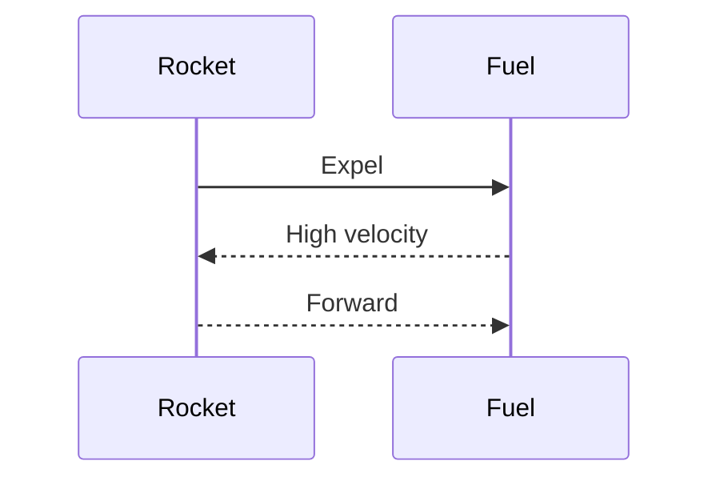

# Unit – II: Circular motion 2.a Apply the concept of linear momentum and its conservation to explain recoil of gun and rockets propulsion. 2.b Apply the concept of centripetal and centrifugal forces to solve

*(AI-generated self-study book for GTU, subject code 4300004 — generated locally with Ollama.)*

This module carries approximately **10 marks (3 Remember + 3 Understand + 4 Apply) (per syllabus)**.


## 2.1. Force, momentum, law of conservation of linear momentum, its applications such as recoil of gun, rocket propulsion, impulse and its applications

### 2.1.1. Force and Momentum
**Force** is a push or pull acting on an object. It can change the velocity of an object, causing it to accelerate. **Momentum** is a measure of the quantity of motion and is defined as the product of an object's mass and its velocity. Mathematically, it is given by:
[ \text{Momentum} = m \times v ]
where m is mass and v is velocity.

### 2.1.2. Law of Conservation of Linear Momentum
The **law of conservation of linear momentum** states that the total linear momentum of a closed system remains constant if no external forces act on the system. This can be mathematically stated as:
[ \text{Initial Momentum} = \text{Final Momentum} ]
or
[ m_1u_1 + m_2u_2 = m_1v_1 + m_2v_2 ]
where m₁, m₂ are the masses of the objects, u₁, u₂ are the initial velocities, and v₁, v₂ are the final velocities.

#### 2.1.2.1. Application: Recoil of Gun
Consider a gun firing a bullet. The gun and the bullet form a closed system. Let the mass of the gun be M and the mass of the bullet be m. The initial velocity of the gun and the bullet is zero. After firing, the velocity of the bullet is v_b and the recoil velocity of the gun is v_g. According to the conservation of momentum:
[ 0 = Mv_g + mv_b ]
Solving for v_g:
[ v_g = -\frac{mv_b}{M} ]
This equation shows that the gun recoils with a velocity opposite to that of the bullet.

> **Example:** A gun with a mass of 5 kg fires a bullet of mass 0.02 kg with a velocity of 300 m/s. Calculate the recoil velocity of the gun.
>
>> **Example:** Given M = 5 kg, m = 0.02 kg, and v_b = 300 m/s, the recoil velocity v_g is calculated as:
>>
>> [ v_g = -\frac{0.02 \times 300}{5} = -1.2 \, \text{m/s} ]
>>
>> The gun recoils with a velocity of 1.2 m/s in the opposite direction to the bullet.

### 2.1.3. Rocket Propulsion
**Rocket propulsion** is another application of the conservation of linear momentum. In a rocket, the fuel is burned to produce hot exhaust gases. These gases are expelled at high velocity out of the rocket, providing a reaction force that propels the rocket forward. This is based on Newton's third law of motion: for every action, there is an equal and opposite reaction.

#### 2.1.3.1. Impulse and its Applications
**Impulse** is the change in momentum produced by a force acting over a period of time. It is given by:
[ \text{Impulse} = F \times t = \Delta p ]
where F is the force, t is the time, and Δ p is the change in momentum.

#### 2.1.3.2. Application: Rocket Propulsion
Consider a rocket of mass M with a small mass Δ m of fuel being expelled at a velocity u relative to the rocket. The initial momentum of the system (rocket + fuel) is zero. After expelling the fuel, the momentum of the rocket is:
[ Mv = -\Delta m u ]
Solving for v:
[ v = -\frac{\Delta m u}{M} ]
The negative sign indicates that the rocket moves in the opposite direction to the expelled fuel.

### Mermaid Diagram: Rocket Propulsion


This diagram illustrates the sequence of events in rocket propulsion, showing the expulsion of fuel and the resulting forward motion of the rocket.

### Summary
The concept of linear momentum and its conservation is crucial in understanding various phenomena, including the recoil of a gun and rocket propulsion. The law of conservation of linear momentum and the concept of impulse are fundamental in analyzing these systems. Understanding these principles will help in solving related problems effectively.

---

## 2.2. Circular motion, angular displacement, angular velocity, angular acceleration and their interrelation

### Circular Motion
Circular motion is the movement of an object along a circular path. It is commonly observed in many physical phenomena such as the motion of a car on a roundabout, the orbit of a planet around the sun, and the motion of a satellite around Earth. In circular motion, the object moves at a constant speed but its velocity changes due to the direction of the motion changing continuously.

### Angular Displacement
Angular displacement, denoted by θ, is the angle through which a point or line has been rotated in a specified sense about a specified axis. It is measured in radians (rad) or degrees (°). Angular displacement is a vector quantity, with direction given by the right-hand rule.

### Angular Velocity
Angular velocity, denoted by ω, is the rate of change of angular displacement with respect to time. It is given by the formula:
[
\omega = \frac{d\theta}{dt}
]
Angular velocity is also a vector quantity, but in the context of circular motion, it is often treated as a scalar quantity, with the direction being tangential to the circle. The unit of angular velocity is radians per second (rad/s).

### Angular Acceleration
Angular acceleration, denoted by α, is the rate of change of angular velocity with respect to time. It is given by the formula:
[
\alpha = \frac{d\omega}{dt}
]
Angular acceleration is a vector quantity, with the direction being the same as the change in angular velocity. The unit of angular acceleration is radians per second squared (rad/s²).

### Interrelation of Angular Displacement, Angular Velocity, and Angular Acceleration
The interrelation between angular displacement, angular velocity, and angular acceleration can be described using the following equations:
[
\omega = \frac{\theta}{t} \quad \text{(average angular velocity)}
]
[
\alpha = \frac{\omega}{t} \quad \text{(average angular acceleration)}
]

For constant angular acceleration, the equations can be further simplified to:
[
\omega = \omega_0 + \alpha t
]
[
\theta = \theta_0 + \omega_0 t + \frac{1}{2} \alpha t^2
]
where ω₀ and θ₀ are the initial angular velocity and angular displacement, respectively.

### Example
> **Example:** A car is moving in a circular path of radius 10 meters with an initial angular velocity of 2 rad/s. If the angular acceleration is 0.5 rad/s², find the angular displacement after 4 seconds.

1. **Given:**
   - Initial angular velocity, ω₀ = 2 rad/s
   - Angular acceleration, α = 0.5 rad/s²
   - Time, t = 4 s

2. **Find:**
   - Angular displacement, θ

3. **Solution:**
   - Using the equation for angular displacement under constant angular acceleration:
     [
     \theta = \theta_0 + \omega_0 t + \frac{1}{2} \alpha t^2
     ]
     Since the initial angular displacement θ₀ = 0, the equation simplifies to:
     [
     \theta = \omega_0 t + \frac{1}{2} \alpha t^2
     ]
     Substituting the given values:
     [
     \theta = (2 \, \text{rad/s}) \times (4 \, \text{s}) + \frac{1}{2} \times (0.5 \, \text{rad/s}^2) \times (4 \, \text{s})^2
     ]
     [
     \theta = 8 \, \text{rad} + \frac{1}{2} \times 0.5 \times 16 \, \text{rad}
     ]
     [
     \theta = 8 \, \text{rad} + 4 \, \text{rad}
     ]
     [
     \theta = 12 \, \text{rad}
     ]

Thus, the angular displacement after 4 seconds is 12 rad.

---

## 2.3. Centripetal and centrifugal forces examples: banking of roads and bending of cyclist

### Banking of Roads

When a vehicle moves on a curved road, it experiences a centripetal force directed towards the center of the curve. This force is provided by the normal reaction force of the road. To prevent skidding, the road is often banked at an appropriate angle. This banking helps in balancing the forces acting on the vehicle.

#### **Explanation:**

- **Centripetal Force (F_c):** The force that acts towards the center of a circular path and is necessary to keep an object moving in a circle.
- **Normal Reaction (N):** The force exerted by the road on the vehicle, perpendicular to the surface of the road.
- **Gravitational Force (mg):** The force due to gravity acting downwards.

The banking angle θ is determined by the balance of forces in the vertical and horizontal directions.

### Mermaid Diagram
```mermaid
flowchart TD
    A[Centripetal Force (F_c)] --> B[Normal Reaction (N)]
    A --> C[Gravitational Force (mg)]
    B --> D[Frictional Force (f)]
    A --> E[Centrifugal Force (F_c)]
    C --> F[Vertical Component (Ncosθ)]
    C --> G[Horizontal Component (Nsinθ)]
    N --> F
    N --> G
    N --> H[Normal Reaction (N)]
    mg --> I[Vertical Component (mg)]
    mg --> J[Horizontal Component (mg)]
    I --> K[Vertical Component (mg)]
    J --> L[Horizontal Component (F_c)]
```

### Banking of Roads Example

> **Example:** A cyclist is moving on a curved road with a radius of 50 meters. If the cyclist is moving at a speed of 10 m/s, find the banking angle required to prevent skidding. Assume the coefficient of friction between the tire and the road is 0.2.

1. **Given:**
   - Radius of the curve, r = 50 meters.
   - Speed of the cyclist, v = 10 m/s.
   - Coefficient of friction, μ = 0.2.

2. **Centripetal Acceleration:**
   [
   a_c = \frac{v^2}{r} = \frac{(10)^2}{50} = 2 \text{ m/s}^2
   ]

3. **Forces in the Vertical Direction:**
   [
   N\cos\theta = mg
   ]
   [
   N = \frac{mg}{\cos\theta}
   ]

4. **Forces in the Horizontal Direction:**
   [
   N\sin\theta = ma_c
   ]
   [
   N\sin\theta = m \cdot 2
   ]
   [
   \frac{mg}{\cos\theta} \cdot \sin\theta = 2m
   ]
   [
   g\tan\theta = 2
   ]
   [
   \tan\theta = \frac{2}{g}
   ]
   [
   \tan\theta = \frac{2}{9.8} \approx 0.204
   ]
   [
   \theta \approx \tan^{-1}(0.204) \approx 11.5^\circ
   ]

Thus, the banking angle required to prevent skidding is approximately 11.5^.

### Bending of Cyclist

When a cyclist takes a turn, the centripetal force required to change the direction of motion is provided by the frictional force between the tires and the road. If the speed is too high, the frictional force may not be sufficient, leading to skidding.

#### **Explanation:**

- **Centripetal Force (F_c):** The force required to keep the cyclist moving in a circular path.
- **Frictional Force (f):** The force that prevents skidding and provides the necessary centripetal force.

The maximum speed vmax at which the cyclist can safely take the turn without skidding can be found by balancing the centripetal force with the frictional force.

### Bending of Cyclist Example

> **Example:** A cyclist is moving on a curved path with a radius of 30 meters. If the coefficient of friction between the tire and the road is 0.4, find the maximum speed at which the cyclist can safely take the turn without skidding.

1. **Given:**
   - Radius of the curve, r = 30 meters.
   - Coefficient of friction, μ = 0.4.

2. **Maximum Speed Calculation:**
   - The maximum frictional force is given by fmax = μ N = μ mg.
   - The centripetal force required is F_c = mv² r.
   - For safe turning, F_c = fmax.
   [
   \frac{mv^2}{r} = \mu mg
   ]
   [
   \frac{v^2}{r} = \mu g
   ]
   [
   v^2 = \mu gr
   ]
   [
   v = \sqrt{\mu gr}
   ]
   [
   v = \sqrt{0.4 \cdot 9.8 \cdot 30} \approx \sqrt{117.6} \approx 10.84 \text{ m/s}
   ]

Thus, the maximum speed at which the cyclist can safely take the turn without skidding is approximately 10.84 m/s.
