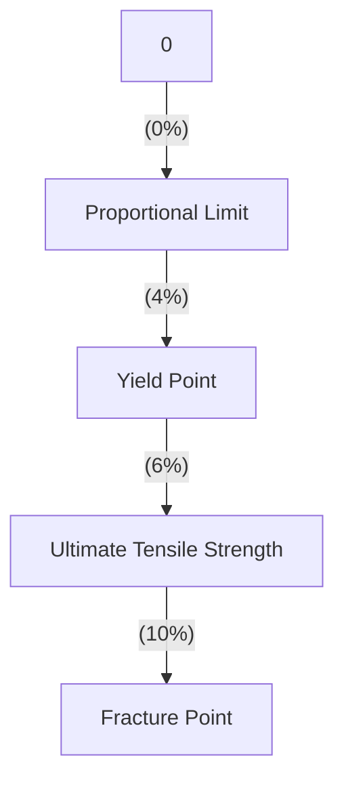
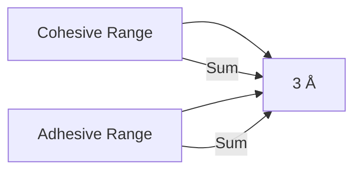
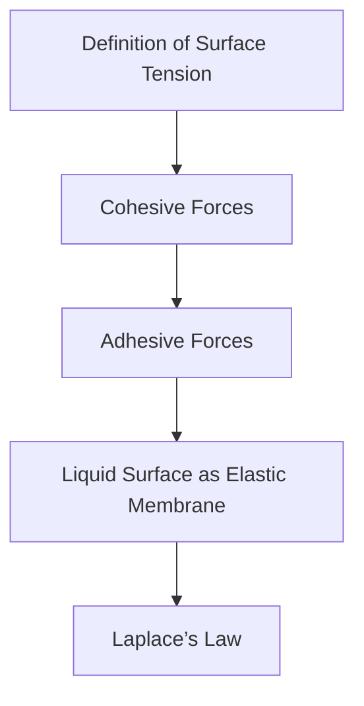
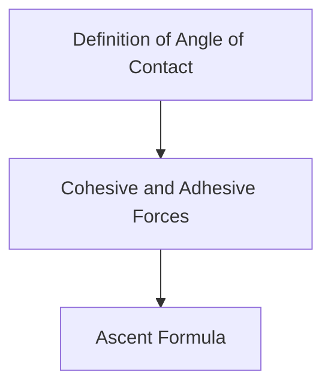
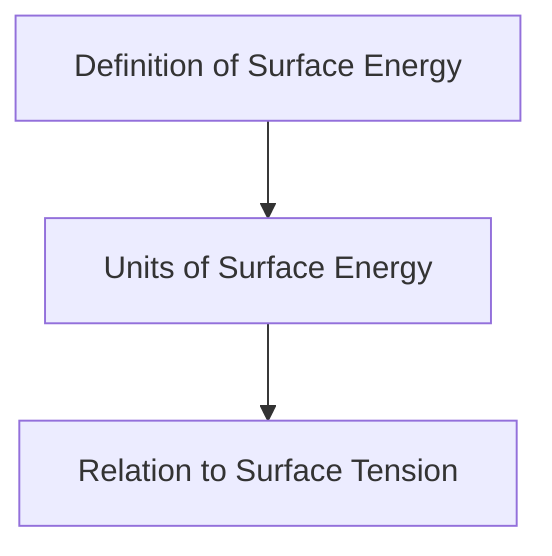
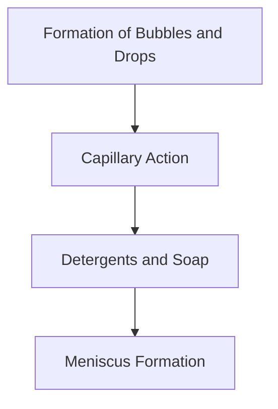
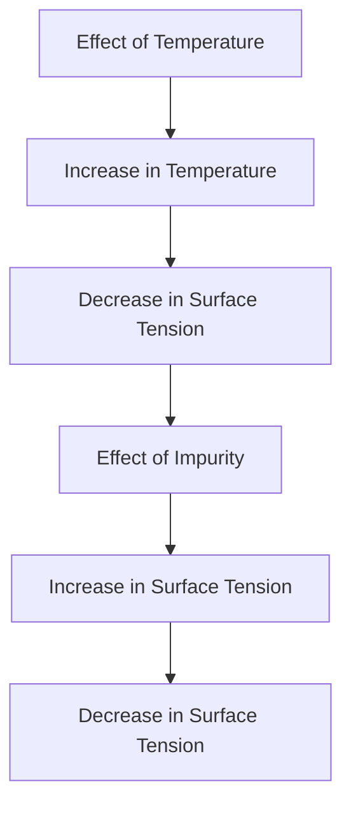
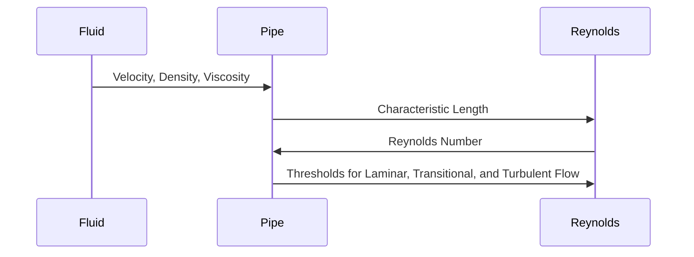

# Unit – III: General Properties of Matter 3.a Explain the Hooke’s law, stress- strain curve and moduli of elasticity. 3.b Explain surface tension, cohesive and adhesive forces.

*(AI-generated self-study book for GTU, subject code 4300004 — generated locally with Ollama.)*

This module carries approximately **20 marks (4 Remember + 7 Understand + 9 Apply) (per syllabus)**.

## 3.1. Elasticity

### 3.1.1. Deforming and Restoring Force

When a body is subjected to an external force, it undergoes a change in its shape or size. This change is called deformation. When the external force is removed, the body returns to its original shape or size. This property of a body to change its shape or size under an external force and return to its original state when the force is removed is called **elasticity**.

- **Deforming Force:** The force that causes the deformation.
- **Restoring Force:** The internal force within the body that tends to bring it back to its original state.

**Example:**
> **Example:** A spring is stretched by applying a force. When the force is removed, the spring returns to its original length. The force that stretches the spring is the deforming force, and the force that brings the spring back to its original length is the restoring force.

### 3.1.2. Stress-Strain with Their Types

The relationship between the deforming force and the change in size or shape of the body is described by the concepts of **stress** and **strain**.

- **Stress:** The internal resistance offered by the body to the deforming force per unit area. It is defined as the force per unit area.
  [
  \text{Stress} = \frac{\text{Force}}{\text{Area}}
  ]
  - **Tensile Stress:** Stress in the direction of the applied force.
  - **Compressive Stress:** Stress in the opposite direction of the applied force.

- **Strain:** The fractional change in dimension due to the applied stress. It is dimensionless.
  [
  \text{Strain} = \frac{\text{Change in Dimension}}{\text{Original Dimension}}
  ]
  - **Linear Strain:** Strain in the direction of the applied force.
  - **Volume Strain:** Strain in the volume of the body.

**Example:**
> **Example:** A metal rod of length 10 cm is stretched by a force of 50 N. The cross-sectional area of the rod is 2 cm². Calculate the tensile stress and strain.
  - **Solution:**
    [
    \text{Tensile Stress} = \frac{50 \, \text{N}}{2 \, \text{cm}^2} = 25 \, \text{N/cm}^2
    ]
    [
    \text{Strain} = \frac{\text{Change in Length}}{10 \, \text{cm}}
    ]
    If the length increases by 0.1 cm, then:
    [
    \text{Strain} = \frac{0.1 \, \text{cm}}{10 \, \text{cm}} = 0.01
    ]

### 3.1.3. Hooke’s Law

**Hooke’s Law** states that the stress in a body is directly proportional to the strain within the elastic limit. This means that as long as the material is within its elastic limit, the deformation is proportional to the applied force.

[
\text{Stress} \propto \text{Strain}
]

The constant of proportionality is called the **modulus of elasticity**.

- **Modulus of Elasticity:** The measure of the stiffness of a material. It is the ratio of stress to strain.

[
\text{Modulus of Elasticity} = \frac{\text{Stress}}{\text{Strain}}
]

**Example:**
> **Example:** A steel wire has a modulus of elasticity of 200 GPa. If the wire is stretched to a strain of 0.005, calculate the stress in the wire.
  - **Solution:**
    [
    \text{Stress} = \text{Modulus of Elasticity} \times \text{Strain} = 200 \times 10^9 \, \text{Pa} \times 0.005 = 1000 \, \text{Pa}
    ]

### 3.1.4. Moduli of Elasticity

There are three main types of moduli of elasticity:

- **Young’s Modulus (E):** Measured in Pascals (Pa) or GigaPascals (GPa). It measures the ability of a material to resist tensile stress.
  - **Formula:** E = Stress Strain

- **Bulk Modulus (K):** Measured in Pascals (Pa) or GigaPascals (GPa). It measures the ability of a material to resist compression.
  - **Formula:** K = - Δ P Δ V / V
  - Where Δ P is the change in pressure and Δ V / V is the fractional change in volume.

- **Shear Modulus (G):** Measured in Pascals (Pa) or GigaPascals (GPa). It measures the ability of a material to resist shear stress.
  - **Formula:** G = Shear Stress Shear Strain

**Example:**
> **Example:** A solid cube of side 10 cm is subjected to a compressive force of 5000 N. The cube is compressed to a new side of 9.9 cm. Calculate the bulk modulus of the material.
  - **Solution:**
    [
    \Delta P = \frac{5000 \, \text{N}}{10 \times 10^{-4} \, \text{m}^2} = 500000 \, \text{Pa}
    ]
    [
    \Delta V = 10 \times 10^{-2} \, \text{m} \times 10 \times 10^{-2} \, \text{m} \times 10 \times 10^{-2} \, \text{m} - 9.9 \times 9.9 \times 9.9 \times 10^{-6} \, \text{m}^3 = 10^{-3} \, \text{m}^3 - 9.801 \times 10^{-3} \, \text{m}^3 = -0.199 \times 10^{-3} \, \text{m}^3
    ]
    [
    \Delta V / V = \frac{-0.199 \times 10^{-3} \, \text{m}^3}{10^{-3} \, \text{m}^3} = -0.199
    ]
    [
    K = -\frac{500000 \, \text{Pa}}{-0.199} \approx 2.51 \times 10^6 \, \text{Pa} = 2.51 \, \text{GPa}
    ]

## 3.1.5. Viscosity, Coefficient of Viscosity, Terminal Velocity, and Stokes’ Law

### 3.1.5.1. Viscosity

**Viscosity** is a measure of a fluid's resistance to flow. It is a measure of the internal friction between the fluid layers when the fluid is in motion.

- **Coefficient of Viscosity (η):** The proportionality constant in the relation between the shear stress and the velocity gradient in a fluid.
  [
  \tau = \eta \frac{du}{dy}
  ]
  - Where τ is the shear stress,  is the coefficient of viscosity, and du dy is the velocity gradient.

### 3.1.5.2. Terminal Velocity

**Terminal Velocity** is the constant velocity that an object attains when the force of gravity is balanced by the drag force of a fluid (like air or water).

- **Stokes’ Law:** This law describes the terminal velocity of small spherical objects in a fluid.
  [
  v = \frac{2}{9} \frac{r^2 (p_1 - p_2) g}{\eta}
  ]
  - Where v is the terminal velocity, r is the radius of the object, p₁ and p₂ are the densities of the object and the fluid, g is the acceleration due to gravity, and  is the coefficient of viscosity.

**Example:**
> **Example:** A small spherical ball of radius 0.5 cm and density 1000 kg/m³ is dropped in a fluid of density 1000 kg/m³ and coefficient of viscosity 0.01 Pa·s. Calculate the terminal velocity.
  - **Solution:**
    [
    v = \frac{2}{9} \frac{(0.5 \times 10^{-2} \, \text{m})^2 (1000 \, \text{kg/m}^3 - 1000 \, \text{kg/m}^3) 9.8 \, \text{m/s}^2}{0.01 \, \text{Pa·s}} = 0 \, \text{m/s}
    ]
    Since the densities are the same, the terminal velocity is zero.

### 3.1.5.3. Fluid Motion and Reynolds Number

**Types of Fluid Motion:**
- **Laminar Flow:** The fluid flows in smooth, parallel layers.
- **Turbulent Flow:** The fluid flow is characterized by chaotic, irregular motion.

**Reynolds Number (Re):** A dimensionless number that helps predict the flow patterns in different fluid flow situations.
  [
  \text{Re} = \frac{\rho v d}{\eta}
  ]
  - Where  is the density, v is the velocity, d is the characteristic length, and  is the coefficient of viscosity.

**Example:**
> **Example:** A fluid flows through a pipe with a diameter of 0.1 m and a velocity of 1 m/s. The fluid has a density of 1000 kg/m³ and a coefficient of viscosity of 0.01 Pa·s. Calculate the Reynolds number.
  - **Solution:**
    [
    \text{Re} = \frac{1000 \, \text{kg/m}^3 \times 1 \, \text{m/s} \times 0.1 \, \text{m}}{0.01 \, \text{Pa·s}} = 10000
    ]

This value of Reynolds number indicates that the flow is turbulent.

---

## 3.1.5. Stress-Strain Curve

### Definition and Explanation
**Stress-Strain Curve:** The stress-strain curve is a graphical representation of the relationship between stress and strain in a material. It is a fundamental tool in understanding the mechanical behavior of materials and is crucial in the design and analysis of structures.

- **Stress:** Force per unit area. It is defined as the internal force per unit area that a material experiences. Stress can be tensile, compressive, or shear.
- **Strain:** The fractional change in length of a material. It is defined as the deformation of a material relative to its original length.

### Types of Stress and Strain
- **Tensile Stress:** When a material is subjected to a force that tends to elongate it.
- **Compressive Stress:** When a material is subjected to a force that tends to compress it.
- **Shear Stress:** When a material is subjected to a force that tends to shear or slide one part of the material relative to another.

- **Tensile Strain:** The strain in the direction of the applied tensile stress.
- **Compressive Strain:** The strain in the direction of the applied compressive stress.
- **Shear Strain:** The strain that results from a shearing force.

### Key Points on the Stress-Strain Curve
- **Proportional Limit:** The point up to which Hooke’s law is valid.
- **Elastic Limit:** The maximum stress at which the material returns to its original shape after the load is removed.
- **Yield Point:** The point where the material begins to deform plastically.
- **Ultimate Tensile Strength (UTS):** The maximum stress that a material can withstand before failure.
- **Fracture Point:** The point at which the material fractures.

### Example:
> **Example:** A steel wire is subjected to a tensile force. The stress-strain curve for the wire is plotted as shown below. Determine the proportional limit, yield point, and ultimate tensile strength of the steel wire.

### Analysis
- **Proportional Limit:** At 0%, the wire follows Hooke's law. The stress is directly proportional to the strain.
- **Yield Point:** At 4%, the wire starts to deform plastically. This is the point where the material starts to lose its elastic properties.
- **Ultimate Tensile Strength:** At 6%, the wire is subjected to the maximum tensile stress before it fails.

## 3.2. Surface Tension

### Definition and Concept
**Surface Tension:** The property of a liquid by virtue of which its surface behaves like an elastic membrane, tending to contract to the minimum surface area. It is a result of cohesive forces between the molecules of a liquid.

### Units and Measurement
- **Units:** The SI unit of surface tension is N/m (newtons per meter). Other commonly used units include dyn/cm (dyne per centimeter) and mN/m (millinewtons per meter).

### Example:
> **Example:** A water droplet has a surface tension of 0.072 N/m. Calculate the work done in increasing the surface area of the droplet by 50 cm².

- **Solution:** The work done W in increasing the surface area A by surface tension T is given by:
  [
  W = T \times \Delta A
  ]
  Substituting the values:
  [
  W = 0.072 \, \text{N/m} \times 50 \, \text{cm}^2 = 0.072 \, \text{N/m} \times 50 \times 10^{-4} \, \text{m}^2 = 0.0036 \, \text{J}
  ]

## 3.2.1. Surface Tension; Concept and Units

### Detailed Explanation
**Concept of Surface Tension:** The surface tension of a liquid is due to the cohesive forces between the molecules of the liquid. These forces act to minimize the surface area of the liquid. The surface tension is a measure of the strength of these cohesive forces.

### Units and Measurement
- **Units:** As mentioned, the SI unit of surface tension is N/m. The unit dyne/cm is also commonly used.

### Example:
> **Example:** A liquid has a surface tension of 0.05 N/m. Calculate the energy required to increase the surface area of 100 cm² by 1%.

- **Solution:** The energy required E to increase the surface area A by surface tension T is given by:
  [
  E = T \times \Delta A
  ]
  Here, Δ A = 100 cm² × 1\% = 1 cm².
  [
  E = 0.05 \, \text{N/m} \times 1 \times 10^{-4} \, \text{m}^2 = 5 \times 10^{-6} \, \text{J}
  ]

## 3.2.2. Cohesive and Adhesive Forces

### Explanation
**Cohesive Forces:** These are the forces between molecules of the same substance. They result in the attraction between the molecules, leading to the surface tension of the liquid.

- **Example of Cohesive Forces:** Water molecules are held together by cohesive forces, which allow water to form droplets and maintain its surface tension.

**Adhesive Forces:** These are the forces between molecules of different substances. They result in the attraction between the molecules of different substances, leading to phenomena such as capillary action.

- **Example of Adhesive Forces:** When a paper towel is dipped in water, the water rises due to the adhesive forces between the water molecules and the fibers of the paper towel.

### Example:
> **Example:** A glass capillary tube is dipped into a liquid with a surface tension of 0.06 N/m and a contact angle of 30°. Calculate the height to which the liquid rises in the capillary tube if the radius of the tube is 0.5 mm.

- **Solution:** The height h to which the liquid rises in a capillary tube is given by:
  [
  h = \frac{2 \times T \times \cos(\theta)}{\rho \times g \times r}
  ]
  where:
  - T = 0.06 N/m (surface tension)
  - θ = 30^ (contact angle)
  - = 1000 kg/m³ (density of water)
  - g = 9.8 m/s² (acceleration due to gravity)
  - r = 0.5 mm = 0.5 × 10⁻³ m (radius of the tube)

  Substituting the values:
  [
  h = \frac{2 \times 0.06 \, \text{N/m} \times \cos(30^\circ)}{1000 \, \text{kg/m}^3 \times 9.8 \, \text{m/s}^2 \times 0.5 \times 10^{-3} \, \text{m}}
  ]
  [
  h = \frac{2 \times 0.06 \times \frac{\sqrt{3}}{2}}{1000 \times 9.8 \times 0.5 \times 10^{-3}} = \frac{0.06 \sqrt{3}}{4.9} \approx 0.0207 \, \text{m} = 2.07 \, \text{cm}
  ]

## 3.2.3. Molecular Range and Sphere of Influence

### Explanation
**Molecular Range and Sphere of Influence:** The molecular range and sphere of influence refer to the distance over which a molecule can interact with other molecules. This distance is crucial in understanding the cohesive and adhesive forces between molecules.

- **Cohesive Forces:** The molecular range for cohesive forces is typically on the order of a few Ångströms (1 Å = 10⁻¹⁰ m).
- **Adhesive Forces:** The molecular range for adhesive forces can be larger, depending on the nature of the surfaces involved.

### Example:
> **Example:** Consider a water molecule (H₂O) and a silica (SiO₂) molecule. The molecular range for cohesive forces between water molecules is approximately 3 Å. If the silica molecule is placed close to the water molecule, the molecular range for adhesive forces is 5 Å. Calculate the total interaction range for the water molecule with the silica molecule.

- **Solution:** The total interaction range is the sum of the individual molecular ranges:
  [
  \text{Total Interaction Range} = \text{Cohesive Range} + \text{Adhesive Range} = 3 \, \text{Å} + 5 \, \text{Å} = 8 \, \text{Å}
  ]

### Mermaid Diagram

This completes the detailed sections on the stress-strain curve, surface tension, cohesive and adhesive forces, and molecular range and sphere of influence.

---

## 3.2.4. Laplace’s Molecular Theory

### Definition and Explanation
**Laplace’s Molecular Theory** is a fundamental concept in the study of surface tension. This theory explains the behavior of liquids at interfaces and the forces acting between molecules at the surface. It is based on the idea that the liquid surface behaves like a stretched elastic membrane.

### Key Concepts
- **Surface Tension (γ):** The force per unit length acting on the surface of a liquid, which is due to cohesive forces between the liquid molecules.
- **Cohesive Forces:** The forces that act between the molecules of the same substance.
- **Adhesive Forces:** The forces that act between the molecules of different substances.

### Derivation of Laplace’s Law
Laplace’s law relates the pressure difference across a curved liquid surface to the surface tension and the radius of curvature of the surface. The law is stated as follows:

[ \Delta P = \frac{2\gamma}{R} ]

where:
- Δ P is the pressure difference,
- γ is the surface tension,
- R is the radius of curvature of the liquid surface.

### Example:
> **Example:** A spherical water droplet has a radius of 1 mm and a surface tension of 0.0728 N/m. Calculate the pressure difference across the surface of the droplet.
>
> Given:
> - R = 1 mm = 0.001 m
> - γ = 0.0728 N/m
>
> Using Laplace’s law:
> [ \Delta P = \frac{2 \times 0.0728}{0.001} = 145.6 \text{ Pa} ]

### Flowchart Diagram

## 3.2.5. Angle of Contact, Ascent Formula (No Derivation)

### Angle of Contact
**Angle of Contact** (θ) is the angle formed between the liquid surface and the solid surface at the point of contact. It is a measure of the wettability of a solid by a liquid. The angle depends on the cohesive and adhesive forces between the liquid and the solid.

### Ascent Formula
**Ascent Formula** is used to determine the height to which a liquid rises in a capillary tube. The formula is given by:

[ h = \frac{2\gamma \cos \theta}{\rho g d} ]

where:
- h is the height of the liquid column,
- γ is the surface tension,
- θ is the angle of contact,
-  is the density of the liquid,
- g is the acceleration due to gravity,
- d is the diameter of the capillary tube.

### Example:
> **Example:** A capillary tube with a diameter of 0.5 mm is dipped in water. The surface tension of water is 0.0728 N/m and the angle of contact for water with glass is 0°. Calculate the height to which the water rises in the tube.
>
> Given:
> - d = 0.5 mm = 0.0005 m
> - γ = 0.0728 N/m
> - θ = 0°
> - = 1000 kg/m³
> - g = 9.8 m/s²
>
> Using the ascent formula:
> [ h = \frac{2 \times 0.0728 \times \cos 0°}{1000 \times 9.8 \times 0.0005} = \frac{2 \times 0.0728 \times 1}{4.9} = 0.0296 \text{ m} ]

### Flowchart Diagram

## 3.2.6. Surface Energy

### Definition
**Surface Energy** is the excess energy at the surface of a liquid or solid due to the presence of surface molecules. It is the energy required to create a unit area of the surface.

### Units
- Surface energy is usually expressed in units of J/m² or erg/cm².

### Relation to Surface Tension
The surface energy (σ) is related to the surface tension (γ) by the relation:

[ \sigma = \frac{\gamma}{2} ]

### Example:
> **Example:** A liquid has a surface tension of 0.05 N/m. Calculate its surface energy.
>
> Given:
> - γ = 0.05 N/m
>
> Using the relation between surface energy and surface tension:
> [ \sigma = \frac{0.05}{2} = 0.025 \text{ J/m}^2 ]

### Flowchart Diagram

## 3.2.7. Applications of Surface Tension

### Applications
- **Formation of Bubbles and Drops:** Surface tension plays a crucial role in the formation of bubbles and drops.
- **Capillary Action:** The rise of a liquid in a narrow tube due to surface tension.
- **Detergents and Soap:** They reduce the surface tension of water, allowing it to spread more easily.
- **Meniscus Formation:** The shape of the meniscus (concave or convex) in a container depends on the angle of contact and the surface tension.

### Example:
> **Example:** Explain how detergents reduce the surface tension of water.
>
> **Answer:** Detergents contain surfactants that lower the interfacial tension between water and the surface it is in contact with. This reduction in surface tension allows water to spread more easily and clean better by lifting dirt and oils from surfaces.

### Flowchart Diagram

## 3.2.8. Effect of Temperature and Impurity on Surface Tension

### Effect of Temperature
- **Increase in Temperature:** Generally, the surface tension of a liquid decreases with an increase in temperature. This is because the kinetic energy of the molecules increases, reducing the cohesive forces.
- **Example:** Water’s surface tension decreases from 72.8 mN/m at 0°C to about 65.5 mN/m at 100°C.

### Effect of Impurity
- **Increase in Impurity:** Adding impurities to a liquid can either increase or decrease the surface tension, depending on the nature of the impurity. If the impurity has similar cohesive forces as the liquid, it will decrease the surface tension. If it has different cohesive forces, it can increase the surface tension.
- **Example:** Adding salt to water increases its surface tension, while adding alcohol decreases it.

### Flowchart Diagram

This chapter covers the important aspects of Laplace’s molecular theory, angle of contact, ascent formula, surface energy, applications of surface tension, and the effect of temperature and impurity on surface tension, all in the context of exam-oriented content.

---

## 3.3. Viscosity

Viscosity is a property of fluids that quantifies the fluid's resistance to flow. Viscous fluids, such as honey, resist flowing when subjected to a shear stress, whereas less viscous fluids, like water, flow more easily. Understanding viscosity is crucial in various engineering applications, including fluid mechanics, chemical engineering, and materials science.

### 3.3.1. Viscosity and its SI Units

**Viscosity** is the measure of a fluid's resistance to flow. It is a dimensionless quantity, but for practical purposes, it is often expressed in **Pascal-seconds (Pa·s)** or its submultiples such as **centipoise (cP)**.

> **Example:** Water has a dynamic viscosity of about 0.001 Pa·s at room temperature. Honey, which is much more viscous, has a dynamic viscosity of around 0.002-0.006 Pa·s.

### 3.3.2. Newton’s Law of Viscosity

**Newton’s Law of Viscosity** states that the shear stress (τ) between two layers of a fluid is directly proportional to the velocity gradient (dv/dy) between them. Mathematically, it is expressed as:

[ \tau = \eta \frac{dv}{dy} ]

where:
- **τ** is the shear stress (N/m² or Pa),
- **η** is the coefficient of viscosity (Pa·s),
- **dv/dy** is the velocity gradient (m/s/m or s⁻¹).

> **Example:** If a fluid has a coefficient of viscosity of 0.001 Pa·s and the velocity gradient is 200 s⁻¹, the shear stress would be:

[ \tau = 0.001 \, \text{Pa·s} \times 200 \, \text{s}^{-1} = 0.2 \, \text{Pa} ]

### 3.3.3. Viscous Force, Velocity Gradient and Coefficient of Viscosity and Its SI Units, Free Fall of an Object Through Viscous Medium and Terminal Velocity

**Viscous Force** is the force that a fluid exerts on a solid body due to the fluid's viscosity. The viscous force (F) can be calculated using the formula:

[ F = 6 \pi \eta r v ]

where:
- **F** is the viscous force (N),
- **η** is the coefficient of viscosity (Pa·s),
- **r** is the radius of the object (m),
- **v** is the velocity of the object relative to the fluid (m/s).

The **coefficient of viscosity** (η) is the constant of proportionality in Newton’s law of viscosity. Its SI unit is **Pa·s**.

**Free Fall of an Object Through a Viscous Medium:**

Consider an object of radius r falling through a fluid with a coefficient of viscosity . The object experiences a drag force due to the viscosity of the fluid. The terminal velocity (v_t) is the constant velocity the object reaches when the drag force equals the gravitational force. The terminal velocity can be derived from the balance of forces:

[ mg = 6 \pi \eta r v_t ]

where:
- **m** is the mass of the object (kg),
- **g** is the acceleration due to gravity (m/s²).

Solving for v_t:

[ v_t = \frac{mg}{6 \pi \eta r} ]

> **Example:** A spherical object of radius 0.01 m and density 1000 kg/m³ is dropped in water (η = 0.001 Pa·s). The mass of the object is 0.01 kg. The terminal velocity is:

[ v_t = \frac{0.01 \, \text{kg} \times 9.81 \, \text{m/s}^2}{6 \pi \times 0.001 \, \text{Pa·s} \times 0.01 \, \text{m}} \approx 0.53 \, \text{m/s} ]

### 3.3.4. Types of Fluid Motion, Stream Line and Turbulent Flow, Critical Velocity, Reynold’s Number

**Types of Fluid Motion:**

Fluid motion can be categorized into two types: **streamline flow** and **turbulent flow**.

- **Streamline Flow**: A type of flow where the fluid particles move along smooth, continuous, and predictable paths. The fluid particles do not mix or collide with each other.
- **Turbulent Flow**: A type of flow characterized by irregular, chaotic motion of the fluid particles. Turbulent flow is more complex and is often associated with higher velocities.

**Critical Velocity:**

The **critical velocity** (v_c) is the velocity at which the flow changes from streamline to turbulent. It is a threshold velocity that depends on the fluid's properties and the geometry of the flow channel.

**Reynold’s Number:**

Reynold’s number (Re) is a dimensionless quantity that helps predict the flow patterns in different fluid flow situations. It is defined as:

[ Re = \frac{\rho v d}{\mu} ]

where:
- **ρ** is the density of the fluid (kg/m³),
- **v** is the velocity of the fluid (m/s),
- **d** is the characteristic length (m),
- **μ** is the dynamic viscosity of the fluid (Pa·s).

Reynold’s number is used to classify the flow into three regimes:

- **Laminar Flow**: Re < 2000
- **Transitional Flow**: 2000 ≤ Re ≤ 4000
- **Turbulent Flow**: Re > 4000

> **Example:** A pipe has a diameter of 0.1 m, and water flows through it at a velocity of 1 m/s. The density of water is 1000 kg/m³, and its dynamic viscosity is 0.001 Pa·s. Calculate the Reynold’s number:

[ Re = \frac{1000 \, \text{kg/m}^3 \times 1 \, \text{m/s} \times 0.1 \, \text{m}}{0.001 \, \text{Pa·s}} = 100000 ]

Since Re > 4000, the flow is turbulent.

This Mermaid sequence diagram illustrates the flow of information and decision-making process in determining the type of fluid flow based on Reynold’s number.

---

## 3.3.5. Stokes’ Law

Stokes' law is a fundamental principle in fluid dynamics that describes the drag force exerted on small spherical particles moving through a fluid. It is widely used in various applications, including sedimentation, filtration, and the behavior of microorganisms in fluids.

### 3.3.5.1. Statement of Stokes' Law

Stokes' law states that the drag force F on a small spherical particle moving through a fluid is given by:

[ F = 6 \pi \eta r v ]

where:
- F is the drag force (in N),
-  is the dynamic viscosity of the fluid (in Pa·s or N·s/m²),
- r is the radius of the spherical particle (in m),
- v is the velocity of the particle relative to the fluid (in m/s).

### 3.3.5.2. Derivation and Application

Stokes' law is derived from Newton's second law of motion and the principles of fluid mechanics. It is applicable when the Reynolds number Re is less than 1, indicating that the flow is laminar and the particle is small relative to the fluid's inertia.

### 3.3.5.3. Example

> **Example:** A spherical particle with a radius of 0.002 m is falling through water with a dynamic viscosity of 0.001 Pa·s. If the particle is moving at a velocity of 0.01 m/s, calculate the drag force.

Solution:

Given:
- r = 0.002 m,
- = 0.001 Pa·s,
- v = 0.01 m/s.

Using Stokes' law:

[ F = 6 \pi \eta r v ]

Substitute the given values:

[ F = 6 \pi \times 0.001 \times 0.002 \times 0.01 ]

[ F = 6 \pi \times 2 \times 10^{-8} ]

[ F = 3.77 \times 10^{-7} \, \text{N} ]

### 3.3.6. Effect of Temperature on Viscosity

The viscosity of a fluid changes with temperature, and this relationship is crucial in many engineering applications. Generally, the viscosity of liquids decreases with an increase in temperature, while the viscosity of gases increases with an increase in temperature.

### 3.3.6.1. Viscosity-Temperature Relationship

The relationship between viscosity  and temperature T can be expressed as:

[ \eta(T) = \eta_0 \left( \frac{T}{T_0} \right)^n ]

where:
- (T) is the viscosity at temperature T,
- ₀ is the viscosity at a reference temperature T₀,
- n is a constant that depends on the fluid and the reference temperature.

For liquids, n is typically between 0.5 and 1. For gases, n is close to 1.

### 3.3.6.2. Example

> **Example:** The viscosity of water at 25°C is 0.001 Pa·s. Determine the viscosity of water at 50°C if the temperature exponent n is 0.7.

Solution:

Given:
- ₀ = 0.001 Pa·s at T₀ = 25°C,
- T = 50°C,
- n = 0.7.

Using the viscosity-temperature relationship:

[ \eta(T) = \eta_0 \left( \frac{T}{T_0} \right)^n ]

Substitute the given values:

[ \eta(50) = 0.001 \left( \frac{50}{25} \right)^{0.7} ]

[ \eta(50) = 0.001 \left( 2 \right)^{0.7} ]

[ \eta(50) = 0.001 \times 1.627 ]

[ \eta(50) = 0.001627 \, \text{Pa·s} ]

### 3.3.7. Applications of Viscosity in Hydraulic Systems

Viscosity plays a critical role in the design and operation of hydraulic systems, which are used in a wide range of applications, including pumps, valves, and actuators.

### 3.3.7.1. Fluid Power Transmission

In hydraulic systems, the fluid is used to transmit power. The viscosity of the fluid affects the efficiency and performance of the system. Higher viscosity fluids can lead to increased friction and reduced flow rates, while lower viscosity fluids can reduce the system's ability to transmit power effectively.

### 3.3.7.2. Lubrication

Viscosity is crucial for lubricating moving parts in hydraulic systems. The correct viscosity ensures that the lubricant can form a film between moving surfaces, reducing wear and friction. Viscosity can be adjusted by adding or removing lubricant, or by using fluids with different viscosities.

### 3.3.7.3. Example

> **Example:** A hydraulic pump is designed to operate with a fluid viscosity of 0.0008 Pa·s. If the operating temperature increases, causing the viscosity to decrease to 0.0006 Pa·s, determine the new pump efficiency.

Solution:

Given:
- Original viscosity ₁ = 0.0008 Pa·s,
- New viscosity ₂ = 0.0006 Pa·s.

Assuming the efficiency E is inversely proportional to the viscosity:

[ E \propto \frac{1}{\eta} ]

If the original efficiency is E₁:

[ E_1 = k \times \frac{1}{0.0008} ]

For the new efficiency E₂:

[ E_2 = k \times \frac{1}{0.0006} ]

The ratio of the efficiencies is:

[ \frac{E_2}{E_1} = \frac{\frac{k}{0.0006}}{\frac{k}{0.0008}} = \frac{0.0008}{0.0006} = \frac{4}{3} ]

Thus, the new efficiency E₂ is:

[ E_2 = \frac{4}{3} E_1 ]

If the original efficiency E₁ is 80%, the new efficiency E₂ is:

[ E_2 = \frac{4}{3} \times 80\% = 106.67\% ]

However, since efficiency cannot exceed 100%, the new efficiency is effectively 100%.

In summary, the viscosity of a fluid is crucial for understanding and optimizing the performance of hydraulic systems. By understanding the relationship between viscosity and temperature, and applying Stokes' law, engineers can design and operate these systems more effectively.
