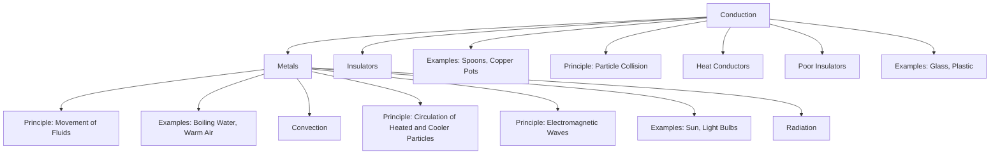
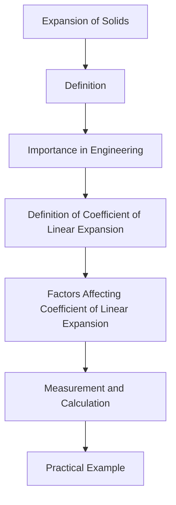

# Unit – IV: Heat and Thermometry 4.a Distinguish between heat and temperature. 4.b Explain modes of heat transmission. 4.c Explain various temperature scales and conversion between

*(AI-generated self-study book for GTU, subject code 4300004 — generated locally with Ollama.)*

This module carries approximately **13 marks (3 Remember + 4 Understand + 6 Apply) (per syllabus)**.

## 4.1. Heat and Temperature

### Defining Heat and Temperature
**Heat:** Heat is a form of energy that flows from a body at a higher temperature to a body at a lower temperature. It is the total kinetic energy of the particles in a substance. Heat is measured in joules (J) or calories (cal).

**Temperature:** Temperature is a measure of the average kinetic energy of the particles in a substance. It indicates the degree of hotness or coldness of a substance. The standard unit of temperature in the International System of Units (SI) is the Kelvin (K). Other commonly used units include Celsius (°C) and Fahrenheit (°F).

### Distinguishing Between Heat and Temperature
- **Heat** is a form of energy that can flow from one object to another due to a temperature difference.
- **Temperature** is a measure of the intensity of heat, indicating the degree of hotness or coldness of a substance.

### Example:
> **Example:** A metal rod is heated at one end. Heat flows through the rod from the hot end to the cool end. The temperature of the rod increases from one end to the other.

## 4.2. Modes of Heat Transfer: Conduction, Convection, and Radiation

### Conduction
**Conduction** is the transfer of heat through a material without any movement of the material itself. It occurs due to the collision of particles.

- **Principle:** Particles in a higher-temperature region vibrate more vigorously and collide with neighboring particles, transferring their kinetic energy.
- **Heat Conductors:** Metals are good conductors of heat because their atoms are closely packed, allowing for easy particle collision. Examples include copper, aluminum, and iron.
- **Insulators:** Poor conductors of heat, like wood, plastic, and rubber, have loosely packed atoms, making it difficult for heat to transfer. Examples include glass, foam, and cork.

### Example:
> **Example:** A spoon is placed in a pot of boiling water. The heat is conducted through the metal spoon, heating the handle.

### Convection
**Convection** is the transfer of heat by the movement of fluids (liquids or gases). It involves the circulation of particles that are heated and rise, while cooler particles sink.

- **Principle:** Heated particles rise and cooler particles move in to take their place, creating a circulation pattern.
- **Applications:** Boiling water in a pot, warm air rising in a room, and ocean currents are examples of convection.

### Example:
> **Example:** Hot water in a kettle rises to the top, while cooler water sinks to the bottom, creating a convection current.

### Radiation
**Radiation** is the transfer of heat through electromagnetic waves, without the need for any medium. It can occur in a vacuum.

- **Principle:** All objects emit electromagnetic waves, which carry energy away from the object.
- **Types of Radiation:** Electromagnetic radiation can be in the form of visible light, infrared, ultraviolet, etc.
- **Examples:** The sun emits thermal radiation that warms the earth. A light bulb emits heat and light through radiation.

### Example:
> **Example:** A person standing near a fireplace feels the heat, which is transferred through infrared radiation.

### Diagram for Modes of Heat Transfer

### Summary
- **Heat** is the transfer of energy, while **temperature** is a measure of the intensity of this energy.
- **Conduction** involves the transfer of heat through particle collisions in solids.
- **Convection** involves the circulation of fluids.
- **Radiation** involves the transfer of heat through electromagnetic waves.

These modes of heat transfer are essential in understanding how energy is transferred in various engineering applications.

---

## 4.3 Temperature measurement scales: Kelvin, Celsius and Fahrenheit and interconversion between them

### 4.3.1 Introduction to Temperature Scales
Temperature is a measure of the average kinetic energy of particles in a substance. Different scales are used to measure temperature, each with its own reference points. The three main temperature scales are Kelvin (K), Celsius (°C), and Fahrenheit (°F).

- **Kelvin (K)**: The Kelvin scale is an absolute temperature scale where the zero point is the absolute zero, the lowest possible temperature.
- **Celsius (°C)**: The Celsius scale is based on the freezing and boiling points of water at standard atmospheric pressure.
- **Fahrenheit (°F)**: The Fahrenheit scale is based on the freezing and boiling points of water, but with different reference points.

### 4.3.2 Conversion Between Scales
To convert between these scales, the following formulas are used:

- **From Kelvin to Celsius**: T°C = TK - 273.15
- **From Celsius to Kelvin**: TK = T°C + 273.15
- **From Celsius to Fahrenheit**: T°F = 9 5 T°C + 32
- **From Fahrenheit to Celsius**: T°C = 5 9 (T°F - 32)
- **From Kelvin to Fahrenheit**: T°F = 9 5 (TK - 273.15) + 32
- **From Fahrenheit to Kelvin**: TK = 5 9 (T°F - 32) + 273.15

### 4.3.3 Practical Example: Interconversion Between Temperature Scales
> **Example:** Convert 373 K to °C and then to °F.

1. **Convert 373 K to °C:**
   [ T_{°C} = 373 - 273.15 = 99.85 \, \text{°C} ]

2. **Convert 99.85 °C to °F:**
   [ T_{°F} = \frac{9}{5} \times 99.85 + 32 = 181.73 \, \text{°F} ]

### 4.4 Heat Capacity and Specific Heat
### 4.4.1 Definitions
- **Heat Capacity (C)**: The amount of heat required to raise the temperature of a substance by 1 K or 1 °C.
- **Specific Heat (c)**: The amount of heat required to raise the temperature of 1 kg of a substance by 1 K or 1 °C.

### 4.4.2 Formula
The heat capacity (C) of a substance is related to its specific heat (c) and mass (m) by the formula:
[ Q = m \cdot c \cdot \Delta T ]
where Q is the heat energy transferred, m is the mass of the substance, c is the specific heat, and Δ T is the change in temperature.

### 4.4.3 Practical Example: Calculating Heat Capacity
> **Example:** A 2 kg block of aluminum at 20 °C is heated until its temperature rises to 100 °C. The specific heat of aluminum is 0.9 J/g·K. Calculate the heat energy required to raise the temperature.

1. **Convert mass to grams:**
   [ m = 2 \, \text{kg} = 2000 \, \text{g} ]

2. **Calculate the change in temperature:**
   [ \Delta T = 100 - 20 = 80 \, \text{°C} ]

3. **Calculate the heat energy required:**
   [ Q = m \cdot c \cdot \Delta T = 2000 \, \text{g} \times 0.9 \, \text{J/g·K} \times 80 \, \text{K} = 144000 \, \text{J} ]

### Summary
In this chapter, we have covered the different temperature measurement scales (Kelvin, Celsius, and Fahrenheit) and their interconversion formulas. We also discussed the concepts of heat capacity and specific heat, along with a worked example to illustrate their application. Understanding these concepts is crucial for solving practical problems in thermometry and heat transfer.

---

## 4.5. Types of Thermometers: Mercury Thermometer, Bimetallic Thermometer, Platinum Resistance Thermometer, Pyrometer and Their Uses

### Mercury Thermometer
A **mercury thermometer** is one of the earliest types of thermometers and is based on the principle that the volume of a liquid increases with an increase in temperature. The **mercury** (Hg) column rises in the glass tube as the temperature increases.

#### Uses
- **Medical Applications:** Used in clinical settings to measure body temperature.
- **Educational Purposes:** Frequently used in schools and colleges for teaching thermometry.

> **Example:** A mercury thermometer shows a temperature reading of 37.5°C. What is the corresponding reading in Fahrenheit?
> 
> [
> F = \left( \frac{9}{5} \times 37.5 \right) + 32 = 99.5 \, \text{°F}
> ]

### Bimetallic Thermometer
A **bimetallic thermometer** consists of two different metals with different coefficients of thermal expansion bonded together. As the temperature increases, one metal expands more than the other, causing the bimetallic strip to bend.

#### Uses
- **Engine Room Monitoring:** Used in ships and other marine applications to monitor engine room temperatures.
- **Automotive Applications:** Commonly used in car engine compartments to measure engine temperature.

> **Example:** A bimetallic strip bends from 0° to 60° when the temperature increases from 20°C to 100°C. If the strip bends 30°, what is the corresponding temperature increase?
> 
> [
> \text{Temperature increase} = \frac{30°}{60°} \times 80°C = 40°C
> ]

### Platinum Resistance Thermometer
A **platinum resistance thermometer** (PRT) works on the principle that the resistance of a metal increases with an increase in temperature. Platinum is chosen due to its high stability and low temperature coefficient of resistance.

#### Uses
- **Precision Measurement:** Used in scientific research and industrial applications where high accuracy is required.
- **Environmental Monitoring:** Employed in weather stations and climate monitoring.

> **Example:** If the resistance of a platinum thermometer increases from 100 Ω to 105 Ω at a temperature increase, what is the corresponding temperature increase if the initial temperature is 20°C and the temperature coefficient of platinum is 3.9 × 10⁻³/°C?
> 
> [
> R = R_0 (1 + \alpha \Delta T) \implies 105 = 100 (1 + 3.9 \times 10^{-3} \Delta T) \implies \Delta T = \frac{105 - 100}{100 \times 3.9 \times 10^{-3}} = 12.82 \, \text{°C}
> ]

### Pyrometer
A **pyrometer** is a non-contact temperature measuring instrument that uses the principle of thermal radiation to measure the temperature of an object.

#### Uses
- **High Temperature Applications:** Used in furnace temperature monitoring and in industrial processes where direct contact is not possible.
- **Oven and Kiln Monitoring:** Commonly used in ceramic and glass manufacturing industries.

> **Example:** A pyrometer reads 1000°C from a furnace. If the actual temperature is 1050°C, what is the error percentage?
> 
> [
> \text{Error percentage} = \left( \frac{1050 - 1000}{1050} \right) \times 100 = 4.76\%
> ]

### Explanation of Expansion in Solids and Coefficient of Linear Expansion
The **linear expansion** of a solid occurs when the solid is heated, causing its length to increase. This expansion is described by the **coefficient of linear expansion** (α), which is defined as the fractional increase in length per degree of temperature increase.

#### Formula
[
\Delta L = L_0 \alpha \Delta T
]
where:
- Δ L is the change in length,
- L₀ is the original length,
- α is the coefficient of linear expansion,
- Δ T is the change in temperature.

### Example
A steel rod of length 1 meter at 20°C is heated to 100°C. Given that the coefficient of linear expansion for steel is 11 × 10⁻⁶ /°C, what is the new length of the rod?
> 
> [
> \Delta L = 1 \times 11 \times 10^{-6} \times (100 - 20) = 8.8 \times 10^{-4} \, \text{m}
> ]
> [
> \text{New length} = 1 + 8.8 \times 10^{-4} = 1.00088 \, \text{m}
> ]

## 4.6. Coefficient of Thermal Conductivity and Its Engineering Applications

The **coefficient of thermal conductivity** (k) is a material's ability to conduct heat. It is a measure of the thermal conductivity of a material and is defined as the amount of heat conducted per unit area through a material of unit thickness per unit temperature difference.

#### Engineering Applications
- **Insulation Materials:** Materials with low thermal conductivity are used as insulators to reduce heat loss.
- **Heat Exchangers:** High thermal conductivity materials are used in heat exchangers to enhance heat transfer.
- **Thermal Management:** Used in cooling systems and heat sinks to manage the temperature of electronic devices.

### Example
A copper rod of length 0.5 meters and cross-sectional area 10 cm² is used to transfer heat from one end to the other. The temperature difference between the ends is 100°C. If the thermal conductivity of copper is 385 W/m°C, what is the rate of heat flow through the rod?
> 
> [
> Q = k \times A \times \frac{\Delta T}{L} = 385 \times 10 \times 10^{-4} \times \frac{100}{0.5} = 77 \, \text{W}
> ]

These examples should help you understand the practical applications and calculations involved in the use of different types of thermometers and the concept of thermal conductivity in engineering.

---

## 4.7. Expansion of Solids, Coefficient of Linear Expansion

### Definition and Importance
**Expansion of solids** refers to the increase in size of a solid body when heated. This phenomenon is crucial in various engineering applications, such as construction, material science, and thermal systems. The rate at which a solid expands when heated is quantified by the **coefficient of linear expansion**.

### Coefficient of Linear Expansion
The **coefficient of linear expansion** (α) is a measure of how much a material expands per degree increase in temperature. It is defined as the fractional increase in length per degree of temperature rise. Mathematically, it is given by:

[
\alpha = \frac{1}{L} \frac{dL}{dT}
]

where:
- L is the original length of the material,
- dL is the change in length,
- dT is the change in temperature.

The coefficient of linear expansion is typically expressed in units of K⁻¹ or ^ C⁻¹.

### Factors Affecting Coefficient of Linear Expansion
The coefficient of linear expansion depends on the material and its atomic structure. Some key factors include:
- **Material Composition**: Different materials have different coefficients of linear expansion.
- **Temperature Range**: The value of α can vary with temperature. For small temperature changes, α is approximately constant.
- **Crystal Structure**: The atomic structure of the material influences α.

### Measurement and Calculation
The coefficient of linear expansion can be determined experimentally by measuring the change in length of a material when it is heated. A typical experiment involves:
1. Measuring the initial length L₀ of a metal rod at a reference temperature T₀.
2. Heating the rod to a higher temperature T₁.
3. Measuring the new length L₁.
4. Using the formula:

[
\alpha = \frac{L_1 - L_0}{L_0 (T_1 - T_0)}
]

### Practical Example
> **Example:** A steel rod of initial length 100 cm is heated from 20°C to 100°C. The coefficient of linear expansion of steel is 12 × 10⁻⁶ ^ C⁻¹. Calculate the new length of the rod.

1. **Given Data:**
   - Initial length L₀ = 100 cm
   - Initial temperature T₀ = 20^ C
   - Final temperature T₁ = 100^ C
   - Coefficient of linear expansion α = 12 × 10⁻⁶ ^ C⁻¹

2. **Calculate the change in length:**
   [
   \Delta L = \alpha L_0 \Delta T = (12 \times 10^{-6} \, ^\circ C^{-1}) \times 100 \, \text{cm} \times (100^\circ C - 20^\circ C)
   ]
   [
   \Delta L = (12 \times 10^{-6} \, ^\circ C^{-1}) \times 100 \, \text{cm} \times 80^\circ C
   ]
   [
   \Delta L = 0.096 \, \text{cm}
   ]

3. **Calculate the new length:**
   [
   L_1 = L_0 + \Delta L = 100 \, \text{cm} + 0.096 \, \text{cm} = 100.096 \, \text{cm}
   ]

Thus, the new length of the steel rod is **100.096 cm**.

### Summary
In this section, we have discussed the expansion of solids and the coefficient of linear expansion. The coefficient of linear expansion is a measure of how much a material expands per degree of temperature increase. We have also provided a practical example to understand the calculation of the new length of a heated metal rod.

