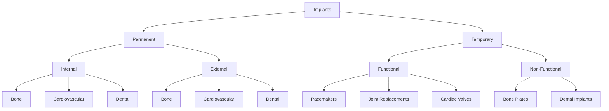

## 1.4 Introduction to Implant

- **Implant:** An implant is a medical device that is surgically placed within the human body to replace or support a damaged or missing body part. Implants are designed to interact with the human body and are often used to improve the function or appearance of a part of the body.
- **Difference from Biomaterial:** While biomaterials are materials that can be used in a medical device, an implant is a specific type of biomaterial that is designed to be permanently or temporarily placed in the body to serve a specific purpose. For example, a bone plate is an implant, but the material from which the bone plate is made (such as titanium) is a biomaterial.

### Common Implants
- **Bone Plates:** Used to hold broken bones together during healing.
- **Sutures:** Used to close wounds or surgical incisions.
- **Joint Replacements:** Used to replace damaged joints like hips or knees.
- **Pacemakers:** Used to regulate the heartbeat.
- **Cardiac Valves:** Used to replace or repair heart valves.
- **Dental Implants:** Used to replace missing teeth.

> **Example:** A patient with a broken femur might be given a metal plate (implant) to hold the bones in place during healing. The plate is made of titanium, a common biomaterial.

## 1.4.1 Classification of Implant

- **Permanent vs Temporary:** 
  - **Permanent Implants:** These are implants that are intended to remain in the body indefinitely, such as pacemakers, joint replacements, and dental implants.
  - **Temporary Implants:** These are implants that are intended to be removed after a specific period, such as drug-eluting stents used in heart surgery.

- **Internal vs External:**
  - **Internal Implants:** These are implants that are placed inside the body, such as pacemakers, joint replacements, and dental implants.
  - **External Implants:** These are implants that are placed outside the body, such as external stents used in blood vessels.

- **Functional vs Non-Functional:**
  - **Functional Implants:** These are implants that are designed to perform a specific function, such as pacemakers, joint replacements, and cardiac valves.
  - **Non-Functional Implants:** These are implants that are used for support or stabilization, such as bone plates and orthopedic implants.

- **By Tissue/Organ Site:**
  - **Bone Implants:** Used to replace or support bone structures, such as joint replacements and dental implants.
  - **Cardiovascular Implants:** Used to replace or support heart structures, such as pacemakers and cardiac valves.
  - **Dental Implants:** Used to replace missing teeth, such as dental implants.

### Flowchart Classification of Implants

> **Example:** If we need to classify a pacemaker, it would be a **Permanent** and **Internal** **Functional** implant, placed in the **Cardiovascular** system.

By understanding these classifications, students can better comprehend the diverse applications and design requirements of implants. This knowledge is crucial for selecting the appropriate biomaterials and implants for specific medical needs.