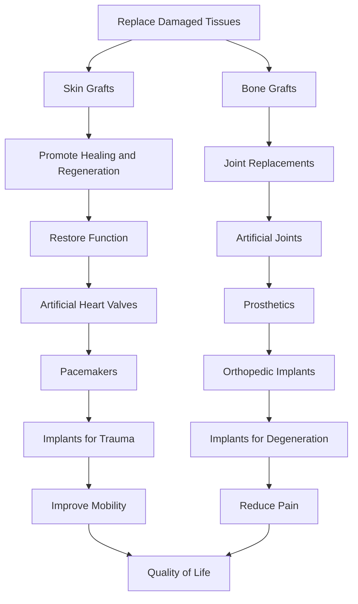
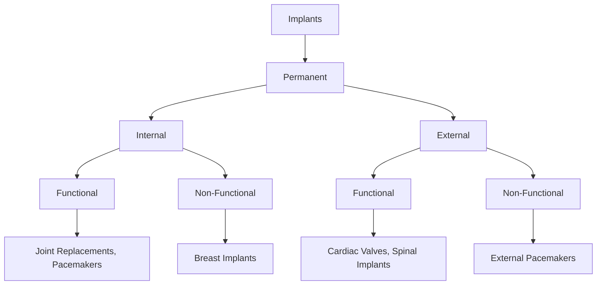
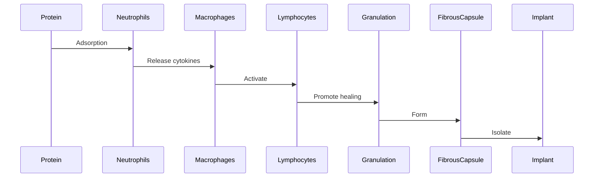

# Unit – I: Introduction of Biomaterials and Implants

*(AI-generated self study book for GTU Diploma Biomedical Engineering, subject code 4360302 — generated locally with Ollama.)*

This unit carries approximately **14 marks in the end-semester exam (7 Remember + 4 Understand + 3 Apply)**.

Learning objectives covered by this unit:
- Define Biomaterial, Implant, Biological Material, Bio compatibility.
- Classify different Biomaterial.
- Enlist the need of biomaterial.
- Explain in detail the need of biomaterial for the society.
- Describe tissue response to implants.
- Explain the concept of biocompatibility of implants with the human body.
- Give Classification for different implant.
- Explain acute and chronic inflammation.
- Enlist the infections that happen due to implants.

# Chapter 1: Introduction to Biomaterials, Biological Materials, and Their Applications

## 1.1 Introduction to Biomaterial and Biological Material

### Definition of Biomaterial
**Biomaterial** is a material that is used in medical devices, implants, or other healthcare applications where it interacts with biological systems. Biomaterials are designed to perform a specific function, such as replacing a damaged tissue or providing structural support.

### Definition of Biological Material
**Biological material** is any naturally occurring substance derived from living organisms, such as proteins, enzymes, and tissues. These materials are often used in medical applications due to their natural compatibility with the human body.

### Comparison of Biomaterials and Biological Materials
- **Metals vs. Bone**: Metals like titanium and stainless steel are used in orthopedic implants because they are strong and durable. Bone, on the other hand, is a natural biological material that is part of the human body and can regenerate and integrate with the surrounding tissues.
- **Polymers vs. Collagen**: Polymers such as polyethylene and polypropylene are used in artificial joints due to their wear resistance and stability. Collagen, a protein found in natural connective tissues, is used in wound dressings and skin grafts because of its ability to promote healing and tissue regeneration.

### Interaction of Biomaterials with Living Tissue
A biomaterial must interact safely with living tissue to ensure that it performs its intended function without causing harm. This interaction includes the material's mechanical properties, biocompatibility, and ability to integrate with the surrounding tissues. For example, an artificial heart valve must not only be durable and able to function correctly but also must not cause any adverse reactions in the patient's body.

> **Example:** A titanium implant is used in orthopedic surgery because it is biocompatible, meaning it does not cause an immune response or other adverse reactions when in contact with living tissues. Its mechanical strength ensures that it can withstand the stresses of daily activities.

## 1.2 Need of Biomaterial

### Enlisting the Needs of Biomaterials for Society

Biomaterials are essential for various applications in the medical field, improving the quality of life and treating numerous conditions. Here are some of the primary needs of biomaterials:

- **Replacing Damaged Tissues**: Biomaterials can be used to replace damaged tissues, such as skin grafts and bone grafts, to promote healing and regeneration.
- **Restoring Function**: Biomaterials are used in implants to restore the function of damaged organs or tissues, such as artificial heart valves, pacemakers, and artificial joints.
- **Trauma and Degeneration**: Biomaterials are crucial in treating trauma and degenerative conditions, such as broken bones and joint replacements.
- **Improving Quality of Life**: Biomaterials can enhance the quality of life for patients by providing solutions that improve their mobility and reduce pain, such as prosthetics and orthopedic implants.

### Flowchart of Needs of Biomaterial for Society

> **Example:** A patient with a damaged heart valve may need an artificial valve implant. This implant must be biocompatible and durable to ensure it functions correctly and does not cause any adverse reactions. The use of biomaterials in this context helps to restore the patient's heart function and improve their quality of life.

This section has introduced the concept of biomaterials and biological materials, compared them with natural examples, and explained the essential interactions required for safe and effective use. The next section will delve into the detailed needs of biomaterials for society and provide further examples and explanations.

---

## 1.3 Classification of Biomaterial

### Introduction to Biomaterials
*Biomaterials* are materials designed to interact with biological systems for a medical purpose. They can be used in the human body to replace or support a biological process. *Implants* are a specific type of biomaterials used to replace or repair damaged tissues or organs. *Biological materials* are those derived from living organisms and are used in medical applications. *Bio-compatibility* refers to the ability of a biomaterial to perform its intended function without eliciting any harmful systemic response.

### Classification of Biomaterials

Biomaterials can be broadly classified into the following main groups:

- **Metals and Alloys**
- **Ceramics**
- **Polymers**
- **Composites**
- **Natural Biomaterials**

These groups are classified based on their chemical composition and physical properties. Each class has specific characteristics and applications in the body.

#### Metals and Alloys
*Metals and alloys* are widely used due to their strength, ductility, and biocompatibility. They are often used in orthopedic implants, dental implants, and cardiovascular devices.

- **Typical Examples:** Stainless steel, titanium, cobalt-chrome alloys
- **Biomedical Application:** Hip and knee replacements, dental implants, orthodontic wires, cardiac stents

> **Example:** Titanium is commonly used in orthopedic implants because of its strength and biocompatibility. It is often used in hip replacements, where it provides structural support and reduces wear and tear.

#### Ceramics
*Ceramics* are inorganic, non-metallic materials that are usually hard, brittle, and chemically inert. They are used in applications that require high strength, wear resistance, and chemical inertness.

- **Typical Examples:** Aluminum oxide, zirconia, bioactive glass
- **Biomedical Application:** Dental implants, cranial plates, vascular grafts

> **Example:** Zirconia is used in dental implants due to its high strength and biocompatibility. It is often used in single-tooth implant restorations because of its aesthetic and functional benefits.

#### Polymers
*Polymers* are long chain molecules that can be used to form biodegradable or non-biodegradable materials. They are often used in soft tissue applications where flexibility and biocompatibility are required.

- **Typical Examples:** Polyethylene, polyurethane, polylactic acid (PLA)
- **Biomedical Application:** Tissue engineering scaffolds, drug delivery systems, sutures, vascular grafts

> **Example:** Polyethylene is used in artificial joints, particularly in knee replacements, due to its low friction and wear-resistant properties. It is often used in the polyethylene liner of the knee implant, ensuring smooth joint movement.

#### Composites
*Composites* are materials made from two or more components with significantly different physical or chemical properties. They combine the strengths of each component to create a material with superior properties.

- **Typical Examples:** Carbon fiber-reinforced polymers, metal matrix composites
- **Biomedical Application:** Spinal implants, cranial plates, orthopedic implants

> **Example:** Carbon fiber-reinforced polymers are used in spinal implants due to their high strength and stiffness. They provide structural support to the spine, helping to stabilize and maintain proper alignment.

#### Natural Biomaterials
*Natural biomaterials* are derived from biological sources and are often used in tissue engineering and regenerative medicine.

- **Typical Examples:** Collagen, hyaluronic acid, chitosan
- **Biomedical Application:** Tissue engineering scaffolds, wound dressings, drug delivery systems

> **Example:** Collagen is used in tissue engineering scaffolds due to its biocompatibility and ability to support cell growth. It is often used in skin grafts and cartilage repair applications.

### Flowchart of Biomaterial Classification

### Summary Table
| Class          | Typical Examples         | Biomedical Application                |
|----------------|-------------------------|--------------------------------------|
| Metals and Alloys | Stainless steel, titanium, cobalt-chrome | Hip and knee replacements, dental implants, orthodontic wires, cardiac stents |
| Ceramics       | Aluminum oxide, zirconia, bioactive glass | Dental implants, cranial plates, vascular grafts |
| Polymers       | Polyethylene, polyurethane, polylactic acid (PLA) | Tissue engineering scaffolds, drug delivery systems, sutures, vascular grafts |
| Composites     | Carbon fiber-reinforced polymers, metal matrix composites | Spinal implants, cranial plates, orthopedic implants |
| Natural Biomaterials | Collagen, hyaluronic acid, chitosan | Tissue engineering scaffolds, wound dressings, drug delivery systems |

This classification helps in selecting the appropriate biomaterials based on the specific needs and applications in the human body.

---

## 1.4 Introduction to Implant

### Defining Implant
An **implant** is a medical device that is surgically inserted into the body to replace or support a damaged part. Implants are designed to interact with the body's tissues and organs to provide structural support or functionality. For example, a hip implant is used to replace a damaged hip joint, enhancing the patient's mobility and reducing pain.

**Implant** differs from a general **biomaterial** in that an implant is specifically designed to be placed within the body for a long-term or permanent function, whereas a biomaterial can be used in a wide range of applications, including temporary or short-term uses.

### Examples of Common Implants
- **Bone Plates**: Used to support and stabilize broken bones during the healing process.
- **Sutures**: Used to close wounds and promote healing.
- **Joint Replacements**: Such as hip and knee replacements, used to replace damaged joints.
- **Pacemakers**: Devices that regulate the heart's rhythm by sending electrical signals to the heart.
- **Cardiac Valves**: Replacements for diseased or damaged heart valves.
- **Dental Implants**: Used to replace missing teeth by anchoring artificial teeth into the jawbone.

### 1.4.1 Classification of Implant

Implants can be classified from different viewpoints. Let's explore these classifications with examples.

#### Permanent vs Temporary
- **Permanent Implants**: These are designed to be used for a long time, such as joint replacements or pacemakers.
  - **Example:** A hip replacement implant is typically used for the patient's entire life.
- **Temporary Implants**: These are used for a short period, often to provide support during healing.
  - **Example:** A bone plate used during the healing of a fracture is removed once the bone has healed.

#### Internal vs External
- **Internal Implants**: These are placed inside the body, such as artificial heart valves or spinal implants.
  - **Example:** A cardiac valve implant is placed inside the heart.
- **External Implants**: These are used outside the body but interact with it, such as external pacemakers.
  - **Example:** An external pacemaker device is placed on the skin to manage heart rhythms.

#### Functional vs Non-Functional
- **Functional Implants**: These are designed to perform a specific function, such as joint replacements or heart valves.
  - **Example:** A knee replacement implant helps to move the knee joint.
- **Non-Functional Implants**: These are used for aesthetic or supportive purposes, such as breast implants.
  - **Example:** A breast implant used for cosmetic surgery.

#### By Tissue/Organ Site
- **Bone Implants**: Used in orthopedic surgeries, such as hip and knee replacements.
  - **Example:** A titanium hip implant used in orthopedic surgery.
- **Cardiovascular Implants**: Used in heart surgeries, such as pacemakers and heart valves.
  - **Example:** A mechanical heart valve used in valve replacement surgery.
- **Neurological Implants**: Used in brain surgeries, such as deep brain stimulators.
  - **Example:** A deep brain stimulator used to treat Parkinson's disease.

### Flowchart for Classification of Implants

> **Example:** Consider a patient who needs a hip replacement. The hip replacement implant is a **permanent** and **internal** implant, designed to be **functional** and replace the damaged hip joint. Contrast this with a **temporary** and **internal** implant like a bone plate, which is used to support the healing process but is eventually removed.

### Summary
In this section, we have introduced the concept of implants and classified them based on different criteria such as permanence, internal/external usage, functionality, and the tissue/organ site they are used in. Understanding these classifications is crucial for selecting the appropriate implant for a specific medical need.

---

## 1.5 Tissue Response to Implants

### 1.5.1 Biocompatibility
- **Biocompatibility**: This term refers to the ability of a material to perform its intended function without causing any harmful biological response. An implant is considered biocompatible if it is compatible with the living human body, meaning it does not cause rejection, toxicity, or adverse tissue reactions.
> **Example:** A titanium implant is biocompatible because it does not trigger an immune response in the human body and can integrate well with the surrounding tissues.

### 1.5.2 Inflammation and Infection

#### Acute Inflammation
- **Causes**: Acute inflammation occurs immediately after an implant is placed. It is triggered by the foreign material, cellular damage, or the presence of bacteria.
- **Cells Involved**: Neutrophils, macrophages, and lymphocytes are the primary cells involved in the acute inflammatory response.
- **Characteristics**: The acute inflammatory response is characterized by redness, swelling, heat, and pain. The area around the implant may appear red and swollen due to the influx of immune cells.
- **Timeline**: Acute inflammation typically lasts for 24 to 72 hours and peaks within 2 to 3 days.

#### Chronic Inflammation
- **Causes**: Chronic inflammation persists for a longer period, often beyond 72 hours. It is usually a response to ongoing irritation or infection.
- **Cells Involved**: Macrophages, lymphocytes, and fibroblasts are the key cells involved in chronic inflammation.
- **Characteristics**: Chronic inflammation is characterized by the formation of granulation tissue and the development of a fibrous capsule. The area around the implant may become thickened and may form a layer of connective tissue.
- **Timeline**: Chronic inflammation can last for weeks to months and may lead to tissue damage if not resolved.

#### Granulation Tissue
- **Formation**: Granulation tissue is a loose connective tissue rich in capillaries and fibroblasts. It forms during the healing process and helps in the repair of damaged tissues.
- **Role**: Granulation tissue plays a crucial role in the repair and regeneration of tissues around the implant.

#### Fibrous Capsule
- **Formation**: A fibrous capsule is a layer of dense connective tissue that forms around the implant. It helps to isolate the implant from the surrounding tissues and can prevent further inflammatory responses.
- **Role**: The fibrous capsule helps in maintaining the stability of the implant and prevents its displacement.

### Timeline of Tissue Response to Implants

### Example: Tissue Response to Implant
> **Example:** After a dental implant is placed, the initial response involves the adsorption of proteins on the implant surface. This triggers the activation of neutrophils, which release cytokines. Macrophages are then activated and begin to phagocytose bacteria and debris. Lymphocytes are involved in the adaptive immune response, helping to form granulation tissue. Over time, a fibrous capsule forms around the implant, providing a protective barrier.

## 1.5.3 Acute and Chronic Inflammation

### Acute Inflammation
- **Causes**: Acute inflammation is caused by the immediate response to a foreign material or injury. It is a rapid and intense response.
- **Cells Involved**: Neutrophils and macrophages are the primary cells involved.
- **Characteristics**: Redness, swelling, heat, and pain are common. The area around the implant may appear red and swollen.
- **Timeline**: Acute inflammation typically lasts 24 to 72 hours and peaks within 2 to 3 days.

### Example: Acute Inflammation
> **Example:** A patient undergoes a knee replacement surgery. Immediately after the surgery, the knee area becomes red, swollen, and painful. Neutrophils and macrophages are quickly recruited to the site of injury to initiate the healing process.

### Chronic Inflammation
- **Causes**: Chronic inflammation persists for a longer period, often due to ongoing irritation or infection.
- **Cells Involved**: Macrophages, lymphocytes, and fibroblasts are the key cells involved.
- **Characteristics**: The area around the implant becomes thickened and may form a layer of connective tissue.
- **Timeline**: Chronic inflammation can last for weeks to months and may lead to tissue damage if not resolved.

### Example: Chronic Inflammation
> **Example:** A patient with a pacemaker experiences persistent swelling and pain around the implant site. This indicates chronic inflammation, which is a prolonged response to the pacemaker.

## 1.5.4 Infections Due to Implants

### Surgical Infections
- **Causes**: Surgical infections occur during or after the implantation procedure due to bacterial contamination.
- **Prevention**: Proper sterilization and aseptic techniques are essential to prevent surgical infections.

### Biofilm Formation on Devices
- **Causes**: Biofilms are communities of microorganisms that adhere to a surface and are encased in a matrix of extracellular polymeric substances (EPS). They can form on implant surfaces, leading to persistent infections.
- **Prevention**: Antibacterial coatings and regular cleaning can help prevent biofilm formation.

### Pacemaker Infections
- **Causes**: Pacemakers can become infected if bacteria adhere to the device or its leads.
- **Prevention**: Regular check-ups and proper hygiene practices can reduce the risk of infection.

### Dental Implant Infections
- **Causes**: Dental implants can become infected if bacteria enter the implant site during the procedure or if the patient has poor oral hygiene.
- **Prevention**: Proper oral hygiene and regular dental check-ups are essential.

### Orthopaedic Implant Infections
- **Causes**: Orthopaedic implants can become infected if bacteria enter the implant site during the procedure or if the patient has poor hygiene.
- **Prevention**: Sterile techniques during surgery and post-operative care are crucial.

### Example: Infections Due to Implants
> **Example:** A patient with a hip implant experiences persistent pain and swelling. A microbiological test reveals the presence of Staphylococcus aureus bacteria, indicating an infection. The patient is prescribed antibiotics and undergoes further treatment to prevent the spread of the infection.

---

This structure covers all the required elements for the chapter, including worked examples and a flowchart to illustrate the tissue response timeline.

---

## Solved Examples

### Example 1: Classify Biomaterials
> **Example:** Classify the following biomaterials: Titanium, Tungsten, Hydroxyapatite, PTFE, and Polylactic Acid (PLA).

- **Titanium** [Metal]: Used in orthopedic implants like hip and knee replacements.
- **Tungsten** [Metal]: Used in radiation shielding for cancer treatment.
- **Hydroxyapatite** [Ceramic]: Used in bone grafts and dental implants.
- **PTFE** [Polymer]: Used in joint replacements and vascular grafts.
- **Polylactic Acid (PLA)** [Polymer]: Used in medical sutures and tissue engineering scaffolds.

### Example 2: Explain Tissue Response to Implants
> **Example:** Explain the sequence of tissue response to an implant, starting from initial contact to long-term integration.

1. **Initial Contact**: The implant surface interacts with the surrounding tissues, leading to the formation of a protein film and adsorption of blood plasma.
2. **Fibroblast Migration**: Fibroblasts migrate to the implant surface, forming a thin layer of connective tissue.
3. **Osteoblast Differentiation**: Osteoblasts differentiate from mesenchymal cells, leading to new bone formation around the implant.
4. **Osteoid Production**: Osteoid is produced by osteoblasts, which later mineralizes to form new bone.
5. **Remodeling**: The bone around the implant continues to remodel, integrating the implant into the surrounding bone structure.

### Example 3: Define Biocompatibility
> **Example:** Define biocompatibility, biological material, and implant, and explain the need for biocompatibility in implants.

- **Biocompatibility** – The ability of a biomaterial to perform with an appropriate host response in a specific application without eliciting harmful effects.
- **Biological Material** – Any material derived from living organisms, which can be used in medical applications.
- **Implant** – A device placed into the body to replace or support a damaged or diseased part of the body.

- **Explanation of Need for Biocompatibility**: Biocompatibility is crucial because it ensures the safety and effectiveness of the implant. An implant that is not biocompatible can cause adverse reactions, leading to inflammation, infection, and tissue damage, which can result in implant failure.

## Unit-End Questions (GTU exam style)

- (3) Define biomaterial.
- (3) Define implant.
- (3) Define biological material.
- (3) Define biocompatibility.
- (4) Classify the following biomaterials: Titanium, Tungsten, Hydroxyapatite, PTFE, and Polylactic Acid (PLA).
- (7) Explain the sequence of tissue response to an implant, starting from initial contact to long-term integration.

## Summary

- **Biomaterials**: Materials derived from living organisms or synthesized to function within living systems.
- **Implants**: Devices placed into the body to replace or support a damaged or diseased part of the body.
- **Biological Material**: Materials derived from living organisms.
- **Biocompatibility**: The ability of a biomaterial to perform with an appropriate host response in a specific application without eliciting harmful effects.
- **Classification of Biomaterials**: Metals (Titanium, Tungsten), Ceramics (Hydroxyapatite), Polymers (PTFE, PLA).
- **Sequence of Tissue Response**: Initial contact, fibroblast migration, osteoblast differentiation, osteoid production, remodeling.
- **Need of Biocompatibility**: Ensures the safety and effectiveness of implants, prevents adverse reactions.

## Key Terms

- **Biomaterial** – Materials derived from living organisms or synthesized to function within living systems.
- **Implant** – A device placed into the body to replace or support a damaged or diseased part of the body.
- **Biological Material** – Materials derived from living organisms.
- **Biocompatibility** – The ability of a biomaterial to perform with an appropriate host response in a specific application without eliciting harmful effects.
- **Metal** – Materials like Titanium and Tungsten used in orthopedic and radiation applications.
- **Ceramic** – Materials like Hydroxyapatite used in bone grafts and dental implants.
- **Polymer** – Materials like PTFE and PLA used in medical sutures and tissue engineering.
- **Tissue Response** – The sequence of reactions of the body to an implanted material.
