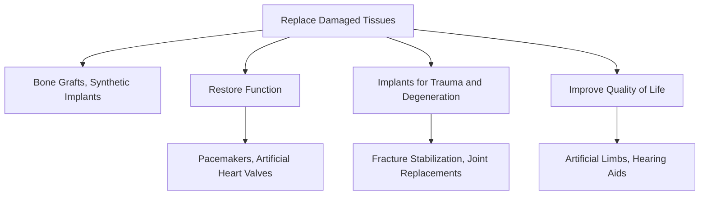
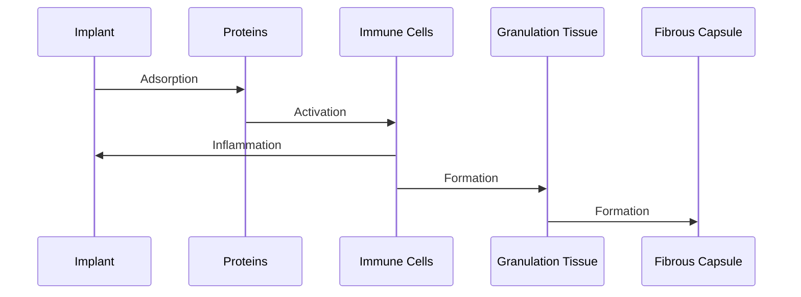
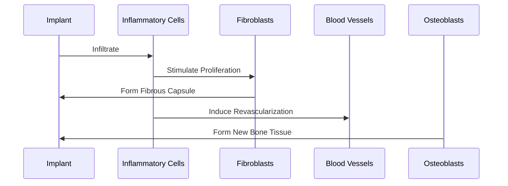

# Unit – I: Introduction of Biomaterials and Implants

*(AI-generated self study book for GTU Diploma Biomedical Engineering, subject code 4360302 — generated locally with Ollama.)*

This unit carries approximately **14 marks in the end-semester exam (7 Remember + 4 Understand + 3 Apply)**.

Learning objectives covered by this unit:
- Define Biomaterial, Implant, Biological Material, Bio compatibility.
- Classify different Biomaterial.
- Enlist the need of biomaterial.
- Explain in detail the need of biomaterial for the society.
- Describe tissue response to implants.
- Explain the concept of biocompatibility of implants with the human body.
- Give Classification for different implant.
- Explain acute and chronic inflammation.
- Enlist the infections that happen due to implants.

# Biomaterials and Implants: An Introduction

Biomaterials and implants play a critical role in modern medical technology, enabling the restoration and enhancement of human health. This chapter will explore the definitions, needs, and the interactions of biomaterials and biological materials. By the end of this chapter, you will have a clear understanding of how these materials are used and their importance in society.

## 1.1 Introduction to Biomaterial and Biological Material

### 1.1.1 Definition of Biomaterial
**Biomaterial:** A biomaterial is a substance that can perform, either alone or in conjunction with the body, a beneficial medical function. It can be a synthetic, semi-synthetic, or natural material that is designed to interact with biological systems.

### 1.1.2 Definition of Biological Material
**Biological Material:** A biological material is a naturally occurring substance that is derived from living organisms, such as bone, collagen, or blood. It is often used as a component in the development of biomaterials.

### 1.1.3 Comparison with Examples
- **Metals vs. Bone:** Metals like titanium are used in implants such as hip and knee replacements. Bone is a biological material that is naturally strong and flexible. The strength and flexibility of bone inspire the design of metal implants.
- **Polymers vs. Collagen:** Polymers like polyethylene are used in artificial joints. Collagen, a protein found in skin and bones, is a biological material that can be used in wound dressings and tissue engineering.

### 1.1.4 Safe Interaction with Living Tissue
Biomaterials must interact safely with the living tissue to ensure that they do not cause harm. For example, titanium implants are chosen for their low toxicity and ability to integrate well with bone tissue. Similarly, collagen-based materials are used in sutures because they are biocompatible and promote healing.

> **Example:** A titanium implant is used in a patient to replace a damaged hip joint. The titanium is chosen because it is biocompatible and can integrate well with the surrounding bone tissue, ensuring long-term stability and patient comfort.

## 1.2 Need of Biomaterial

### 1.2.1 Enlist the Needs of Biomaterials
- **Replace Damaged Tissues:** Biomaterials are used to replace damaged tissues that cannot heal on their own. For example, bone can be replaced using bone grafts or synthetic implants.
- **Restore Function:** Biomaterials can restore the function of organs or limbs that have been damaged. For instance, pacemakers restore the electrical function of the heart, and artificial heart valves replace malfunctioning natural valves.
- **Implants for Trauma and Degeneration:** Biomaterials are used in trauma cases to stabilize fractures and in degenerative conditions like osteoarthritis to replace worn-out joints.
- **Improve Quality of Life:** Biomaterials enhance the quality of life by providing solutions for conditions that limit daily activities. For example, artificial limbs and hearing aids improve the mobility and hearing of patients, respectively.

### 1.2.2 Flowchart for the Needs of Biomaterials

> **Example:** A patient with a severe knee injury undergoes a total knee replacement surgery. The artificial knee implant is used to replace the damaged cartilage and bone, restoring the patient's ability to walk without pain. This procedure significantly improves the patient's quality of life.

### 1.2.3 Practical Example
- **Artificial Heart Valve:** An artificial heart valve is used to replace a diseased valve that cannot open and close properly. This valve is made from biomaterials like tissue or mechanical components. The valve must be biocompatible and durable to ensure the patient's long-term health.

> **Example:** A patient with a leaky aortic valve undergoes surgery to replace it with an artificial valve. The valve is designed to mimic the natural valve's function and is made from biocompatible materials to ensure safe and effective integration with the body.

By understanding the needs and applications of biomaterials, we can appreciate their critical role in modern medical technology. In the next section, we will explore the concept of biocompatibility and its importance in the selection of biomaterials.

---

## 1.3 Classification of Biomaterial

- **Biomaterials** are materials that are used in medical devices or implants and are biocompatible with the human body. They play a crucial role in supporting the body's functions, repairing tissues, and assisting in the healing process.
- **Implants** are biomaterials that are surgically placed inside the body to replace or support a lost function.
- **Biological Material** refers to any material derived from biological sources, such as tissues, cells, or proteins.
- **Bio compatibility** is the ability of a biomaterial to perform its intended function without eliciting any adverse effects in the body.

### Classification of Biomaterial

- Biomaterials can be broadly classified into the following main groups:
  - **Metals and Alloys**
  - **Ceramics**
  - **Polymers**
  - **Composites**
  - **Natural Biomaterials**

The table below summarizes the classification of biomaterials:

| Class | Typical Examples | Biomedical Application |
|-------|------------------|-----------------------|
| Metals and Alloys | Titanium, Stainless Steel | Orthopedic implants, dental implants |
| Ceramics | Zirconia, Calcium Phosphate | Dental implants, bone grafts |
| Polymers | Polyethylene, Polyurethane | Artificial joints, vascular grafts |
| Composites | Glass Ionomer, Carbon Fiber | Composite bone grafts, bone plates |
| Natural Biomaterials | Collagen, Chitosan | Tissue engineering, wound dressings |

### Flowchart for Classification of Biomaterials

### Example

> **Example:** Titanium is a commonly used metal in orthopedic implants because of its excellent biocompatibility and strength. It is often used in hip and knee replacements. The mechanical properties of titanium, such as its high strength-to-weight ratio, make it suitable for load-bearing applications.

## 1.3.1 Metals and Alloys

- **Metals and Alloys** are materials that are often used in orthopedic and dental applications due to their strength and biocompatibility.
- **Titanium** is a highly biocompatible metal that is commonly used in orthopedic implants. It is used in hip and knee replacements due to its strength and resistance to corrosion.
- **Stainless Steel** is another commonly used metal in medical applications. It is used in surgical instruments and some types of implants due to its strength and resistance to corrosion.

### Example

> **Example:** A patient needs a hip replacement. The doctor decides to use a titanium implant because of its biocompatibility and strength. The titanium implant will support the patient's new hip joint and allow for normal movement.

## 1.3.2 Ceramics

- **Ceramics** are inorganic, non-metallic materials that are used in medical applications due to their biocompatibility and strength.
- **Zirconia** is a ceramic material that is used in dental implants and bone grafts. It is known for its high strength and ability to bond with bone.
- **Calcium Phosphate** is another ceramic material that is used in bone grafts and orthopedic implants. It is biocompatible and can be used to replace missing bone tissue.

### Example

> **Example:** A patient needs a bone graft to repair a fracture. The doctor decides to use a calcium phosphate implant because of its ability to bond with the patient's bone tissue. The calcium phosphate implant will help the bone tissue regenerate and heal.

## 1.3.3 Polymers

- **Polymers** are synthetic materials that are used in medical applications due to their flexibility and biocompatibility.
- **Polyethylene** is a polymer that is commonly used in artificial joints, such as hip and knee replacements. It is used as a liner in the joint to reduce friction and wear.
- **Polyurethane** is another polymer that is used in medical applications. It is used in vascular grafts and tissue engineering due to its biocompatibility and flexibility.

### Example

> **Example:** A patient needs a knee replacement. The doctor decides to use a polyethylene liner in the knee implant because of its ability to reduce friction and wear. The polyethylene liner will help the knee joint function smoothly and reduce pain.

## 1.3.4 Composites

- **Composites** are materials that are made by combining two or more different materials to enhance their properties.
- **Glass Ionomer** is a composite material that is used in dental applications. It is used in filling cavities and as a liner in root canals due to its ability to bond with tooth tissue.
- **Carbon Fiber** is another composite material that is used in orthopedic implants. It is used in bone plates and rods due to its high strength and flexibility.

### Example

> **Example:** A patient needs a bone plate to support a fractured bone. The doctor decides to use a carbon fiber plate because of its high strength and flexibility. The carbon fiber plate will help the bone heal and reduce the risk of infection.

## 1.3.5 Natural Biomaterials

- **Natural Biomaterials** are materials derived from biological sources, such as tissues, cells, or proteins.
- **Collagen** is a natural biomaterial that is used in tissue engineering and wound dressings. It is derived from animal tissues and is used to promote tissue regeneration.
- **Chitosan** is another natural biomaterial that is used in wound dressings and tissue engineering. It is derived from the exoskeleton of crustaceans and is used to promote the healing of wounds.

### Example

> **Example:** A patient needs a wound dressing to treat a chronic wound. The doctor decides to use a chitosan dressing because of its ability to promote the healing of wounds. The chitosan dressing will help the wound heal and reduce the risk of infection.

By understanding the classification and properties of biomaterials, students can better select appropriate materials for medical applications. This knowledge is crucial for ensuring the safety and effectiveness of medical devices and implants.

---

## 1.4 Introduction to Implant

- **Implant:** An implant is a medical device that is surgically inserted into the body to replace a damaged or diseased part. It is designed to be integrated with the body tissues over a longer period and often remains in the body permanently.
- **Biomaterial:** A biomaterial is any substance that is used in the contact with biological systems for a medical purpose. Biomaterials can be used to create implants, but they are not necessarily implants. For example, a biomaterial could be a tissue-engineered scaffold that does not remain permanently in the body.

### Common Examples of Implants

- **Bone Plates:** Used to stabilize and align fractures and broken bones.
- **Sutures:** Used to close wounds and surgical incisions.
- **Joint Replacements (e.g., Hip and Knee):** Replaces damaged joints with artificial joints to relieve pain and restore function.
- **Pacemakers:** Used to regulate the heartbeat in individuals with arrhythmias.
- **Cardiac Valves:** Replaces damaged heart valves to improve heart function.
- **Dental Implants:** Used to replace missing teeth by anchoring artificial teeth into the jawbone.

> **Example:** A patient with a fractured femur may require a bone plate to stabilize the bone while it heals. The bone plate is an implant because it is surgically inserted and is expected to remain in the body for a long time.

## 1.4.1 Classification of Implant

- **Viewpoints for Classification:**
  - **Permanent vs Temporary:** Permanent implants are designed to remain in the body for a long time, whereas temporary implants are used for short-term treatment and are removed after their purpose is fulfilled.
  - **Internal vs External:** Internal implants are placed inside the body, while external implants are placed on the body’s surface.
  - **Functional vs Non-functional:** Functional implants have a specific function such as providing support or regulating a bodily function, whereas non-functional implants are used for cosmetic or prosthetic purposes.
  - **By Tissue/Organ Site:** Implants can be classified based on the tissue or organ they interact with, such as bone implants, cardiovascular implants, or dental implants.

### Flowchart TD

> **Example:** A pacemaker is a functional internal implant used to regulate the heartbeat. It is a permanent implant because it is surgically inserted and remains in the body for a long time.

This flowchart helps to visualize the different classifications of implants based on various viewpoints. Each node represents a specific type of implant and its classification.

---

## 1.5 Tissue Response to Implants

### 1.5.1 Biocompatibility

> **Example:** Biocompatibility refers to the ability of a biomaterial to perform its intended function without eliciting any harmful biological response. An implant is considered biocompatible if it does not cause rejection, toxicity, or adverse tissue reactions in the host body. The host response to an implant involves the body's immune system, which can either be beneficial or harmful depending on the implant's properties.

### 1.5.2 Tissue Response Sequence

The tissue and tissue-fluid reactions to an implanted biomaterial can be described in a sequence as follows:

- **Protein Adsorption**: When an implant is placed, proteins from the surrounding fluids adsorb onto the implant surface. This adsorption is a crucial step in the initial interaction between the biomaterial and the body.
- **Acute Inflammatory Response**: Following protein adsorption, the immune system responds, causing an acute inflammatory response. This involves the release of cytokines and the infiltration of various immune cells, such as neutrophils and macrophages.
- **Chronic Inflammation**: If the acute inflammatory response is not resolved, it can lead to chronic inflammation. This is characterized by the long-term presence of inflammatory cells and the formation of a fibrous capsule around the implant.
- **Granulation Tissue**: Granulation tissue is formed during the healing process, consisting of newly formed blood vessels and fibroblasts. This tissue helps in tissue repair and regeneration.
- **Fibrous Capsule**: Over time, a fibrous capsule forms around the implant. This capsule helps to separate the implant from the surrounding tissue and can limit the interaction between the implant and the host body.

### 1.5.3 Biocompatibility (Continued)

> **Example:** An implant is biocompatible if it does not cause any adverse reactions. For instance, a titanium implant is biocompatible because it does not cause tissue rejection or toxicity. The implant should integrate well with the surrounding tissue, forming a stable interface that minimizes immune response.

### 1.5.4 Inflammation and Infection

#### Acute Inflammation

- **Causes**: Acute inflammation can be caused by the initial interaction of the implant with the surrounding tissues, leading to the release of pro-inflammatory cytokines.
- **Cells Involved**: Neutrophils and macrophages are the primary cells involved in the acute inflammatory response.
- **Characteristics**: This response is typically short-term and is characterized by redness, swelling, and pain.
- **Timeline**: The acute inflammatory response usually occurs within the first few hours to days after implantation.

#### Chronic Inflammation

- **Causes**: Chronic inflammation can occur if the acute inflammatory response is not resolved, leading to the long-term presence of immune cells and the formation of a fibrous capsule.
- **Cells Involved**: Chronic inflammation involves a prolonged presence of macrophages, fibroblasts, and other immune cells.
- **Characteristics**: Chronic inflammation is characterized by tissue remodeling and the formation of a fibrous capsule, which can limit the interaction between the implant and the host body.
- **Timeline**: The chronic inflammatory response can last for weeks to months after implantation.

#### Infections

- **Surgical Infection**: This occurs immediately after the surgery, often due to bacterial contamination.
- **Biofilm Formation on Devices**: Biofilms are communities of microorganisms that adhere to a surface and produce a protective extracellular matrix. They can form on implants, leading to persistent infections.
- **Pacemaker Infections**: Pacemakers can develop infections, especially if they are exposed to bacteria during surgery or due to poor hygiene.
- **Dental Implants Infections**: Dental implants can also develop infections, particularly if there is poor oral hygiene or if the implant is not properly cleaned.
- **Orthopaedic Implants Infections**: Orthopaedic implants, such as hip and knee replacements, can also develop infections, often due to bacteria entering the bloodstream during surgery.

> **Example:** A patient had a dental implant placed. After two weeks, the patient experienced pain, swelling, and fever. The dentist suspected an infection and performed a biopsy. The biopsy results showed the presence of bacteria, confirming a biofilm infection. The patient was prescribed antibiotics and the implant was cleaned thoroughly to prevent further infection.

By understanding the sequence of tissue responses and the concept of biocompatibility, engineers can design implants that are more likely to integrate well with the human body, reducing the risk of adverse reactions and infections.

---

## Solved Examples

### Example 1: Classify Biomaterials
> **Example:** Classify the following biomaterials into categories: titanium alloy, hydroxyapatite, polyethylene, and polyurethane.

- **Solution:**
  - **Metal:** Titanium alloy
  - **Ceramic:** Hydroxyapatite
  - **Polymer:** Polyethylene, Polyurethane

### Example 2: Explain Tissue Response to Implants
> **Example:** Explain the sequence of tissue response to an implant.

- **Solution:**
  1. **Invasion by Inflammatory Cells:** The first response is the infiltration of inflammatory cells such as neutrophils and macrophages.
  2. **Proliferation of Fibroblasts and Connective Tissue:** Fibroblasts start to proliferate and form a fibrous capsule around the implant.
  3. **Revascularization:** New blood vessels grow into the implant site to supply nutrients and oxygen.
  4. **Osteoblastic Activity:** Osteoblasts start to form new bone tissue, leading to integration of the implant.

### Example 3: Define and Contrast Biocompatibility Terms
> **Example:** Define and contrast biocompatibility and bioinertness.

- **Solution:**
  - **Biocompatibility:** The ability of a biomaterial to perform its intended function without causing any harmful effects to the surrounding biological system.
  - **Bioinertness:** The characteristic of a biomaterial to be non-reactive and not inducing any significant immune response or tissue response.

- **Comparison:**
  - Biocompatibility allows for some level of interaction, whereas bioinertness implies minimal interaction.

## Unit-End Questions (GTU exam style)

- (3) Define biomaterial.
- (3) Define implant.
- (3) Define biological material.
- (3) Define bio compatibility.
- (4) Classify the following biomaterials into categories: titanium alloy, hydroxyapatite, polyethylene, and polyurethane.
- (7) Explain the sequence of tissue response to an implant.
- (7) Explain the concept of biocompatibility of implants with the human body.
- (3) Define acute inflammation.
- (3) Define chronic inflammation.
- (4) Enlist the infections that happen due to implants.

## Summary

- Biomaterial: A material that is used in or for a medical device or implant.
- Implant: A medical device that is surgically inserted into the body to replace or support a biological structure.
- Biological Material: Any organic or biological material used in medical applications.
- Bio Compatibility: The ability of a biomaterial to interact with biological tissues without causing any adverse effects.
- Biomaterial Classification: Materials can be classified into metals, ceramics, polymers, and composites.
- Tissue Response to Implants: Involves stages such as inflammatory response, fibrous capsule formation, revascularization, and osteoblastic activity.
- Biocompatibility: Involves the material's interaction with the biological system.
- Acute Inflammation: Immediate, short-term inflammatory response.
- Chronic Inflammation: Long-term inflammatory response.
- Infections Due to Implants: Can include bacterial infections, fungal infections, and biofilm formation.

## Key Terms

- **Biomaterial:** A material used in or for a medical device or implant.
- **Implant:** A medical device surgically inserted into the body.
- **Biological Material:** Any organic or biological material used in medical applications.
- **Bio Compatibility:** The ability of a biomaterial to interact with biological tissues without causing adverse effects.
- **Inflammatory Response:** The body's reaction to a foreign material.
- **Fibrous Capsule:** A layer of fibrous tissue that forms around an implant.
- **Acute Inflammation:** Immediate, short-term inflammatory response.
- **Chronic Inflammation:** Long-term inflammatory response.
