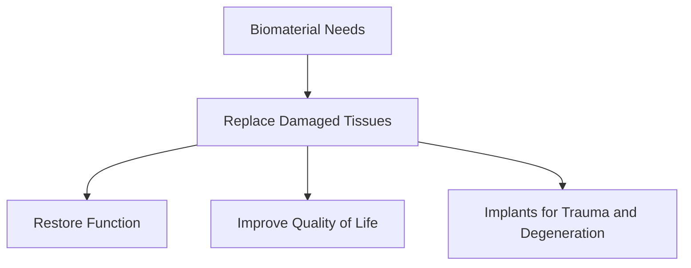
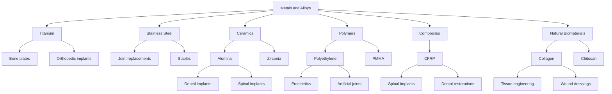
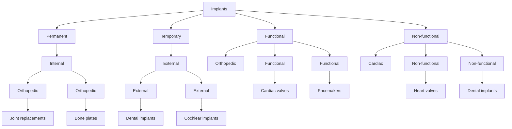

# Unit – I: Introduction of Biomaterials and Implants

*(AI-generated self study book for GTU Diploma Biomedical Engineering, subject code 4360302 — generated locally with Ollama.)*

This unit carries approximately **14 marks in the end-semester exam (7 Remember + 4 Understand + 3 Apply)**.

Learning objectives covered by this unit:
- Define Biomaterial, Implant, Biological Material, Bio compatibility.
- Classify different Biomaterial.
- Enlist the need of biomaterial.
- Explain in detail the need of biomaterial for the society.
- Describe tissue response to implants.
- Explain the concept of biocompatibility of implants with the human body.
- Give Classification for different implant.
- Explain acute and chronic inflammation.
- Enlist the infections that happen due to implants.

# Chapter 1: Biomaterials and Biomaterial Applications

## 1.1 Introduction to Biomaterial and Biological Material

### Definition of Biomaterial

**Biomaterial** is a substance that is used and tolerated by biological systems. It can be a synthetic or natural material and is often used in medical applications to replace or repair damaged tissues. Biomaterials can be used for a wide range of applications, from implants to drug delivery systems.

### Definition of Biological Material

**Biological material** refers to natural substances that are derived from living organisms. These materials are often used in biomaterials due to their biocompatibility and natural structure. Examples of biological materials include collagen, chitosan, and silk.

### Comparison of Biomaterials and Biological Materials

- **Metals vs. Bone:** Metals like titanium are used in implants due to their strength and biocompatibility. Bone, on the other hand, is a natural biological material that can be used for grafting or bioengineering.
  
- **Polymers vs. Collagen:** Polymers such as polyethylene and polypropylene are commonly used in prosthetic joints. Collagen, a protein found in connective tissues, is used in sutures and other medical applications due to its natural biocompatibility.

### Safe Interaction with Living Tissue

A biomaterial must interact safely with living tissue to ensure that it does not cause harm or trigger an immune response. This interaction can include mechanical properties, chemical stability, and biocompatibility. For example, a dental implant must be biocompatible to avoid causing inflammation or infection in the surrounding bone tissue.

> **Example:** A titanium dental implant is chosen because it has excellent biocompatibility and can integrate well with the bone tissue, promoting healing and stability.

## 1.2 Need of Biomaterial

### Enlisting the Needs of Biomaterials for Society

Biomaterials play a crucial role in enhancing the quality of life and restoring functionality in various medical conditions. Here are some key needs of biomaterials for society:

- **Replacing Damaged Tissues:** Biomaterials can replace tissues that have been damaged due to injury, disease, or congenital defects. For example, a patient with a damaged heart valve can receive a prosthetic valve made from biomaterials.
  
- **Restoring Function:** Biomaterials can restore lost functionality. For instance, a patient with a torn rotator cuff can benefit from an implant made from biomaterials that can support the healing process and restore shoulder function.
  
- **Implants for Trauma and Degeneration:** Biomaterials are used in trauma surgery to repair broken bones using plates and screws. They are also used in degenerative conditions like arthritis to replace joints with artificial ones.
  
- **Improving Quality of Life:** Biomaterials can enhance the quality of life by providing solutions for chronic conditions. For example, pacemakers and artificial heart valves improve the life expectancy and quality of life for patients with heart conditions.

### Flowchart of Biomaterial Needs

### Worked Example

> **Example:** A patient requires a heart valve replacement due to a congenital defect. The doctor decides to use a biomaterial-based valve because it is biocompatible and can integrate well with the patient's existing heart tissue, ensuring long-term functionality and reducing the risk of complications.

This example illustrates how biomaterials are chosen based on their biocompatibility and ability to integrate with the patient's body, thereby improving the patient's quality of life.

---

## 1.3 Classification of Biomaterial

### Introduction
Biomaterials are materials that interact with biological systems for a medical or surgical purpose. They are used in a wide range of applications such as implants, prosthetics, and tissue engineering. Biomaterials can be broadly classified into several main groups based on their composition and properties.

### Classification of Biomaterials
- **Metals and Alloys**: These are materials that are typically used for their mechanical strength and biocompatibility.
- **Ceramics**: These materials are known for their hardness and wear resistance.
- **Polymers**: These materials are versatile and can be processed easily.
- **Composites**: These materials are made by combining two or more different materials to achieve specific properties.
- **Natural Biomaterials**: These are derived from biological sources and are often biodegradable.

#### Table: Classification of Biomaterials
| Class           | Typical Examples                 | Biomedical Application                      |
|-----------------|---------------------------------|--------------------------------------------|
| Metals and Alloys | Titanium, Stainless Steel        | Bone plates, orthopedic implants            |
| Ceramics         | Alumina, Zirconia                | Dental implants, spinal implants            |
| Polymers         | Polyethylene, Polymethyl Methacrylate (PMMA) | Prosthetics, artificial joints              |
| Composites       | Carbon Fiber Reinforced Polymer (CFRP) | Spinal implants, dental restorations       |
| Natural Biomaterials | Collagen, Chitosan              | Tissue engineering, wound dressings         |

### Flowchart: Classification of Biomaterials

### Example
> **Example:** A common application of titanium in the medical field is as a bone plate used in orthopedic surgeries. Titanium is chosen for its biocompatibility and ability to integrate well with bone tissue. This material is used to stabilize broken bones and promote healing. The mechanical properties of titanium make it suitable for applications requiring high strength and corrosion resistance.

> **Example:** Dental implants are often made from zirconia due to its biocompatibility and strength. Zirconia is used in single-tooth implants, dental bridges, and full-arch solutions. Its high hardness and wear resistance make it ideal for long-term use in the mouth.

## 1.4 Biomaterials and Their Applications

### Introduction
Biomaterials are used in a variety of medical applications to replace or repair damaged tissues, organs, or other parts of the body. The choice of biomaterial depends on the specific needs of the application.

### Example
> **Example:** Polymethyl methacrylate (PMMA) is used in artificial joint replacements, such as hip and knee replacements. Its biocompatibility and ease of processing make it a popular choice. The material is typically used in the form of a cement that is injected into the joint space to provide a stable and durable replacement.

### Example
> **Example:** Composites, such as carbon fiber reinforced polymers (CFRP), are used in spinal implants. These materials are chosen for their high strength and low weight, making them suitable for minimally invasive surgeries. The use of composites in spinal implants helps in maintaining the structural integrity of the spine while providing a stable environment for bone healing.

### Example
> **Example:** Natural biomaterials, such as collagen, are used in tissue engineering. Collagen is derived from animal tissues and is biocompatible and biodegradable. It is used to create scaffolds for tissue regeneration, which can be implanted into the body to support the growth of new tissue. Collagen can also be used in wound dressings to promote healing.

### Conclusion
Understanding the classification and applications of biomaterials is crucial for selecting the appropriate material for specific medical applications. The choice of biomaterial depends on factors such as biocompatibility, mechanical properties, and the specific requirements of the application.

---

## 1.4 Introduction to Implant

- **Implant:** An implant is a device or material that is surgically inserted into the human body to replace, support, or enhance the function of a damaged or diseased part. Implants are designed to be durable and to integrate with the body's tissues over time. They can be temporary or permanent, depending on the requirement and the nature of the application.

- **Biomaterial:** A biomaterial is any material that is used and expected to interact with biological systems for a medical purpose. Biomaterials can be used in implants, but not all biomaterials are implants. For instance, a biomaterial like collagen is used in wound dressings but is not considered an implant because it does not permanently replace or support a body part.

### Common Implants

- **Bone Plates:** Used in orthopedic surgeries to stabilize bones during healing. They are typically made of titanium or other biocompatible metals.
- **Sutures:** Used to close wounds and promote healing. They can be made of synthetic materials or natural fibers like silk.
- **Joint Replacements:** Used to replace damaged or diseased joints, such as knees or hips. Common materials include ceramic, metal, and polyethylene.
- **Pacemakers:** Electronic devices that regulate the heart's rhythm. They are internal implants.
- **Cardiac Valves:** Used to replace diseased heart valves. They can be biological (derived from animal or human tissue) or mechanical.
- **Dental Implants:** Used to replace missing teeth. They consist of a titanium post that fuses with the jawbone and a crown that replaces the visible part of the tooth.

## 1.4.1 Classification of Implant

- **Permanent vs Temporary:** 
  - Permanent implants, such as hip replacements, are designed to last a lifetime.
  - Temporary implants, like catheters or bandages, are used for a short duration.

- **Internal vs External:**
  - Internal implants, such as pacemakers, are fully enclosed within the body.
  - External implants, like certain types of prosthetics, are outside the body but interact with it.

- **Functional vs Non-functional:**
  - Functional implants, such as pacemakers, perform a specific function within the body.
  - Non-functional implants, like dental implants, provide structural support.

- **By Tissue/Organ Site:**
  - Orthopedic implants (e.g., bone plates, joint replacements) are used in the musculoskeletal system.
  - Cardiac implants (e.g., pacemakers, cardiac valves) are used in the cardiovascular system.
  - Neurological implants (e.g., cochlear implants) are used in the nervous system.

### Flowchart Classification of Implants

### Example

> **Example:** 
- **Orthopedic Implant:** A titanium bone plate is used to stabilize a broken femur. It is a permanent, internal, functional implant used in the musculoskeletal system.
- **Cardiac Implant:** A mechanical valve is used to replace a damaged aortic valve. It is a permanent, internal, functional implant used in the cardiovascular system.
- **External Implant:** A prosthetic limb is an external implant used to provide mobility to a person who has lost a limb. It is a non-functional implant used in the musculoskeletal system.

This example helps to understand the different classifications of implants and their applications.

---

## 1.5 Tissue Response to Implants

### 1.5.1 Biocompatibility
Biocompatibility refers to the ability of a biomaterial or implant to perform its intended function without causing any adverse reactions in the body. An implant is considered biocompatible if it does not trigger a rejection response, does not cause toxicity, and does not induce any adverse tissue reactions. The host response is a crucial factor in determining the biocompatibility of an implant. The host response includes the immune system's reaction to the foreign body, which can vary from a mild response with no adverse effects to a severe response that can lead to implant failure.

### 1.5.2 Inflammation and Infection

#### Acute and Chronic Inflammation
Acute and chronic inflammation are two distinct phases of the body's immune response to an implant. These phases are characterized by different cellular and molecular responses.

**Acute Inflammation:**
- **Causes:** Acute inflammation occurs due to the initial mechanical injury caused by the implant, followed by the release of inflammatory mediators.
- **Cells Involved:** Neutrophils, macrophages, and other immune cells are the primary responders.
- **Characteristics:** The site of implantation becomes red, swollen, warm, and painful. This phase typically lasts for 1-2 days.
- **Timeline:** Acute inflammation starts immediately after implantation and lasts for a few days.

**Chronic Inflammation:**
- **Causes:** Chronic inflammation is triggered by persistent local irritation or infection. It can also occur due to the presence of biofilms on the implant surface.
- **Cells Involved:** Monocytes, macrophages, and lymphocytes are involved in chronic inflammation.
- **Characteristics:** The site of implantation becomes chronically inflamed, with thickened blood vessels, increased fibroblast activity, and collagen deposition. This phase can last for weeks to months.
- **Timeline:** Chronic inflammation starts after the acute phase and can persist for an extended period.

#### Infections Due to Implants
Infections are a significant concern in the field of implantology. Several types of infections can occur due to implants, including surgical infections, biofilm formation, and infections of specific implants like pacemakers, dental implants, and orthopaedic implants.

**Surgical Infections:**
- Surgical infections occur during or after the implantation procedure. They are caused by bacteria that enter the surgical site during the operation.
- **Example:** A patient undergoes a hip replacement surgery. Post-surgery, the patient develops fever, pain, and redness around the surgical site. This is indicative of a surgical infection.

**Biofilm Formation:**
- Biofilms are complex communities of microorganisms that adhere to surfaces and produce a protective extracellular matrix. They can form on implant surfaces and contribute to chronic infections.
- **Example:** A patient with a dental implant develops a chronic infection due to the formation of a biofilm. The patient experiences persistent pain and swelling around the implant site.

**Pacemaker/Implantable Device Infections:**
- Pacemaker infections are rare but can be severe. They are typically caused by bacteria that enter the bloodstream during the implantation procedure.
- **Example:** A patient with a pacemaker experiences sudden onset of fever and chest pain. A clinical examination reveals signs of infection around the pacemaker site.

**Dental Implant Infections:**
- Dental implant infections can occur due to poor dental hygiene or the presence of bacteria in the oral cavity.
- **Example:** A patient with a dental implant develops a localized infection around the implant. The patient reports increased pain and swelling. A dental examination confirms the presence of a dental implant infection.

**Orthopaedic Implant Infections:**
- Orthopaedic implants, such as hip and knee replacements, can also be sites for infections.
- **Example:** A patient with a knee replacement experiences increasing pain and swelling. A clinical examination and imaging studies reveal signs of an orthopaedic implant infection.

### Flowchart for Tissue Response Timeline

### Example
> **Example:** A patient undergoes a hip replacement surgery. Post-surgery, the patient experiences increasing pain and swelling around the surgical site. The patient also develops a fever. A clinical examination and imaging studies reveal signs of acute inflammation and an infection. The patient is prescribed antibiotics and the surgical site is closely monitored for signs of improvement.

In summary, the tissue response to implants involves a sequence of events starting with protein adsorption, followed by acute and chronic inflammation, granulation tissue formation, and the eventual development of a fibrous capsule. Understanding these processes is crucial for selecting appropriate biomaterials and implants that can minimize adverse reactions and infections.

---

## Solved Examples

### Example 1: Classify Biomaterials
> **Example:** Classify the following biomaterials into categories: Tantalum, Polycaprolactone, Polyethylene, Hydroxyapatite, Carbon Fiber, and Silicone.

1. **Metal:** Tantalum
2. **Biodegradable Polymer:** Polycaprolactone, Polyethylene
3. **Ceramic:** Hydroxyapatite
4. **Composite:** Carbon Fiber
5. **Synthetic Rubber:** Silicone

### Example 2: Explain Tissue Response to Implants
> **Example:** Explain the sequence of tissue response to an implant, starting from initial contact until stabilization.

1. **Inflammation:** The initial response involves the release of cytokines, chemokines, and other inflammatory mediators. This leads to the recruitment of immune cells such as macrophages and neutrophils.
2. **Proliferation:** Over time, fibroblasts and endothelial cells begin to proliferate, forming a fibrous capsule around the implant.
3. **Remodeling:** The final stage involves the reorganization of the tissue around the implant, leading to a stable state where the implant is well integrated.

### Example 3: Define and Contrast Biocompatibility and Bioinertness
> **Example:** Define and contrast the terms **biocompatibility** and **bioinertness**.

- **Biocompatibility:** The ability of a material to perform with an appropriate host response in a specific application without eliciting harmful systemic, sub-systemic, or local adverse effects.
- **Bioinertness:** The property of a material to have minimal interaction with the biological environment, resulting in no adverse reactions or changes in the material over time.

## Unit-End Questions (GTU exam style)

- (3) Define biomaterial.
- (3) Classify the following biomaterials: Titanium, Polyethylene, Hydroxyapatite, Silk Fibroin, and Silicone.
- (3) Explain the concept of biocompatibility of implants with the human body.
- (3) Enlist the need of biomaterial in biomedical engineering.
- (4) Explain the need of biomaterial for the society with specific examples.
- (7) Describe the tissue response sequence to an implant, starting from initial contact until stabilization.

## Summary

- **Biomaterial:** A material that is used in biological systems or a medical device that interfaces with biological tissues.
- **Implant:** A medical device that is surgically inserted into the body to replace or support a bodily function.
- **Biological Material:** Any material that is derived from biological sources, such as bone, cartilage, or collagen.
- **Bioinertness:** The property of a material to have minimal interaction with the biological environment.
- **Biocompatibility:** The ability of a material to perform with an appropriate host response in a specific application without eliciting harmful systemic, sub-systemic, or local adverse effects.
- **Acute Inflammation:** A rapid, short-term immune response to an injury or foreign material.
- **Chronic Inflammation:** A long-term inflammatory response that can lead to tissue damage if not properly managed.
- **Infections Due to Implants:** Microbial infections that can occur due to the presence of an implant, leading to complications such as sepsis or septic arthritis.

## Key Terms

- **Biomaterial** – A material used in biological systems or medical devices that interfaces with biological tissues.
- **Implant** – A medical device surgically inserted into the body to replace or support a bodily function.
- **Biological Material** – Any material derived from biological sources, such as bone, cartilage, or collagen.
- **Bioinertness** – The property of a material to have minimal interaction with the biological environment.
- **Biocompatibility** – The ability of a material to perform with an appropriate host response in a specific application without eliciting harmful effects.
- **Acute Inflammation** – A rapid, short-term immune response to an injury or foreign material.
- **Chronic Inflammation** – A long-term inflammatory response that can lead to tissue damage.
- **Infections Due to Implants** – Microbial infections that can occur due to the presence of an implant, leading to complications such as sepsis or septic arthritis.
