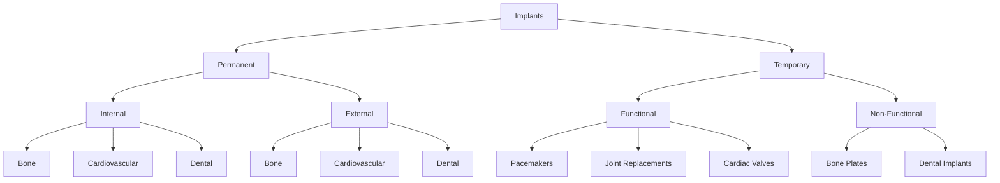

# Unit – I: Introduction of Biomaterials and Implants

*(AI-generated self study book for GTU Diploma Biomedical Engineering, subject code 4360302 — generated locally with Ollama.)*

This unit carries approximately **14 marks in the end-semester exam (7 Remember + 4 Understand + 3 Apply)**.

Learning objectives covered by this unit:
- Define Biomaterial, Implant, Biological Material, Bio compatibility.
- Classify different Biomaterial.
- Enlist the need of biomaterial.
- Explain in detail the need of biomaterial for the society.
- Describe tissue response to implants.
- Explain the concept of biocompatibility of implants with the human body.
- Give Classification for different implant.
- Explain acute and chronic inflammation.
- Enlist the infections that happen due to implants.

# Biomaterials in Biomedical Engineering

Biomedical engineering is a field that combines principles of engineering with biological and medical sciences to develop materials and devices that interact with living systems for medical purposes. In this chapter, we will delve into the basics of biomaterials and their importance in biomedical applications. We will define key terms and explore the various needs and applications of biomaterials.

## 1.1 Introduction to Biomaterial and Biological Material

### **Biomaterials**
A **biomaterial** is a non-living material that is used in a medical device or clinical application and interacts with living tissue. Biomaterials are designed to support, enhance, or replace a function of the human body, either temporarily or permanently. They can be made from synthetic or natural substances, or a combination of both.

### **Biological (Natural) Material**
A **biological (natural) material** is an organic substance derived from living organisms. Examples include collagen, which is found in connective tissues and skin, and chitin, which is found in the exoskeletons of crustaceans. Natural materials are often preferred for their biocompatibility and ability to integrate with the human body.

### **Comparison with Examples**
- **Metals vs Bone**: Metals like titanium and stainless steel are used in implants due to their strength and durability. However, they are not as biocompatible as natural bone. For instance, titanium is used in hip replacements, but the bone around it may not fully integrate with the metal, leading to complications.
- **Polymers vs Collagen**: Polymers like polyethylene are used in artificial joints. They are strong and can withstand the mechanical stresses of the joint. Collagen, on the other hand, is a natural protein found in connective tissues. It is biocompatible and can integrate well with the body, but its durability is lower compared to synthetic polymers.

### **Safe Interaction with Living Tissue**
A biomaterial must interact safely with living tissue to ensure that the body does not reject it. This involves several factors:
- **Biocompatibility**: The material should not cause any adverse reactions in the body.
- **Mechanical Properties**: The material should have the necessary strength and flexibility to perform its intended function.
- **Degradability**: The material should be designed to degrade in a controlled manner, either completely or partially, without causing harm to the body.

> **Example:** A titanium implant is used in a patient's knee. The implant is designed to provide long-term support and replace the damaged knee joint. However, the body's immune response to the titanium might cause a thin layer of scar tissue to form around it, which can affect the mobility of the knee.

## 1.2 Need of Biomaterial

### **Enlisting the Needs of Biomaterials for Society**

Biomaterials play a crucial role in enhancing the quality of life and treating various medical conditions. Here are some of the key needs and applications of biomaterials:

1. **Replacement of Damaged Tissues**: Biomaterials can be used to replace damaged tissues that cannot be repaired by the body. For example, bone plates and screws are used to stabilize fractures and promote bone healing.
2. **Restoration of Function**: Implants such as pacemakers and artificial heart valves help restore the function of organs that have failed. Pacemakers regulate the heartbeat, while artificial heart valves replace defective ones to ensure proper blood flow.
3. **Treatment of Trauma and Degeneration**: Biomaterials are used in trauma care to provide support and stability to injured tissues. For instance, sutures are used to close wounds, while joint replacements help patients regain mobility after joint degeneration.
4. **Improvement of Quality of Life**: Biomaterials can significantly improve the quality of life for individuals suffering from chronic conditions. For example, blood tubes are used to administer medications and treatments, enhancing the patient's overall health.

### **Flowchart Showing the Needs of Biomaterial for Society**


### **Worked Example**

> **Example:** A patient with a damaged knee joint is recommended a total knee replacement. The surgeon chooses a biomaterial implant made of a combination of metal and ceramic. The metal provides strength and stability, while the ceramic ensures a smooth surface for the joint to glide. The patient recovers well and regains significant mobility, improving their quality of life.

By understanding the needs and applications of biomaterials, we can appreciate their importance in enhancing the health and well-being of individuals. In the next section, we will delve deeper into the concept of biocompatibility and the tissue response to implants.

---

## 1.3 Classification of Biomaterial

### Introduction to Biomaterial Classification
Biomaterials are materials that are used in the human body, either alone or as part of a system, to replace or support the functions of a damaged or missing body part. They are selected based on their biocompatibility, mechanical properties, and other factors. Biomaterials can be classified into several main groups based on their chemical composition and physical properties.

### Main Groups of Biomaterials

#### 1. Metals and Alloys
Metals and their alloys are commonly used in biomedical applications due to their mechanical strength and biocompatibility.

- **What it is:** Metals and alloys are materials that are typically used in load-bearing applications.
- **Typical Examples:** Stainless steel, titanium, cobalt-chromium alloys.
- **Biomedical Application:** Used in orthopedic implants like hip and knee replacements, dental implants, and orthodontic wires.

> **Example:** Stainless steel is used in surgical instruments and orthopedic implants because it is strong, durable, and corrosion-resistant.

#### 2. Ceramics
Ceramics are brittle materials that are highly biocompatible and are often used in applications requiring high strength and wear resistance.

- **What it is:** Ceramics are inorganic, non-metallic materials that are typically used in load-bearing applications.
- **Typical Examples:** Alumina (Al₂O₃), zirconia (ZrO₂).
- **Biomedical Application:** Used in dental implants, bone cement, and orthopedic implants like hip prostheses.

> **Example:** Alumina ceramics are used in hip prostheses because they provide high wear resistance and biocompatibility.

#### 3. Polymers
Polymers are organic materials that can be shaped into a variety of forms and are used in applications requiring flexibility and biocompatibility.

- **What it is:** Polymers are long-chain molecules that are used in applications requiring flexibility and biocompatibility.
- **Typical Examples:** Polyethylene (PE), polycarbonate (PC), polyurethane (PU).
- **Biomedical Application:** Used in orthopedic implants, vascular grafts, and surgical sutures.

> **Example:** Polyethylene is used in the acetabular cup of hip prostheses because it provides low wear and is biocompatible.

#### 4. Composites
Composites are materials made from two or more different materials, combining the desirable properties of each component.

- **What it is:** Composites are materials made from two or more different materials.
- **Typical Examples:** Carbon fiber-reinforced polymers, glass fiber-reinforced ceramics.
- **Biomedical Application:** Used in bone plates, dental implants, and orthopedic implants.

> **Example:** Carbon fiber-reinforced polymers are used in bone plates because they provide high strength and flexibility.

#### 5. Natural Biomaterials
Natural biomaterials are materials derived from biological sources, often used in applications requiring biocompatibility and bioactivity.

- **What it is:** Natural biomaterials are derived from biological sources.
- **Typical Examples:** Collagen, chitosan, silk.
- **Biomedical Application:** Used in tissue engineering, wound healing, and drug delivery systems.

> **Example:** Collagen is used in tissue engineering scaffolds because it promotes cell adhesion and tissue growth.

### Mermaid Diagram for Biomaterial Classification

```mermaid
flowchart TD
    A[Biomaterials] --> B[Metals and Alloys]
    B --> C[Stainless steel]
    B --> D[Titanium]
    B --> E[Cobalt-chromium alloys]
    A --> F[Ceramics]
    F --> G[Alumina (Al₂O₃)]
    F --> H[Zirconia (ZrO₂)]
    A --> I[Polymers]
    I --> J[Polyethylene (PE)]
    I --> K[Polycarbonate (PC)]
    I --> L[Polyurethane (PU)]
    A --> M[Composites]
    M --> N[Carbon fiber-reinforced polymers]
    M --> O[Glass fiber-reinforced ceramics]
    A --> P[Natural Biomaterials]
    P --> Q[Collagen]
    P --> R[Chitosan]
    P --> S[Silk]
```

### Enlist the Need of Biomaterial
Biomaterials are essential in medical applications due to their unique properties, which include biocompatibility, mechanical strength, and the ability to promote tissue regeneration. They are used in various medical devices and implants to improve the quality of life for patients.

### Explain the Need of Biomaterial for the Society
Biomaterials play a crucial role in modern medicine by enhancing the functionality and durability of medical devices and implants. They improve patient outcomes and reduce the need for repeated surgeries, thereby reducing healthcare costs and improving overall quality of life.

### Describe Tissue Response to Implants
Tissue response to implants can be classified into acute and chronic phases. Understanding these responses is crucial for the successful integration of biomaterials into the human body.

### Explain the Concept of Biocompatibility of Implants with the Human Body
Biocompatibility refers to the ability of a biomaterial to interact with the human body without causing adverse reactions. It is a critical factor in the selection and application of biomaterials.

### Classify Different Implants
Implants can be classified based on their function and material. Common types include orthopedic, dental, cardiovascular, and neurosurgical implants.

### Explain Acute and Chronic Inflammation
Acute and chronic inflammation are critical responses to the presence of foreign bodies in the human body. Understanding these responses is important for the design and selection of biomaterials.

### Enlist the Infections That Happen Due to Implants
Infections due to implants can occur due to various reasons, including poor sterilization, inadequate surgical technique, and material biocompatibility issues. Common infections include periprosthetic infections and biofilm formation.

> **Example:** Periprosthetic infections are a common complication of joint replacements, often leading to implant failure and the need for revision surgery.

This classification and explanation of biomaterials provide a comprehensive understanding of the various materials used in biomedical applications and their importance in modern healthcare.

---

## 1.4 Introduction to Implant

- **Implant:** An implant is a medical device that is surgically placed within the human body to replace or support a damaged or missing body part. Implants are designed to interact with the human body and are often used to improve the function or appearance of a part of the body.
- **Difference from Biomaterial:** While biomaterials are materials that can be used in a medical device, an implant is a specific type of biomaterial that is designed to be permanently or temporarily placed in the body to serve a specific purpose. For example, a bone plate is an implant, but the material from which the bone plate is made (such as titanium) is a biomaterial.

### Common Implants
- **Bone Plates:** Used to hold broken bones together during healing.
- **Sutures:** Used to close wounds or surgical incisions.
- **Joint Replacements:** Used to replace damaged joints like hips or knees.
- **Pacemakers:** Used to regulate the heartbeat.
- **Cardiac Valves:** Used to replace or repair heart valves.
- **Dental Implants:** Used to replace missing teeth.

> **Example:** A patient with a broken femur might be given a metal plate (implant) to hold the bones in place during healing. The plate is made of titanium, a common biomaterial.

## 1.4.1 Classification of Implant

- **Permanent vs Temporary:** 
  - **Permanent Implants:** These are implants that are intended to remain in the body indefinitely, such as pacemakers, joint replacements, and dental implants.
  - **Temporary Implants:** These are implants that are intended to be removed after a specific period, such as drug-eluting stents used in heart surgery.

- **Internal vs External:**
  - **Internal Implants:** These are implants that are placed inside the body, such as pacemakers, joint replacements, and dental implants.
  - **External Implants:** These are implants that are placed outside the body, such as external stents used in blood vessels.

- **Functional vs Non-Functional:**
  - **Functional Implants:** These are implants that are designed to perform a specific function, such as pacemakers, joint replacements, and cardiac valves.
  - **Non-Functional Implants:** These are implants that are used for support or stabilization, such as bone plates and orthopedic implants.

- **By Tissue/Organ Site:**
  - **Bone Implants:** Used to replace or support bone structures, such as joint replacements and dental implants.
  - **Cardiovascular Implants:** Used to replace or support heart structures, such as pacemakers and cardiac valves.
  - **Dental Implants:** Used to replace missing teeth, such as dental implants.

### Flowchart Classification of Implants


> **Example:** If we need to classify a pacemaker, it would be a **Permanent** and **Internal** **Functional** implant, placed in the **Cardiovascular** system.

By understanding these classifications, students can better comprehend the diverse applications and design requirements of implants. This knowledge is crucial for selecting the appropriate biomaterials and implants for specific medical needs.

---

## 1.5 Tissue Response to Implants

### 1.5.1 Biocompatibility

> **Example:** Biocompatibility refers to the ability of a biomaterial to perform its intended function without causing any adverse tissue reaction or toxicity to the host. An implant is considered biocompatible if it does not trigger an immune response that would lead to its rejection. For instance, when a titanium implant is placed in the body, it does not elicit a strong inflammatory response, allowing it to integrate with the surrounding tissues.

### 1.5.2 Inflammation and Infection

#### Acute Inflammation
Acute inflammation is the initial response to an implant. It is characterized by the recruitment of inflammatory cells to the site of the implant.

- **Causes:** Bacterial contamination, mechanical irritation, chemical reaction.
- **Cells Involved:** Neutrophils, macrophages.
- **Characteristics:** Redness, swelling, heat, pain.
- **Timeline:** Immediate to 2-3 days post-implantation.

> **Example:** If an orthopaedic implant is placed, neutrophils are the first cells to arrive at the site, followed by macrophages. This response is necessary to fight any bacterial infection.

#### Chronic Inflammation
Chronic inflammation occurs if the acute phase is not resolved. It is characterized by the persistence of inflammatory cells and the formation of granulation tissue.

- **Causes:** Persistent mechanical irritation, persistent infection.
- **Cells Involved:** Macrophages, fibroblasts.
- **Characteristics:** Tissue damage, fibrosis.
- **Timeline:** 3-7 days to weeks post-implantation.

> **Example:** In dental implants, chronic inflammation can lead to the formation of granulation tissue and the development of fibrous capsules around the implant, which can affect its integration with the surrounding bone.

#### Granulation Tissue
Granulation tissue is a provisional tissue that is rich in capillaries and fibroblasts. It forms in response to the damage caused by the implant and helps in the repair process.

- **Formation:** Occurs during the healing process.
- **Components:** Fibroblasts, capillaries, inflammatory cells.

#### Fibrous Capsule
The fibrous capsule is a layer of fibroblasts and collagen that forms around the implant. It is a protective layer that helps in the long-term integration of the implant.

- **Formation:** Occurs over weeks to months.
- **Function:** Protects the implant from the surrounding tissue and helps in stabilizing it.

### Flowchart LR for Tissue Response Timeline


## 1.5.3 Biocompatibility (Revisited)

> **Example:** Consider a biomaterial used in a heart valve. For the material to be biocompatible, it must not cause any adverse reactions in the patient. This means it should not trigger an immune response that could lead to the rejection of the valve, and it should not be toxic to the surrounding tissues. In clinical testing, the biomaterial is tested for its biocompatibility to ensure it meets these criteria.

## 1.5.4 Inflammation and Infection (Revisited)

### 1.5.4.1 Acute Inflammation

> **Example:** In a surgical site, if there is a bacterial infection due to a contaminated implant, the first response would be acute inflammation. This involves the immediate recruitment of neutrophils and macrophages to the site to fight the infection.

### 1.5.4.2 Chronic Inflammation

> **Example:** If the acute inflammation is not resolved, it can lead to chronic inflammation. This is seen in cases where the implant is causing persistent mechanical irritation. The chronic inflammation is characterized by the persistent presence of macrophages and fibroblasts, leading to tissue damage and fibrosis.

### 1.5.4.3 Infections Due to Implants

- **Surgical Infection:** Occurs immediately after the implantation. It can be caused by the presence of bacteria during the surgery.
- **Biofilm Formation on Devices:** Bacteria can form a biofilm on the surface of the implant, making it difficult to eliminate with antibiotics.
- **Pacemaker Infections:** Infections can occur around pacemakers, leading to complications such as endocarditis.
- **Dental Implant Infections:** Infections can occur around dental implants, leading to the formation of granulomas and abscesses.
- **Orthopaedic Implant Infections:** Infections can occur around orthopaedic implants, leading to chronic inflammation and the formation of fibrous capsules.

> **Example:** In the case of a pacemaker infection, the bacteria form a biofilm on the surface of the device, leading to a chronic inflammatory response. This can cause the pacemaker to fail and may require removal and replacement of the device.

---

## Solved Examples

### Example 1: Classify Different Biomaterials
> **Example:** Classify the following biomaterials into categories: titanium, polyethylene, polyethylene glycol, hydroxyapatite, and silicone rubber.

1. **Metals**: Titanium
2. **Polymers**: Polyethylene, Polyethylene glycol
3. **Ceramics**: Hydroxyapatite
4. **Elastomers**: Silicone rubber

### Example 2: Explain the Tissue Response to Implants
> **Example:** Explain the sequence of tissue response to an implant in three stages: initial response, healing, and stabilization.

1. **Initial Response**:
   - **Inflammatory Response**: Immediate response involving the release of cytokines and the influx of inflammatory cells.
   - **Fibrin Clot Formation**: Formation of a fibrin clot at the implant site to stabilize the area.

2. **Healing**:
   - **Osteoblast Activity**: Osteoblasts start forming new bone around the implant.
   - **Bone Ingrowth**: Bone tissue begins to grow into the implant surface, promoting osseointegration.

3. **Stabilization**:
   - **Osseointegration**: Strong and stable bond between the bone and the implant surface.
   - **Functional Integration**: The implant is fully integrated into the biological environment, providing long-term stability.

### Example 3: Explain the Concept of Biocompatibility of Implants
> **Example:** Explain the concept of biocompatibility of implants with the human body, highlighting its importance.

- **Biocompatibility**: The ability of a material to perform its intended function without eliciting any harmful biological response.
- **Importance**: Ensures safety and effectiveness of implants, reducing the risk of complications such as infections, inflammation, and rejection.

## Unit-End Questions (GTU exam style)

- (3) Define **Biomaterial**.  
- (3) Define **Implant**.  
- (3) Define **Biological Material**.  
- (3) Define **Bio compatibility**.  
- (3) Explain the need of biomaterial for the society.  
- (3) Describe tissue response to implants.  
- (3) Explain the concept of biocompatibility of implants with the human body.  
- (3) Give Classification for different implant.  
- (3) Explain acute and chronic inflammation.  
- (3) Enlist the infections that happen due to implants.

## Summary

- **Biomaterials** and **Implants** are classified into different categories like metals, polymers, ceramics, and elastomers.
- **Tissue response** to implants occurs in stages: initial response, healing, and stabilization.
- **Biocompatibility** is the ability of a material to perform without harmful biological responses.
- **Acute and chronic inflammation** are explained as different stages of immune response.
- **Infections due to implants** include peritonitis, osteomyelitis, and septic arthritis.

## Key Terms

- **Biomaterial** – A material used in medical applications to interact with biological systems.
- **Implant** – A device placed into the body to replace or augment a bodily function.
- **Biological Material** – Any natural or synthetic material used in medical applications.
- **Bio compatibility** – The ability of a biomaterial to perform its desired function without causing harmful biological responses.
- **Osseointegration** – Direct contact between bone and a biomaterial.
- **Tissue Response** – The body’s reaction to the presence of an implant.
- **Inflammation** – The body’s response to injury or infection.
- **Acute Inflammation** – A rapid response to injury or infection.
- **Chronic Inflammation** – A prolonged response to ongoing irritation or infection.
