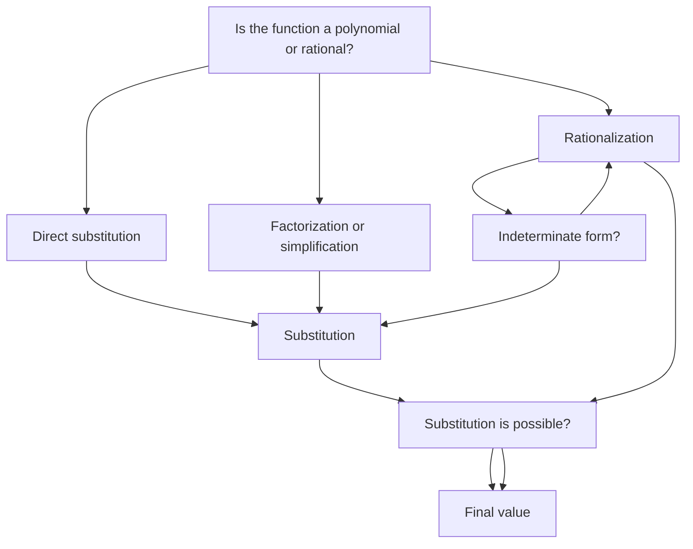

## 5.1. Limit of a Function

### Definition and Concept of Limit
**Limit of a function** is a fundamental concept in calculus that describes the value that a function approaches as the input approaches some value. Formally, the limit of a function f(x) as x approaches a is denoted as:
[ \lim_{x \to a} f(x) = L ]
where L is the limit. This means that as x gets arbitrarily close to a, the value of f(x) gets arbitrarily close to L.

### Importance of Limits
Understanding limits is crucial because they help in defining derivatives and integrals, which are core concepts in calculus. Limits are also used to solve indeterminate forms, such as 0 0 and , and to analyze the behavior of functions at specific points.

### Types of Limits
- **One-Sided Limits:** These are limits where x approaches a from the left (x → a⁻) or from the right (x → a⁺).
- **Two-Sided Limits:** These are limits where x approaches a from both sides.

### Properties of Limits
1. **Constant Rule:** If c is a constant, then
[ \lim_{x \to a} c = c ]
2. **Identity Rule:** If f(x) = x, then
[ \lim_{x \to a} x = a ]
3. **Sum Rule:** If f(x) and g(x) are functions, then
[ \lim_{x \to a} [f(x) + g(x)] = \lim_{x \to a} f(x) + \lim_{x \to a} g(x) ]
4. **Difference Rule:** If f(x) and g(x) are functions, then
[ \lim_{x \to a} [f(x) - g(x)] = \lim_{x \to a} f(x) - \lim_{x \to a} g(x) ]
5. **Product Rule:** If f(x) and g(x) are functions, then
[ \lim_{x \to a} [f(x) \cdot g(x)] = \left( \lim_{x \to a} f(x) \right) \left( \lim_{x \to a} g(x) \right) ]
6. **Quotient Rule:** If f(x) and g(x) are functions and g(x) ≠ 0, then
[ \lim_{x \to a} \left[ \frac{f(x)}{g(x)} \right] = \frac{\lim_{x \to a} f(x)}{\lim_{x \to a} g(x)} ]

### Evaluating Limits
- **Substitution Rule:** If f(x) is a polynomial or a rational function and f(a) is defined, then
[ \lim_{x \to a} f(x) = f(a) ]
- **Factorization and Simplification:** If direct substitution leads to an indeterminate form, factorize or simplify the expression.
- **Rationalization:** For limits involving square roots, rationalize the numerator or denominator.

### Example
> **Example:** Evaluate the limit:
[ \lim_{x \to 2} (x^2 - 3x + 2) ]

1. **Step 1:** Direct substitution:
[ \lim_{x \to 2} (x^2 - 3x + 2) = 2^2 - 3(2) + 2 = 4 - 6 + 2 = 0 ]

Therefore, the limit is:
[ \lim_{x \to 2} (x^2 - 3x + 2) = 0 ]

### Flowchart of Evaluating Limits

This flowchart helps in systematically evaluating limits by considering different scenarios and methods.