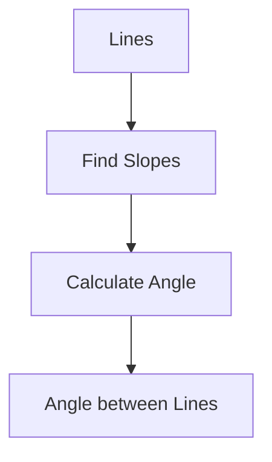
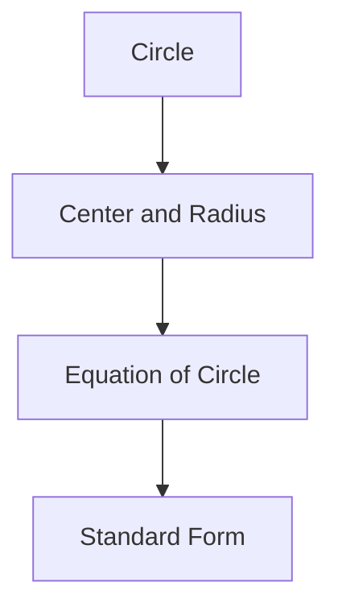

## 4.5. Angle between two lines.

### Definition and Concept
The angle between two lines is the smallest angle formed between their directions. This angle is measured from one line to the other and is always between 0° and 180°.

### Slope of a Line
The slope (m) of a line is defined as the tangent of the angle (θ) that the line makes with the positive x-axis. The slope can be calculated from the coordinates of any two points on the line using the formula:
[ m = \frac{y_2 - y_1}{x_2 - x_1} ]

### Angle Between Two Lines
The angle (θ) between two lines with slopes m₁ and m₂ can be found using the following formula:
[ \tan \theta = \left| \frac{m_1 - m_2}{1 + m_1 m_2} \right| ]
From this, the angle θ can be calculated as:
[ \theta = \tan^{-1} \left( \left| \frac{m_1 - m_2}{1 + m_1 m_2} \right| \right) ]

### Example
> **Example:** Find the angle between the lines with equations 2x - 3y + 5 = 0 and 4x + 6y - 7 = 0.

1. First, find the slopes of both lines.
2. The slope of the line 2x - 3y + 5 = 0 is:
   [ m_1 = \frac{2}{3} ]
3. The slope of the line 4x + 6y - 7 = 0 is:
   [ m_2 = -\frac{4}{6} = -\frac{2}{3} ]
4. Substitute these values into the formula for the angle between the lines:
   [ \tan \theta = \left| \frac{\frac{2}{3} - \left(-\frac{2}{3}\right)}{1 + \left(\frac{2}{3}\right)\left(-\frac{2}{3}\right)} \right| = \left| \frac{\frac{4}{3}}{1 - \frac{4}{9}} \right| = \left| \frac{\frac{4}{3}}{\frac{5}{9}} \right| = \left| \frac{4}{3} \times \frac{9}{5} \right| = \left| \frac{12}{5} \right| = \frac{12}{5} ]
5. Therefore, the angle θ is:
   [ \theta = \tan^{-1} \left( \frac{12}{5} \right) ]

### Mermaid Diagram

## 4.6. Equation of Circle with Center and Radius

### Definition
The general equation of a circle with center (h, k) and radius r is given by:
[ (x - h)^2 + (y - k)^2 = r^2 ]

### Standard Form
The standard form of the equation of a circle with center (h, k) and radius r is:
[ (x - h)^2 + (y - k)^2 = r^2 ]

### Example
> **Example:** Find the equation of the circle with center (3, -4) and radius 5.

1. Use the standard form of the equation of a circle:
   [ (x - h)^2 + (y - k)^2 = r^2 ]
2. Substitute h = 3, k = -4, and r = 5:
   [ (x - 3)^2 + (y + 4)^2 = 5^2 ]
3. Simplify the right-hand side:
   [ (x - 3)^2 + (y + 4)^2 = 25 ]

### Mermaid Diagram

### Summary
- The angle between two lines can be found using the slopes of the lines.
- The equation of a circle with center and radius can be written in standard form.

These examples and explanations should help you in solving problems related to the angle between lines and the equation of a circle with center and radius.