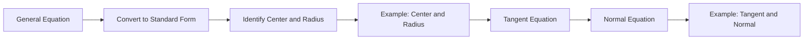

## 4.7. General Equation of Circle

### Definition and Standard Form

A circle is the set of all points in a plane that are equidistant from a fixed point called the center. The distance from the center to any point on the circle is known as the radius. The general equation of a circle is given by the formula:

[ x^2 + y^2 + 2gx + 2fy + c = 0 ]

where g, f, and c are constants. This equation can be transformed into the standard form (x - h)² + (y - k)² = r² by completing the square.

### Converting to Standard Form

To convert the general form to the standard form, follow these steps:

1. **Group the x and y terms:**

   [ x^2 + 2gx + y^2 + 2fy + c = 0 ]

2. **Complete the square for x and y:**

   [ (x^2 + 2gx) + (y^2 + 2fy) + c = 0 ]

   [ (x + g)^2 - g^2 + (y + f)^2 - f^2 + c = 0 ]

   [ (x + g)^2 + (y + f)^2 = g^2 + f^2 - c ]

3. **Identify the center and radius:**

   [ (x + g)^2 + (y + f)^2 = r^2 ]

   Here, the center of the circle is (-g, -f) and the radius r is g² + f² - c.

### Worked Example

> **Example:** Find the center and radius of the circle given by the equation x² + y² - 6x + 4y - 12 = 0.

1. **Group the x and y terms:**

   [ x^2 - 6x + y^2 + 4y = 12 ]

2. **Complete the square:**

   For x: x² - 6x becomes (x - 3)² - 9.

   For y: y² + 4y becomes (y + 2)² - 4.

   [ (x - 3)^2 - 9 + (y + 2)^2 - 4 = 12 ]

   [ (x - 3)^2 + (y + 2)^2 - 13 = 12 ]

   [ (x - 3)^2 + (y + 2)^2 = 25 ]

3. **Identify the center and radius:**

   The center is (3, -2) and the radius is 25 = 5.

Thus, the center is (3, -2) and the radius is 5.

### Applications of the General Equation

The general equation of a circle can be used in various applications, such as in physics to describe the motion of objects in a circular path, or in engineering to design circular structures.

## 4.8. Tangent and Normal to a Circle

### Definition of Tangent and Normal

- **Tangent:** A tangent to a circle is a line that touches the circle at exactly one point.
- **Normal:** The normal to a circle at a point is a line that is perpendicular to the tangent at that point.

### Equations of Tangent and Normal

To find the equations of the tangent and normal to a circle, consider the circle x² + y² + 2gx + 2fy + c = 0 and a point (x₁, y₁) on the circle.

1. **Equation of the Tangent:**

   The equation of the tangent at (x₁, y₁) is given by:

   [ xx_1 + yy_1 + g(x + x_1) + f(y + y_1) + c = 0 ]

2. **Equation of the Normal:**

   The equation of the normal at (x₁, y₁) can be found by using the slope of the tangent. The slope of the tangent is - g + x₁ f + y₁, so the slope of the normal is the negative reciprocal, which is f + y₁ g + x₁.

   The equation of the normal is:

   [ y - y_1 = \frac{f + y_1}{g + x_1} (x - x_1) ]

### Worked Example

> **Example:** Find the equation of the tangent and normal to the circle x² + y² - 6x + 4y - 12 = 0 at the point (5, 2).

1. **Equation of the Tangent:**

   The given circle is x² + y² - 6x + 4y - 12 = 0. The point is (5, 2).

   The equation of the tangent is:

   [ 5x + 2y - 3(5 + 5) + 2(2 + 2) - 12 = 0 ]

   [ 5x + 2y - 30 + 8 - 12 = 0 ]

   [ 5x + 2y - 34 = 0 ]

2. **Equation of the Normal:**

   The slope of the tangent at (5, 2) is - -3 2 = 3 2. The slope of the normal is - 2 3.

   The equation of the normal is:

   [ y - 2 = -\frac{2}{3} (x - 5) ]

   [ 3(y - 2) = -2(x - 5) ]

   [ 3y - 6 = -2x + 10 ]

   [ 2x + 3y - 16 = 0 ]

Thus, the equation of the tangent is 5x + 2y - 34 = 0 and the equation of the normal is 2x + 3y - 16 = 0.

This flowchart illustrates the process from the general form to finding the center and radius, and then to deriving the equations of the tangent and normal.