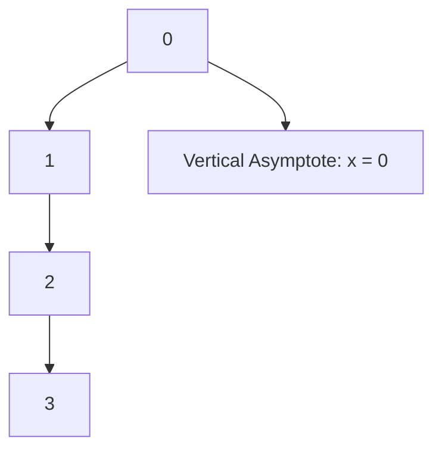

# Unit – I: Determinant and Function

*(AI-generated self-study book for GTU, subject code C4300001 — generated locally with Ollama.)*

This module carries approximately **16 marks (4 Remember + 7 Understand + 5 Apply) (per syllabus)**.

Learning objectives covered by this module:
- 1.a. Solve simple problems of Determinant up to order 3*3.
- 1.b. Explain graphically the given functions.
- 1.c. Solve simple problems using concepts of Logarithms

## 1.1. Determinant and its value up to 3rd order (Without properties)

### Definition and Importance
A **determinant** is a scalar value that can be calculated from the elements of a square matrix. In the context of this chapter, we will focus on determinants of 2x2 and 3x3 matrices. The determinant provides important information about the matrix, such as whether it is invertible or not.

### Determinant of a 2x2 Matrix
For a 2x2 matrix A given by:
[ A = \begin{bmatrix} a & b \\ c & d \end{bmatrix} ]
the determinant, denoted as det(A) or |A|, is calculated as:
[ \text{det}(A) = ad - bc ]

### Determinant of a 3x3 Matrix
For a 3x3 matrix B given by:
[ B = \begin{bmatrix} a & b & c \\ d & e & f \\ g & h & i \end{bmatrix} ]
the determinant, denoted as det(B) or |B|, is calculated as:
[ \text{det}(B) = a(ei - fh) - b(di - fg) + c(dh - eg) ]

### Example
> **Example:** Calculate the determinant of the following 3x3 matrix:
[ C = \begin{bmatrix} 2 & 3 & 4 \\ 1 & 5 & 6 \\ 7 & 8 & 9 \end{bmatrix} ]

To find the determinant of matrix C:
[ \text{det}(C) = 2 \left( 5 \cdot 9 - 6 \cdot 8 \right) - 3 \left( 1 \cdot 9 - 6 \cdot 7 \right) + 4 \left( 1 \cdot 8 - 5 \cdot 7 \right) ]

Calculate each term:
[ 5 \cdot 9 = 45 ]
[ 6 \cdot 8 = 48 ]
[ 1 \cdot 9 = 9 ]
[ 6 \cdot 7 = 42 ]
[ 1 \cdot 8 = 8 ]
[ 5 \cdot 7 = 35 ]

Substitute these values back into the determinant formula:
[ \text{det}(C) = 2(45 - 48) - 3(9 - 42) + 4(8 - 35) ]
[ \text{det}(C) = 2(-3) - 3(-33) + 4(-27) ]
[ \text{det}(C) = -6 + 99 - 108 ]
[ \text{det}(C) = -15 ]

Therefore, the determinant of matrix C is -15.

### Summary
To find the determinant of a 2x2 matrix, use the formula ad - bc. For a 3x3 matrix, use the expanded form:
[ \text{det}(B) = a(ei - fh) - b(di - fg) + c(dh - eg) ]

This method is fundamental in solving systems of linear equations and understanding the properties of matrices.

---

## 1.2. Function and simple examples.

### Definition and Basic Concepts
A **function** is a relation between a set of inputs and a set of permissible outputs with the property that each input is related to exactly one output. In mathematics, functions are used to describe relationships where each element of the input set (domain) is mapped to exactly one element in the output set (range).

### Types of Functions
Functions can be classified based on their input and output. Common types include:
- **Linear functions**: Functions of the form f(x) = ax + b.
- **Quadratic functions**: Functions of the form f(x) = ax² + bx + c.
- **Polynomial functions**: Functions involving variables raised to non-negative integer powers.
- **Exponential functions**: Functions of the form f(x) = aˣ.
- **Logarithmic functions**: Functions of the form f(x) = _a x.

### Graphical Representation
Functions can be represented graphically, which helps in understanding their behavior and properties. The **graph** of a function is the set of all points (x, y) such that y = f(x).

### Simple Examples
Let's consider some simple examples to understand the graphical representation of functions.

> **Example:** 
> 
> 1. **Linear Function**: Consider the linear function f(x) = 2x + 3.
> 
>    - **Graph**: The graph of f(x) = 2x + 3 is a straight line. For x = 0, y = 3, and for x = 1, y = 5. The slope is 2, and the y-intercept is 3.
> 
> 2. **Quadratic Function**: Consider the quadratic function f(x) = x² - 4x + 4.
> 
>    - **Graph**: The graph of f(x) = x² - 4x + 4 is a parabola. It can be rewritten as (x-2)², which means the vertex is at (2, 0). The parabola opens upwards.
> 
> 3. **Exponential Function**: Consider the exponential function f(x) = 2ˣ.
> 
>    - **Graph**: The graph of f(x) = 2ˣ is a curve that increases rapidly as x increases. For x = 0, y = 1, and for x = 1, y = 2.
> 
> 4. **Logarithmic Function**: Consider the logarithmic function f(x) = ₂ x.
> 
>    - **Graph**: The graph of f(x) = ₂ x is a curve that increases slowly as x increases. For x = 1, y = 0, and for x = 2, y = 1.

### Worked Example
> **Example:** 
> 
> Solve the following quadratic function graphically: f(x) = x² - 2x - 3.
> 
> - **Graph**: The function f(x) = x² - 2x - 3 can be factored as (x - 3)(x + 1). The roots are x = 3 and x = -1. The graph is a parabola that opens upwards, with the vertex at x = 1 (since the vertex formula x = - b 2a gives x = 2 2 = 1). The y-intercept is f(0) = -3.
> 
> - **Graphical Solution**: To find the roots, we set f(x) = 0. Solving x² - 2x - 3 = 0 gives (x - 3)(x + 1) = 0, hence x = 3 and x = -1.

This example illustrates how to graphically solve a quadratic function and find its roots. Understanding these concepts will help in solving more complex problems in future sections.

---

## 1.3. Logarithm as a function

### Definition and Basic Properties
**Logarithm:** The logarithm of a number to a given base is the exponent to which the base must be raised to produce that number. Mathematically, if _b a = c, then bc = a.

- **Common Logarithm (Base 10):** ₁₀ a = a
- **Natural Logarithm (Base e):** _e a = a

### Key Properties of Logarithms
- **Product Rule:** _b (xy) = _b x + _b y
- **Quotient Rule:** _b ( x y ) = _b x - _b y
- **Power Rule:** _b (xⁿ) = n _b x
- **Change of Base Formula:** _b a = _c a _c b

### Graphical Representation of Logarithmic Functions
To graph a logarithmic function, consider the function y = _b x. The graph of a logarithmic function has the following characteristics:
- **Domain:** x > 0
- **Range:** All real numbers
- **Asymptote:** The y-axis (x = 0) is a vertical asymptote.
- **Intercept:** The function passes through the point (1, 0) since _b 1 = 0.

### Worked Example
> **Example:** Solve the following problem and graph the function y = ₂ x.

1. **Solve ₂ 8 = x:**
   - We need to find x such that 2ˣ = 8.
   - Since 8 = 2³, we have x = 3.
   - Therefore, ₂ 8 = 3.

2. **Graph the function y = ₂ x:**
   - **Key Points:**
     - (1, 0) because ₂ 1 = 0
     - (2, 1) because ₂ 2 = 1
     - (4, 2) because ₂ 4 = 2
     - (8, 3) because ₂ 8 = 3
   - **Shape:** The graph will be a curve that increases slowly as x increases, approaching the y-axis as x approaches 0.

3. **Graph:**

### Additional Practice
- **Problem 1:** Solve ₃ 27 = x.
- **Problem 2:** Graph the function y = ₃ x and identify its key points and asymptote.

By solving these problems, you will gain a better understanding of logarithmic functions and their properties.

---

## 1.4. Laws of Logarithm and Related Simple Examples

### Definition of Logarithm
A **logarithm** is the power to which a number (the base) must be raised to get another number. For example, the logarithm of 100 to the base 10 is 2, because 10² = 100. This can be written as ₁₀(100) = 2.

### Laws of Logarithm
The laws of logarithms are essential for solving logarithmic problems. There are four main laws of logarithms that we will cover:

1. **Product Law**: _b(mn) = _b(m) + _b(n)
2. **Quotient Law**: _b( m n ) = _b(m) - _b(n)
3. **Power Law**: _b(mⁿ) = n _b(m)
4. **Change of Base Law**: _b(m) = _k(m) _k(b)

#### Example Application of Laws of Logarithm
> **Example:** Simplify the expression ₂(8 × 32).

Using the product law:
[
\log_2(8 \times 32) = \log_2(8) + \log_2(32)
]

Next, we simplify the individual logarithms:
[
\log_2(8) = 3 \quad \text{(since } 2^3 = 8\text{)}
]
[
\log_2(32) = 5 \quad \text{(since } 2^5 = 32\text{)}
]

Thus, the expression simplifies to:
[
\log_2(8 \times 32) = 3 + 5 = 8
]

### Worked Examples

> **Example:** Simplify the expression ₃( 27 9 ).

Using the quotient law:
[
\log_3\left(\frac{27}{9}\right) = \log_3(27) - \log_3(9)
]

Next, we simplify the individual logarithms:
[
\log_3(27) = 3 \quad \text{(since } 3^3 = 27\text{)}
]
[
\log_3(9) = 2 \quad \text{(since } 3^2 = 9\text{)}
]

Thus, the expression simplifies to:
[
\log_3\left(\frac{27}{9}\right) = 3 - 2 = 1
]

> **Example:** Simplify the expression ₄(16²).

Using the power law:
[
\log_4(16^2) = 2 \log_4(16)
]

Next, we simplify the individual logarithm:
[
\log_4(16) = 2 \quad \text{(since } 4^2 = 16\text{)}
]

Thus, the expression simplifies to:
[
\log_4(16^2) = 2 \times 2 = 4
]

### Change of Base Law
The **Change of Base Law** is useful when the base of the logarithm is not the same as the base of the calculator or the logarithm table. It allows us to express a logarithm in terms of a different base. For example, ₃(9) can be expressed in terms of base 10 logarithms:
[
\log_3(9) = \frac{\log_{10}(9)}{\log_{10}(3)}
]

### Worked Example Using Change of Base Law

> **Example:** Evaluate ₅(125) using the change of base law.

Using the change of base law:
[
\log_5(125) = \frac{\log_{10}(125)}{\log_{10}(5)}
]

Using a calculator to find the values:
[
\log_{10}(125) \approx 2.0969 \quad \text{and} \quad \log_{10}(5) \approx 0.6990
]

Thus, the expression evaluates to:
[
\log_5(125) = \frac{2.0969}{0.6990} \approx 3
]

### Summary
In this section, we have covered the fundamental laws of logarithms, including the product, quotient, power, and change of base laws. We have also provided several examples to illustrate how these laws can be applied to simplify and solve logarithmic expressions.
