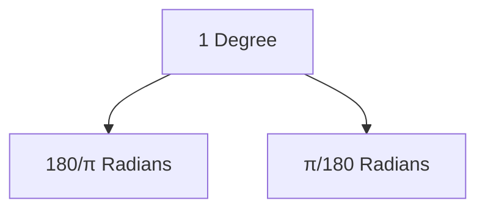
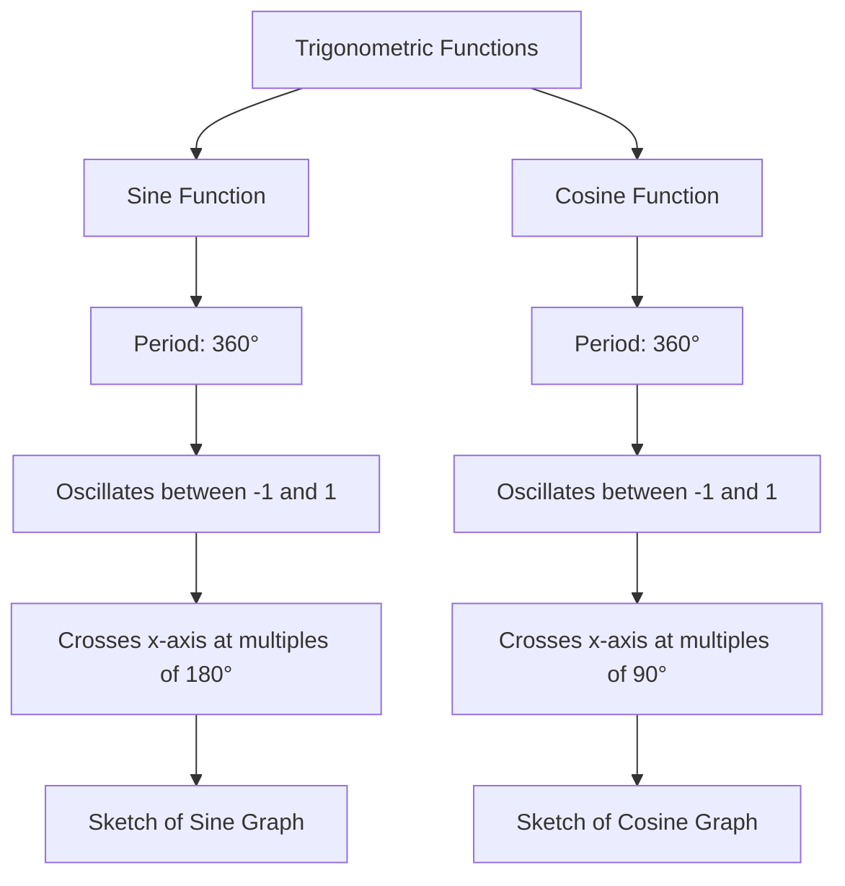
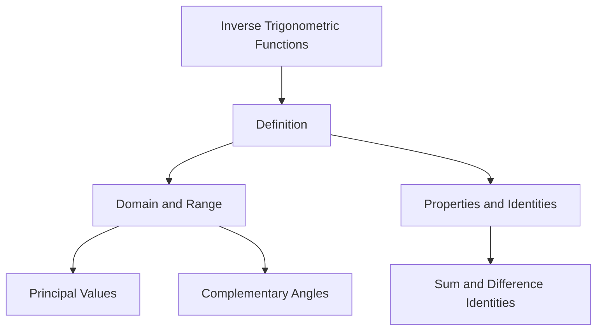

# Unit – II: Trigonometry

*(AI-generated self-study book for GTU, subject code C4300001 — generated locally with Ollama.)*

This module carries approximately **14 marks (4 Remember + 5 Understand + 5 Apply) (per syllabus)**.

Learning objectives covered by this module:
- 2.a. Apply the concept of Compound angle, Allied angle, and Multiple angles to solve the given simple engineering problem(s)
- 2.b. Explain the concept of Sub- Multiple and solve related problem(s).
- 2.c. Invoke the concept of Sum and Factor formulae to solve the given simple problem(s)
- 2.d. Investigate given simple problems using inverse Trigonometric functions.

## 2.1. Units of Angles (degree and radian)

### 2.1.1. Introduction to Units of Angles
Angles can be measured in different units. The most common units are **degrees** and **radians**. Both units are used in engineering problems, especially in trigonometric calculations.

#### **Degree**
- A degree is a unit of angular measurement, where a full circle is divided into 360 degrees.
- The symbol for degree is ^.

#### **Radian**
- A radian is the standard unit of angular measure in mathematics.
- One radian is the angle subtended at the center of a circle by an arc that is equal in length to the radius of the circle.
- The symbol for radian is rad.

### 2.1.2. Relationship Between Degrees and Radians
The relationship between degrees and radians can be expressed as:
[ 1 \text{ radian} = \frac{180}{\pi} \text{ degrees} ]
[ 1 \text{ degree} = \frac{\pi}{180} \text{ radians} ]

#### **Example:**
> **Example:** Convert 120 degrees to radians.
>
> [
> \text{Radians} = \frac{\pi}{180} \times 120 = \frac{2\pi}{3} \text{ radians}
> ]

### 2.1.3. Practical Application of Degrees and Radians
Understanding the conversion between degrees and radians is crucial for solving engineering problems involving angles.

#### **Example:**
> **Example:** A wheel rotates through 270 degrees. Find the equivalent angle in radians.
>
> [
> \text{Radians} = \frac{\pi}{180} \times 270 = \frac{3\pi}{2} \text{ radians}
> ]

## 2.2. Trigonometric Functions

### 2.2.1. Introduction to Trigonometric Functions
Trigonometric functions are fundamental in engineering and are used to solve problems involving angles and lengths. The primary trigonometric functions are **sine (sin)**, **cosine (cos)**, and **tangent (tan)**.

#### **Sine Function (sin)**
- The sine of an angle is the ratio of the length of the opposite side to the hypotenuse in a right triangle.
- θ = opposite hypotenuse

#### **Cosine Function (cos)**
- The cosine of an angle is the ratio of the length of the adjacent side to the hypotenuse in a right triangle.
- θ = adjacent hypotenuse

#### **Tangent Function (tan)**
- The tangent of an angle is the ratio of the sine to the cosine of the angle.
- θ = θ θ = opposite adjacent

### 2.2.2. Trigonometric Identities
Trigonometric identities are essential for solving problems and simplifying expressions.

#### **Pythagorean Identity**
[ \sin^2 \theta + \cos^2 \theta = 1 ]

#### **Reciprocal Identities**
[ \csc \theta = \frac{1}{\sin \theta} ]
[ \sec \theta = \frac{1}{\cos \theta} ]
[ \cot \theta = \frac{1}{\tan \theta} ]

#### **Example:**
> **Example:** Prove the identity ² θ + ² θ = 1.
>
> [
> \sin^2 \theta + \cos^2 \theta = \left(\frac{\text{opposite}}{\text{hypotenuse}}\right)^2 + \left(\frac{\text{adjacent}}{\text{hypotenuse}}\right)^2
> ]
>
> [
> = \frac{\text{opposite}^2}{\text{hypotenuse}^2} + \frac{\text{adjacent}^2}{\text{hypotenuse}^2} = \frac{\text{opposite}^2 + \text{adjacent}^2}{\text{hypotenuse}^2}
> ]
>
> [
> = \frac{\text{hypotenuse}^2}{\text{hypotenuse}^2} = 1
> ]

### 2.2.3. Application of Trigonometric Functions
Trigonometric functions are used in various engineering applications, such as calculating distances, angles, and forces.

#### **Example:**
> **Example:** A ladder leans against a wall, making an angle of 60 degrees with the ground. If the ladder is 10 meters long, find the height at which the ladder touches the wall.
>
> [
> \text{Height} = 10 \times \sin 60^\circ = 10 \times \frac{\sqrt{3}}{2} = 5\sqrt{3} \approx 8.66 \text{ meters}
> ]

### 2.2.4. Inverse Trigonometric Functions
Inverse trigonometric functions are used to find the angle given the value of a trigonometric function.

#### **Sine Inverse (arcsin)**
- x is the angle whose sine is x.
- θ = x

#### **Cosine Inverse (arccos)**
- x is the angle whose cosine is x.
- θ = x

#### **Tangent Inverse (arctan)**
- x is the angle whose tangent is x.
- θ = x

#### **Example:**
> **Example:** Find the angle θ if θ = 0.5.
>
> [
> \theta = \arcsin 0.5 = 30^\circ
> ]

### 2.2.5. Summary
Trigonometric functions and their inverses are essential tools in solving engineering problems. Understanding the relationship between degrees and radians, and applying trigonometric identities, will help in solving various practical problems.

### Mermaid Diagram: Relationship Between Degrees and Radians


### Mermaid Diagram: Trigonometric Functions
```mermaid
flowchart TD
    A[Angle] --> B[Sine(θ)] --> C[Opposite/Hypotenuse]
    A --> D[Cosine(θ)] --> E[Adjacent/Hypotenuse]
    A --> F[Tangent(θ)] --> G[Opposite/Adjacent]
```

This section covers the fundamental concepts of units of angles and trigonometric functions, providing clear explanations and practical examples for GTU students.

---

## 2.3. Allied & Compound Angles, Multiple –Submultiples Angles

### Allied Angles
Allied angles are angles which are related to each other in a way that they can be represented as A ± B, where A and B are angles. These angles are important in trigonometry because they help in simplifying and solving trigonometric expressions and equations.

#### Example:
> **Example:** Find the value of (150^) using the concept of allied angles.
>
> Since 150^ = 180^ - 30^, we can use the identity (180^ - A) = A. Therefore,
> [
> \sin(150^\circ) = \sin(180^\circ - 30^\circ) = \sin 30^\circ = \frac{1}{2}.
> ]

### Compound Angles
Compound angles involve the sum or difference of two angles. The basic formulas for compound angles are:
[
\sin(A \pm B) = \sin A \cos B \pm \cos A \sin B,
]
[
\cos(A \pm B) = \cos A \cos B \mp \sin A \sin B,
]
[
\tan(A \pm B) = \frac{\tan A \pm \tan B}{1 \mp \tan A \tan B}.
]

#### Example:
> **Example:** Find the value of (75^) using the concept of compound angles.
>
> Since 75^ = 45^ + 30^, we can use the identity (A + B) = A B - A B. Therefore,
> [
> \cos(75^\circ) = \cos(45^\circ + 30^\circ) = \cos 45^\circ \cos 30^\circ - \sin 45^\circ \sin 30^\circ.
> ]
> Using the values 45^ = 45^ = 2 2, 30^ = 3 2, and 30^ = 1 2, we get
> [
> \cos(75^\circ) = \left(\frac{\sqrt{2}}{2}\right) \left(\frac{\sqrt{3}}{2}\right) - \left(\frac{\sqrt{2}}{2}\right) \left(\frac{1}{2}\right) = \frac{\sqrt{6}}{4} - \frac{\sqrt{2}}{4} = \frac{\sqrt{6} - \sqrt{2}}{4}.
> ]

### Multiple Angles
Multiple angles involve the trigonometric functions of angles that are multiples of a given angle. The basic formulas for multiple angles are:
[
\sin 2A = 2 \sin A \cos A,
]
[
\cos 2A = \cos^2 A - \sin^2 A = 1 - 2 \sin^2 A = 2 \cos^2 A - 1,
]
[
\tan 2A = \frac{2 \tan A}{1 - \tan^2 A}.
]

#### Example:
> **Example:** Find the value of 120^ using the concept of multiple angles.
>
> Since 120^ = 2 × 60^, we can use the identity 2A = 2 A A. Therefore,
> [
> \sin 120^\circ = \sin(2 \times 60^\circ) = 2 \sin 60^\circ \cos 60^\circ.
> ]
> Using the values 60^ = 3 2 and 60^ = 1 2, we get
> [
> \sin 120^\circ = 2 \left(\frac{\sqrt{3}}{2}\right) \left(\frac{1}{2}\right) = \frac{\sqrt{3}}{2}.
> ]

### Submultiples
Submultiples are angles that are fractions of a given angle. The basic formulas for submultiples are:
[
\sin \left(\frac{A}{2}\right) = \pm \sqrt{\frac{1 - \cos A}{2}},
]
[
\cos \left(\frac{A}{2}\right) = \pm \sqrt{\frac{1 + \cos A}{2}},
]
[
\tan \left(\frac{A}{2}\right) = \pm \sqrt{\frac{1 - \cos A}{1 + \cos A}}.
]

#### Example:
> **Example:** Find the value of 30^ using the concept of submultiples.
>
> Since 30^ = 60^ 2, we can use the identity ( A 2 ) = 1 + A 2. Therefore,
> [
> \cos 30^\circ = \cos \left(\frac{60^\circ}{2}\right) = \sqrt{\frac{1 + \cos 60^\circ}{2}}.
> ]
> Using the value 60^ = 1 2, we get
> [
> \cos 30^\circ = \sqrt{\frac{1 + \frac{1}{2}}{2}} = \sqrt{\frac{\frac{3}{2}}{2}} = \sqrt{\frac{3}{4}} = \frac{\sqrt{3}}{2}.
> ]

## 2.4. Graph of Sine and Cosine

### Graph of Sine Function
The graph of the sine function, y = x, is a periodic function with a period of 360^ (or 2π radians). The sine function oscillates between -1 and 1, and it crosses the x-axis at every integer multiple of 180^.

#### Example:
> **Example:** Sketch the graph of y = x for 0^ ≤ x ≤ 360^.
>
> The graph of y = x for 0^ ≤ x ≤ 360^ is a wave that starts at 0 at 0^, reaches 1 at 90^, returns to 0 at 180^, reaches -1 at 270^, and returns to 0 at 360^.

### Graph of Cosine Function
The graph of the cosine function, y = x, is also a periodic function with a period of 360^ (or 2π radians). The cosine function oscillates between -1 and 1, and it crosses the x-axis at every odd multiple of 90^.

#### Example:
> **Example:** Sketch the graph of y = x for 0^ ≤ x ≤ 360^.
>
> The graph of y = x for 0^ ≤ x ≤ 360^ is a wave that starts at 1 at 0^, reaches 0 at 90^, reaches -1 at 180^, reaches 0 at 270^, and returns to 1 at 360^.

### Mermaid Diagram


This completes the detailed sections on Allied & Compound Angles, Multiple –Submultiples angles and the Graph of Sine and Cosine.

---

## 2.5. Periodic Trigonometric Function

### Definition and Importance
A **trigonometric function** is periodic if it repeats its values in regular intervals or periods. The primary trigonometric functions—sine, cosine, and tangent—are periodic with a fundamental period of 2π. The period of a trigonometric function is the smallest positive number P such that the function repeats its values every P units.

### Periodicity of Trigonometric Functions
- **Sine Function (x)**: The function x has a period of 2π. This means (x + 2π) = x for all x.
- **Cosine Function (x)**: The function x also has a period of 2π. This means (x + 2π) = x for all x.
- **Tangent Function (x)**: The function x has a period of π. This means (x + π) = x for all x.

### Properties and Applications
Periodicity is crucial in various applications, such as signal processing, wave mechanics, and electromagnetic theory. For instance, the periodicity of these functions helps in analyzing alternating current (AC) signals in electrical engineering.

> **Example:** If f(x) = (2x), determine the period of the function.
> 
> Since (2x) is a sine function with a coefficient of 2 inside the argument, the period of (2x) is 2π 2 = π. Therefore, f(x + π) = (2(x + π)) = (2x + 2π) = (2x).

### Graphical Representation
The graphical representation of periodic functions can be visualized using mermaid diagrams. Here is a simple representation of the sine function:

```mermaid
graph TD
    A[Sine Function (y = sin(x))] --> B[Period: 2π]
    A --> C[Range: -1 to 1]
    A --> D[Graph: Waveform]
```

## 2.6. Sum and Factor Formulae

### Sum Formulae
Sum formulae are useful in simplifying and solving trigonometric expressions. These formulae are derived from the angle addition and subtraction formulas.

- **Sum of Sines**: A + B = 2 ( A + B 2 ) ( A - B 2 )
- **Sum of Cosines**: A + B = 2 ( A + B 2 ) ( A - B 2 )

### Factor Formulae
Factor formulae help in expressing the product of trigonometric functions as a sum or difference.

- **Product to Sum Formula**: 
  [
  \sin A \cos B = \frac{1}{2} [\sin(A + B) + \sin(A - B)]
  ]
  [
  \cos A \sin B = \frac{1}{2} [\sin(A + B) - \sin(A - B)]
  ]
  [
  \cos A \cos B = \frac{1}{2} [\cos(A + B) + \cos(A - B)]
  ]
  [
  \sin A \sin B = \frac{1}{2} [\cos(A - B) - \cos(A + B)]
  ]

### Applications
These formulae are widely used in solving complex trigonometric equations, simplifying expressions, and in various engineering applications.

> **Example:** Simplify the expression 75^ + 15^.
> 
> Using the sum formula for sine:
> [
\sin 75^\circ + \sin 15^\circ = 2 \sin\left(\frac{75^\circ + 15^\circ}{2}\right) \cos\left(\frac{75^\circ - 15^\circ}{2}\right)
]
[
= 2 \sin(45^\circ) \cos(30^\circ)
]
[
= 2 \left(\frac{\sqrt{2}}{2}\right) \left(\frac{\sqrt{3}}{2}\right)
]
[
= \frac{\sqrt{6}}{2}
]

### Mermaid Diagram for Sum and Factor Formulae
Here is a mermaid diagram to summarize the sum and factor formulae:

```mermaid
flowchart TD
    A[Sum of Sines] --> B[2 sin((A+B)/2) cos((A-B)/2)]
    A --> C[Example: sin 75° + sin 15° = 2 sin(45°) cos(30°) = √6/2]
    D[Product to Sum] --> E[1/2 [sin(A+B) + sin(A-B)]]
    D --> F[Example: sin 75° cos 15° = 1/2 [sin(90°) + sin(60°)] = 1/2 (1 + √3/2) = 1/2 + √3/4]
```

This section covers the periodicity of trigonometric functions and the application of sum and factor formulae, providing a clear understanding for exam preparation.

---

## 2.7. Inverse Trigonometric Function

### Definition
**Inverse Trigonometric functions** are the functions that are the inverses of the basic trigonometric functions such as sine, cosine, tangent, etc. These functions are denoted as ⁻¹, ⁻¹, ⁻¹, etc. The inverse trigonometric functions are used to find the angle when the value of a trigonometric function is known.

### Domain and Range
- **⁻¹ x**: The domain is [-1, 1] and the range is [- π 2 , π 2 ].
- **⁻¹ x**: The domain is [-1, 1] and the range is [0, π].
- **⁻¹ x**: The domain is R (all real numbers) and the range is (- π 2 , π 2 ].
- **⁻¹ x**: The domain is R and the range is (0, π).
- **⁻¹ x**: The domain is (-, -1] [1, ) and the range is [0, π] - \ π 2 \.
- **⁻¹ x**: The domain is (-, -1] [1, ) and the range is [- π 2 , π 2 ] - \ 0\.

### Properties and Identities
- **Principal Values**: The principal values of the inverse trigonometric functions are the values that lie within their specified ranges.
- **Complementary Angles**: 
  - ⁻¹ x + ⁻¹ x = π 2
  - ⁻¹ x + ⁻¹ x = π 2
- **Sum and Difference Identities**:
  - ⁻¹ x + ⁻¹ y = ⁻¹ (x 1 - y² + y 1 - x² ) if x² + y² ≤ 1
  - ⁻¹ x - ⁻¹ y = ⁻¹ (x 1 - y² - y 1 - x² ) if x² + y² ≤ 1

### Example
> **Example:** Solve for x in the equation ⁻¹ x + ⁻¹ x = π 2.

1. **Step 1**: Recall the complementary angle identity for inverse trigonometric functions.
   [
   \sin^{-1} x + \cos^{-1} x = \frac{\pi}{2}
   ]
   This identity holds true for all x in the domain of ⁻¹ x and ⁻¹ x.

2. **Step 2**: Since the equation is already in the form of the identity, we can directly conclude that the equation is satisfied for any x in the domain of ⁻¹ x and ⁻¹ x.

3. **Step 3**: The domain of ⁻¹ x and ⁻¹ x is [-1, 1]. Therefore, the solution to the equation is:
   [
   x \in [-1, 1]
   ]

Thus, the solution to the equation ⁻¹ x + ⁻¹ x = π 2 is any x in the interval [-1, 1].


