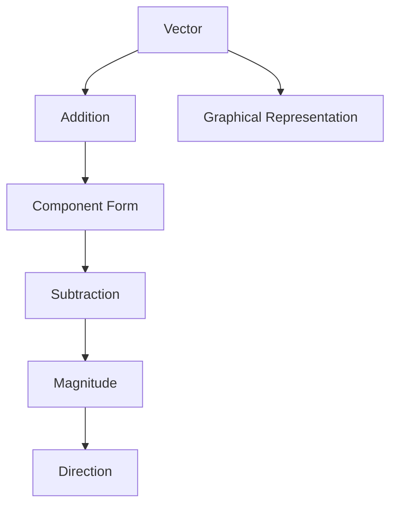
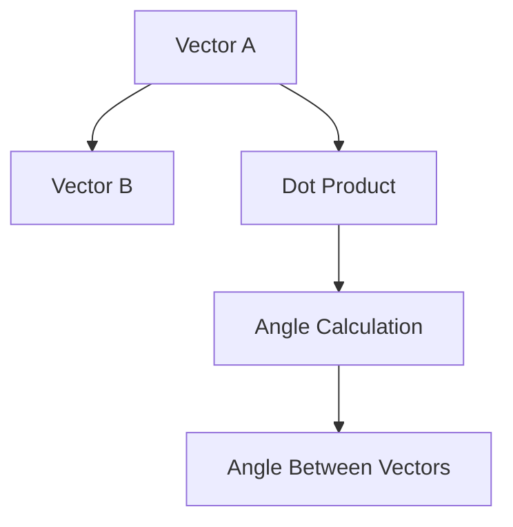

# Unit – III: Vectors

*(AI-generated self-study book for GTU, subject code C4300001 — generated locally with Ollama.)*

This module carries approximately **14 marks (4 Remember + 6 Understand + 4 Apply) (per syllabus)**.

Learning objectives covered by this module:
- 3.a. Apply the concept of algebraic operations of Vectors to solve given simple engineering problem(s)
- 3.b. Apply the concept of Scalar and Vector product to solve specified simple problem(s)
- 3.c. Solve problems of work done and moment of force using the concept of Vectors.

## 3.1. Vector, Addition, Subtraction, Magnitude and Direction

### Definition of Vector
A **vector** is a mathematical object that has both magnitude and direction. In engineering, vectors are used to represent physical quantities such as force, velocity, and displacement, which have both size and direction.

### Vector Representation
Vectors can be represented in various ways. In this context, we will use the component form and graphical representation.

#### Component Form
A vector A in two dimensions can be written as A = A_x i + A_y j, where A_x and A_y are the components of the vector along the x and y axes, respectively, and i and j are unit vectors in the x and y directions, respectively.

#### Graphical Representation
Graphically, a vector is represented by an arrow. The length of the arrow represents the magnitude of the vector, and the direction of the arrow represents the direction of the vector.

### Vector Addition
The addition of vectors is performed by adding their corresponding components. If A = A_x i + A_y j and B = B_x i + B_y j, then the sum C = A + B is given by:

[ \mathbf{C} = (A_x + B_x) \hat{i} + (A_y + B_y) \hat{j} ]

**Example:**
> **Example:**  
> Consider two vectors A = 3 i + 4 j and B = 5 i - 2 j.  
> Find the sum C = A + B.

[ \mathbf{C} = (3 + 5) \hat{i} + (4 - 2) \hat{j} = 8 \hat{i} + 2 \hat{j} ]

### Vector Subtraction
Subtraction of vectors is similar to addition but involves subtracting the corresponding components. If A = A_x i + A_y j and B = B_x i + B_y j, then the difference D = A - B is given by:

[ \mathbf{D} = (A_x - B_x) \hat{i} + (A_y - B_y) \hat{j} ]

**Example:**
> **Example:**  
> Consider the same vectors A = 3 i + 4 j and B = 5 i - 2 j.  
> Find the difference D = A - B.

[ \mathbf{D} = (3 - 5) \hat{i} + (4 - (-2)) \hat{j} = -2 \hat{i} + 6 \hat{j} ]

### Magnitude of a Vector
The magnitude of a vector A = A_x i + A_y j is given by:

[ |\mathbf{A}| = \sqrt{A_x^2 + A_y^2} ]

**Example:**
> **Example:**  
> Find the magnitude of the vector A = 3 i + 4 j.

[ |\mathbf{A}| = \sqrt{3^2 + 4^2} = \sqrt{9 + 16} = \sqrt{25} = 5 ]

### Direction of a Vector
The direction of a vector A = A_x i + A_y j is given by the angle θ it makes with the positive x-axis. This angle can be found using:

[ \theta = \tan^{-1}\left(\frac{A_y}{A_x}\right) ]

**Example:**
> **Example:**  
> Find the direction of the vector A = 3 i + 4 j.

[ \theta = \tan^{-1}\left(\frac{4}{3}\right) ]

### Summary
In summary, vectors are essential in engineering for representing quantities with both magnitude and direction. Vector addition and subtraction involve adding or subtracting corresponding components, respectively. The magnitude of a vector is calculated using the Pythagorean theorem, and the direction is determined using the inverse tangent function.

This diagram illustrates the flow from defining a vector to performing operations such as addition and subtraction, calculating magnitude, and finding direction.

---

## 3.2. Scalar and Vector Product and its Properties

### 3.2.1. Introduction to Scalar and Vector Products

- **Scalar Product (Dot Product):** The scalar product of two vectors A and B is a scalar quantity denoted by A · B and is defined as:
  [
  \mathbf{A} \cdot \mathbf{B} = AB \cos \theta
  ]
  where A and B are the magnitudes of vectors A and B respectively, and θ is the angle between the vectors.

- **Vector Product (Cross Product):** The vector product of two vectors A and B is a vector quantity denoted by A × B and is defined as:
  [
  \mathbf{A} \times \mathbf{B} = AB \sin \theta \mathbf{n}
  ]
  where n is a unit vector perpendicular to both A and B, following the right-hand rule.

### 3.2.2. Properties of Scalar Product

- **Commutative Property:** The scalar product is commutative, i.e.,
  [
  \mathbf{A} \cdot \mathbf{B} = \mathbf{B} \cdot \mathbf{A}
  ]
  - **Example:** If A = 3i + 4j and B = 5i - 2j, then
    [
    \mathbf{A} \cdot \mathbf{B} = (3 \times 5) + (4 \times -2) = 15 - 8 = 7
    ]
    and
    [
    \mathbf{B} \cdot \mathbf{A} = (5 \times 3) + (-2 \times 4) = 15 - 8 = 7
    ]
    \>
    **Example:** If A = 3i + 4j and B = 5i - 2j, calculate A · B and B · A.

### 3.2.3. Properties of Vector Product

- **Anti-Commutative Property:** The vector product is anti-commutative, i.e.,
  [
  \mathbf{A} \times \mathbf{B} = -(\mathbf{B} \times \mathbf{A})
  ]
  - **Example:** If A = 3i + 4j and B = 5i - 2j, then
    [
    \mathbf{A} \times \mathbf{B} = \begin{vmatrix} \mathbf{i} & \mathbf{j} & \mathbf{k} \\ 3 & 4 & 0 \\ 5 & -2 & 0 \end{vmatrix} = (3 \times -2 - 4 \times 5)\mathbf{k} = -26\mathbf{k}
    ]
    and
    [
    \mathbf{B} \times \mathbf{A} = \begin{vmatrix} \mathbf{i} & \mathbf{j} & \mathbf{k} \\ 5 & -2 & 0 \\ 3 & 4 & 0 \end{vmatrix} = (5 \times 4 - (-2) \times 3)\mathbf{k} = 26\mathbf{k}
    ]
    \>
    **Example:** If A = 3i + 4j and B = 5i - 2j, calculate A × B and B × A.

### 3.2.4. Geometric Interpretation of Scalar Product and Vector Product

- **Scalar Product:** The scalar product can be geometrically interpreted as the product of the magnitude of one vector and the projection of the other vector onto the first vector.
  - **Example:** If A = 3i + 4j and B = 5i - 2j, and θ = 60^, then
    [
    \mathbf{A} \cdot \mathbf{B} = AB \cos 60^\circ = \sqrt{3^2 + 4^2} \times \sqrt{5^2 + (-2)^2} \times \frac{1}{2} = 5 \times \sqrt{29} \times \frac{1}{2} \approx 7.21
    ]

- **Vector Product:** The magnitude of the vector product can be interpreted as the area of the parallelogram formed by the vectors. The direction is given by the right-hand rule.
  - **Example:** If A = 3i + 4j and B = 5i - 2j, then
    [
    |\mathbf{A} \times \mathbf{B}| = AB \sin 60^\circ = 5 \times \sqrt{29} \times \frac{\sqrt{3}}{2} \approx 12.52
    ]
    The direction of A × B is k, following the right-hand rule.

### 3.2.5. Application to Work Done and Moment of Force

- **Work Done:** The work done by a force F along a displacement s is given by the scalar product F · s.
  - **Example:** If a force F = 2i + 3j acts on a displacement s = 4i - 2j, then
    [
    \mathbf{F} \cdot \mathbf{s} = (2 \times 4) + (3 \times -2) = 8 - 6 = 2 \text{ Joules}
    ]

- **Moment of Force:** The moment of a force F about a point is given by the vector product r × F, where r is the position vector from the point to the point of application of the force.
  - **Example:** If a force F = 2i + 3j acts at a point given by the position vector r = 3i + 4j, then
    [
    \mathbf{r} \times \mathbf{F} = \begin{vmatrix} \mathbf{i} & \mathbf{j} & \mathbf{k} \\ 3 & 4 & 0 \\ 2 & 3 & 0 \end{vmatrix} = (3 \times 3 - 4 \times 2)\mathbf{k} = 1\mathbf{k} \text{ Nm}
    ]

> **Example:** If a force F = 2i + 3j acts at a point given by the position vector r = 3i + 4j, calculate the moment of force r × F.

---

## 3.3. Angle between two Vectors

### Definition of Angle between Vectors
The angle between two vectors A and B is the smallest angle θ formed by them when placed tail to tail. This angle can be found using the dot product (or scalar product) of the two vectors.

### Formula for the Angle between Vectors
The formula to find the angle θ between two vectors A and B is given by:
[ \mathbf{A} \cdot \mathbf{B} = |\mathbf{A}| |\mathbf{B}| \cos \theta ]
Rearranging this formula, we get:
[ \cos \theta = \frac{\mathbf{A} \cdot \mathbf{B}}{|\mathbf{A}| |\mathbf{B}|} ]
[ \theta = \cos^{-1} \left( \frac{\mathbf{A} \cdot \mathbf{B}}{|\mathbf{A}| |\mathbf{B}|} \right) ]

### Worked Example
> **Example:** 
Suppose we have two vectors A = 2i + 3j - k and B = i - 2j + 2k. Find the angle between these vectors.

1. **Calculate the dot product A · B:**
[ \mathbf{A} \cdot \mathbf{B} = (2)(1) + (3)(-2) + (-1)(2) = 2 - 6 - 2 = -6 ]

2. **Calculate the magnitudes of A and B:**
[ |\mathbf{A}| = \sqrt{2^2 + 3^2 + (-1)^2} = \sqrt{4 + 9 + 1} = \sqrt{14} ]
[ |\mathbf{B}| = \sqrt{1^2 + (-2)^2 + 2^2} = \sqrt{1 + 4 + 4} = \sqrt{9} = 3 ]

3. **Substitute the values into the formula for θ:**
[ \cos \theta = \frac{-6}{\sqrt{14} \cdot 3} = \frac{-6}{3\sqrt{14}} = \frac{-2}{\sqrt{14}} ]

4. **Find θ using the inverse cosine function:**
[ \theta = \cos^{-1} \left( \frac{-2}{\sqrt{14}} \right) ]

Using a calculator, we get:
[ \theta \approx 111.8^{\circ} ]

Thus, the angle between the vectors A and B is approximately 111.8.

This flowchart illustrates the steps involved in finding the angle between two vectors, starting from the dot product and ending with the angle calculation.

---

## 3.4. Applications of Scalar and Vector Product (Work Done and Moment of Force)

### Scalar Product (Dot Product)
The scalar product of two vectors A and B is defined as:
[ \mathbf{A} \cdot \mathbf{B} = AB \cos \theta ]
where θ is the angle between the vectors A and B. The scalar product results in a scalar quantity.

#### Work Done by a Force
Work done by a force F over a displacement s is given by the scalar product of the force and displacement vectors:
[ W = \mathbf{F} \cdot \mathbf{s} ]

**Example:**
> **Example:** A force F = 3 i + 4 j N acts on a particle, moving it from point A(1, 2) to point B(4, 6). Calculate the work done by the force.
> 
> Solution:
> First, find the displacement vector s:
> [ \mathbf{s} = (4 - 1) \mathbf{i} + (6 - 2) \mathbf{j} = 3 \mathbf{i} + 4 \mathbf{j} ]
> Now, calculate the work done:
> [ W = \mathbf{F} \cdot \mathbf{s} = (3 \mathbf{i} + 4 \mathbf{j}) \cdot (3 \mathbf{i} + 4 \mathbf{j}) = 3 \cdot 3 + 4 \cdot 4 = 9 + 16 = 25 \, \text{J} ]

### Vector Product (Cross Product)
The vector product of two vectors A and B is defined as:
[ \mathbf{A} \times \mathbf{B} = AB \sin \theta \, \mathbf{n} ]
where n is a unit vector perpendicular to both A and B, and θ is the angle between the vectors.

#### Moment of Force
The moment of a force F about a point is given by the vector product of the position vector r and the force vector F:
[ \mathbf{M} = \mathbf{r} \times \mathbf{F} ]

**Example:**
> **Example:** A force F = 2 i + 3 j - k N is applied at a point r = 4 i + 2 j - 3 k m. Calculate the moment of the force about the origin.
> 
> Solution:
> The moment vector M is given by:
> [ \mathbf{M} = \mathbf{r} \times \mathbf{F} = \begin{vmatrix} \mathbf{i} & \mathbf{j} & \mathbf{k} \\ 4 & 2 & -3 \\ 2 & 3 & -1 \end{vmatrix} ]
> Calculate the determinant:
> [ \mathbf{M} = \mathbf{i} (2 \cdot -1 - 3 \cdot -3) - \mathbf{j} (4 \cdot -1 - 2 \cdot -3) + \mathbf{k} (4 \cdot 3 - 2 \cdot 2) ]
> [ \mathbf{M} = \mathbf{i} (-2 + 9) - \mathbf{j} (-4 + 6) + \mathbf{k} (12 - 4) ]
> [ \mathbf{M} = 7 \mathbf{i} - 2 \mathbf{j} + 8 \mathbf{k} \, \text{Nm} ]

In summary, the scalar and vector products have significant applications in engineering, particularly in calculating work done and moments of force. Understanding these concepts is crucial for solving various practical problems in mechanics.
