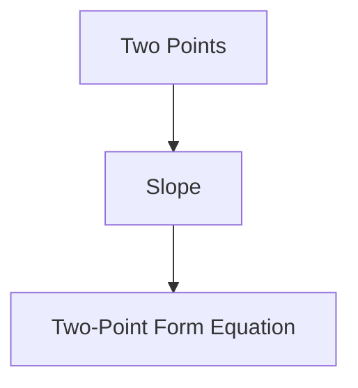
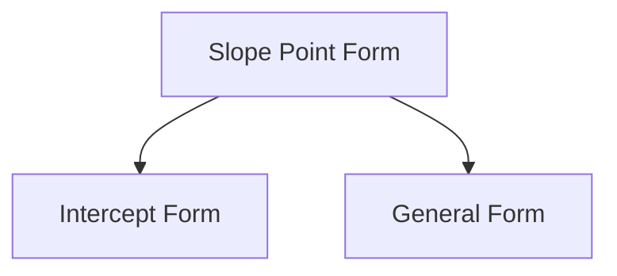
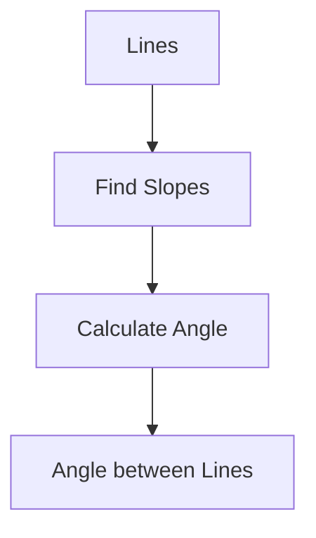
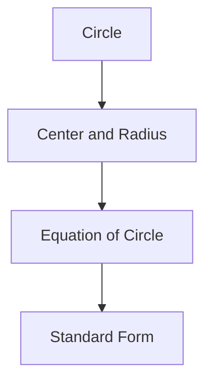

# Unit – IV: Coordinate Geometry

*(AI-generated self-study book for GTU, subject code C4300001 — generated locally with Ollama.)*

This module carries approximately **14 marks (4 Remember + 5 Understand + 5 Apply) (per syllabus)**.

Learning objectives covered by this module:
- 4.a. Employ the equation of straight line to solve given simple problems.
- 4.b. Apply the concept of slope and its consequences to
- 4.c. Find the angle between two lines using the concept of Parallel and Perpendicular lines.
- 4.d. Apply the concept of equation of circle with center and radius to solve the given problems.
- 4.e. Solve problems related to general equation of circle based on tangent and normal. perpendicular lines

## 4.1. Straight line (Two-point form) and slope of straight line

### 4.1.1. Slope of a Straight Line
The slope of a straight line is a measure of its steepness. It is defined as the change in the vertical direction (rise) divided by the change in the horizontal direction (run). Mathematically, it is given by:
[ m = \frac{y_2 - y_1}{x_2 - x_1} ]
where (x₁, y₁) and (x₂, y₂) are any two points on the line.

### 4.1.2. Two-Point Form of the Equation of a Straight Line
The two-point form of the equation of a straight line can be derived using the slope formula. If two points (x₁, y₁) and (x₂, y₂) lie on the line, the equation of the line is:
[ y - y_1 = m(x - x_1) ]
where m is the slope of the line, calculated as:
[ m = \frac{y_2 - y_1}{x_2 - x_1} ]

### 4.1.3. Example
> **Example:** Find the equation of the straight line passing through the points (2, 3) and (4, 7).

1. Calculate the slope m:
   [ m = \frac{7 - 3}{4 - 2} = \frac{4}{2} = 2 ]
2. Use the two-point form equation:
   [ y - 3 = 2(x - 2) ]
3. Simplify the equation:
   [ y - 3 = 2x - 4 ]
   [ y = 2x - 1 ]

### 4.1.4. Mermaid Diagram

## 4.2. Slope Point Form, Intercept Form, General Form of Line

### 4.2.1. Slope Point Form of the Equation of a Straight Line
The slope point form of the equation of a straight line is:
[ y - y_1 = m(x - x_1) ]
where (x₁, y₁) is a point on the line and m is the slope of the line.

### 4.2.2. Intercept Form of the Equation of a Straight Line
The intercept form of the equation of a straight line is:
[ \frac{x}{a} + \frac{y}{b} = 1 ]
where a is the x-intercept and b is the y-intercept.

### 4.2.3. General Form of the Equation of a Straight Line
The general form of the equation of a straight line is:
[ Ax + By + C = 0 ]
where A, B, and C are constants, and A and B are not both zero.

### 4.2.4. Example
> **Example:** Find the equation of the straight line in slope point form, intercept form, and general form passing through the points (3, 2) and (5, 6).

1. **Slope Point Form:**
   - Calculate the slope m:
     [ m = \frac{6 - 2}{5 - 3} = \frac{4}{2} = 2 ]
   - Use the slope point form:
     [ y - 2 = 2(x - 3) ]
   - Simplify:
     [ y - 2 = 2x - 6 ]
     [ y = 2x - 4 ]

2. **Intercept Form:**
   - Find the x-intercept a and y-intercept b:
     - When y = 0:
       [ 0 = 2x - 4 ]
       [ x = 2 ]
     - When x = 0:
       [ y = 2(0) - 4 = -4 ]
   - Use the intercept form:
     [ \frac{x}{2} + \frac{y}{-4} = 1 ]
     [ \frac{x}{2} - \frac{y}{4} = 1 ]

3. **General Form:**
   - Rearrange the slope point form:
     [ y = 2x - 4 ]
     [ 2x - y - 4 = 0 ]

### 4.2.5. Mermaid Diagram

By understanding and applying these forms, you can solve a variety of problems related to straight lines in your exams.

---

## 4.3. Condition of Parallel and Mathematics Course Code: 4300001 NITTTR Bhopal – GTU - COGC-2021 Curriculum Topics and Sub-topics Solve the Given Problems.

### 4.3.1. Condition for Parallel Lines
Two lines are parallel if and only if their slopes are equal. The slope of a line is the ratio of the change in y to the change in x, and can be represented as m. For two lines to be parallel, the equation of a line in slope-intercept form is given by y = mx + c, where m is the slope and c is the y-intercept.

> **Example:** Determine if the lines 2x + 3y = 6 and 4x + 6y = 12 are parallel.

1. First, we convert the equations to slope-intercept form:
   - For 2x + 3y = 6:
     [
     3y = -2x + 6 \implies y = -\frac{2}{3}x + 2
     ]
     The slope m₁ = - 2 3.

   - For 4x + 6y = 12:
     [
     6y = -4x + 12 \implies y = -\frac{2}{3}x + 2
     ]
     The slope m₂ = - 2 3.

2. Since m₁ = m₂, the lines are parallel.

### 4.3.2. Solving Problems Using the Condition of Parallel Lines

> **Example:** If the line 3x - 2y = 5 is parallel to the line 6x - 4y = k, find the value of k.

1. Convert the equations to slope-intercept form:
   - For 3x - 2y = 5:
     [
     -2y = -3x + 5 \implies y = \frac{3}{2}x - \frac{5}{2}
     ]
     The slope m₁ = 3 2.

   - For 6x - 4y = k:
     [
     -4y = -6x + k \implies y = \frac{3}{2}x - \frac{k}{4}
     ]
     The slope m₂ = 3 2.

2. Since the lines are parallel, m₁ = m₂:
   [
   \frac{3}{2} = \frac{3}{2} \implies k \text{ can be any value}
   ]
   However, the problem is asking for the value of k such that the lines are parallel, which is already satisfied for any k. Thus, the specific value of k is not uniquely determined by the condition of parallelism alone.

## 4.4. Equations of Parallel Lines and Perpendicular Lines to the Given Lines

### 4.4.1. Equations of Parallel Lines
If a line is parallel to another line, their slopes are equal. The equation of a line parallel to ax + by = c and passing through the point (x₁, y₁) can be written as ax + by = d, where d is a constant determined by substituting (x₁, y₁).

> **Example:** Find the equation of the line parallel to 3x - 4y = 7 and passing through the point (2, -1).

1. The slope of the line 3x - 4y = 7 is m = 3 4.
2. The equation of the parallel line can be written as 3x - 4y = d.
3. Substitute (2, -1) into the equation:
   [
   3(2) - 4(-1) = d \implies 6 + 4 = d \implies d = 10
   ]
4. Therefore, the equation of the line is 3x - 4y = 10.

### 4.4.2. Equations of Perpendicular Lines
If two lines are perpendicular, the product of their slopes is -1. The equation of a line perpendicular to ax + by = c and passing through the point (x₁, y₁) can be written as bx - ay = d, where d is a constant determined by substituting (x₁, y₁).

> **Example:** Find the equation of the line perpendicular to 3x - 4y = 7 and passing through the point (2, -1).

1. The slope of the line 3x - 4y = 7 is m = 3 4. The slope of the perpendicular line is m' = - 4 3.
2. The equation of the perpendicular line can be written as -4x - 3y = d.
3. Substitute (2, -1) into the equation:
   [
   -4(2) - 3(-1) = d \implies -8 + 3 = d \implies d = -5
   ]
4. Therefore, the equation of the line is -4x - 3y = -5 or 4x + 3y = 5.

> **Example:** Determine if the lines 2x + 3y = 6 and 4x + 6y = 12 are parallel.

1. Convert the equations to slope-intercept form:
   - For 2x + 3y = 6:
     [
     3y = -2x + 6 \implies y = -\frac{2}{3}x + 2
     ]
     The slope m₁ = - 2 3.

   - For 4x + 6y = 12:
     [
     6y = -4x + 12 \implies y = -\frac{2}{3}x + 2
     ]
     The slope m₂ = - 2 3.

2. Since m₁ = m₂, the lines are parallel.

---

## 4.5. Angle between two lines.

### Definition and Concept
The angle between two lines is the smallest angle formed between their directions. This angle is measured from one line to the other and is always between 0° and 180°.

### Slope of a Line
The slope (m) of a line is defined as the tangent of the angle (θ) that the line makes with the positive x-axis. The slope can be calculated from the coordinates of any two points on the line using the formula:
[ m = \frac{y_2 - y_1}{x_2 - x_1} ]

### Angle Between Two Lines
The angle (θ) between two lines with slopes m₁ and m₂ can be found using the following formula:
[ \tan \theta = \left| \frac{m_1 - m_2}{1 + m_1 m_2} \right| ]
From this, the angle θ can be calculated as:
[ \theta = \tan^{-1} \left( \left| \frac{m_1 - m_2}{1 + m_1 m_2} \right| \right) ]

### Example
> **Example:** Find the angle between the lines with equations 2x - 3y + 5 = 0 and 4x + 6y - 7 = 0.

1. First, find the slopes of both lines.
2. The slope of the line 2x - 3y + 5 = 0 is:
   [ m_1 = \frac{2}{3} ]
3. The slope of the line 4x + 6y - 7 = 0 is:
   [ m_2 = -\frac{4}{6} = -\frac{2}{3} ]
4. Substitute these values into the formula for the angle between the lines:
   [ \tan \theta = \left| \frac{\frac{2}{3} - \left(-\frac{2}{3}\right)}{1 + \left(\frac{2}{3}\right)\left(-\frac{2}{3}\right)} \right| = \left| \frac{\frac{4}{3}}{1 - \frac{4}{9}} \right| = \left| \frac{\frac{4}{3}}{\frac{5}{9}} \right| = \left| \frac{4}{3} \times \frac{9}{5} \right| = \left| \frac{12}{5} \right| = \frac{12}{5} ]
5. Therefore, the angle θ is:
   [ \theta = \tan^{-1} \left( \frac{12}{5} \right) ]

### Mermaid Diagram

## 4.6. Equation of Circle with Center and Radius

### Definition
The general equation of a circle with center (h, k) and radius r is given by:
[ (x - h)^2 + (y - k)^2 = r^2 ]

### Standard Form
The standard form of the equation of a circle with center (h, k) and radius r is:
[ (x - h)^2 + (y - k)^2 = r^2 ]

### Example
> **Example:** Find the equation of the circle with center (3, -4) and radius 5.

1. Use the standard form of the equation of a circle:
   [ (x - h)^2 + (y - k)^2 = r^2 ]
2. Substitute h = 3, k = -4, and r = 5:
   [ (x - 3)^2 + (y + 4)^2 = 5^2 ]
3. Simplify the right-hand side:
   [ (x - 3)^2 + (y + 4)^2 = 25 ]

### Mermaid Diagram

### Summary
- The angle between two lines can be found using the slopes of the lines.
- The equation of a circle with center and radius can be written in standard form.

These examples and explanations should help you in solving problems related to the angle between lines and the equation of a circle with center and radius.

---

## 4.7. General Equation of Circle

### Definition and Standard Form

A circle is the set of all points in a plane that are equidistant from a fixed point called the center. The distance from the center to any point on the circle is known as the radius. The general equation of a circle is given by the formula:

[ x^2 + y^2 + 2gx + 2fy + c = 0 ]

where g, f, and c are constants. This equation can be transformed into the standard form (x - h)² + (y - k)² = r² by completing the square.

### Converting to Standard Form

To convert the general form to the standard form, follow these steps:

1. **Group the x and y terms:**

   [ x^2 + 2gx + y^2 + 2fy + c = 0 ]

2. **Complete the square for x and y:**

   [ (x^2 + 2gx) + (y^2 + 2fy) + c = 0 ]

   [ (x + g)^2 - g^2 + (y + f)^2 - f^2 + c = 0 ]

   [ (x + g)^2 + (y + f)^2 = g^2 + f^2 - c ]

3. **Identify the center and radius:**

   [ (x + g)^2 + (y + f)^2 = r^2 ]

   Here, the center of the circle is (-g, -f) and the radius r is g² + f² - c.

### Worked Example

> **Example:** Find the center and radius of the circle given by the equation x² + y² - 6x + 4y - 12 = 0.

1. **Group the x and y terms:**

   [ x^2 - 6x + y^2 + 4y = 12 ]

2. **Complete the square:**

   For x: x² - 6x becomes (x - 3)² - 9.

   For y: y² + 4y becomes (y + 2)² - 4.

   [ (x - 3)^2 - 9 + (y + 2)^2 - 4 = 12 ]

   [ (x - 3)^2 + (y + 2)^2 - 13 = 12 ]

   [ (x - 3)^2 + (y + 2)^2 = 25 ]

3. **Identify the center and radius:**

   The center is (3, -2) and the radius is 25 = 5.

Thus, the center is (3, -2) and the radius is 5.

### Applications of the General Equation

The general equation of a circle can be used in various applications, such as in physics to describe the motion of objects in a circular path, or in engineering to design circular structures.

## 4.8. Tangent and Normal to a Circle

### Definition of Tangent and Normal

- **Tangent:** A tangent to a circle is a line that touches the circle at exactly one point.
- **Normal:** The normal to a circle at a point is a line that is perpendicular to the tangent at that point.

### Equations of Tangent and Normal

To find the equations of the tangent and normal to a circle, consider the circle x² + y² + 2gx + 2fy + c = 0 and a point (x₁, y₁) on the circle.

1. **Equation of the Tangent:**

   The equation of the tangent at (x₁, y₁) is given by:

   [ xx_1 + yy_1 + g(x + x_1) + f(y + y_1) + c = 0 ]

2. **Equation of the Normal:**

   The equation of the normal at (x₁, y₁) can be found by using the slope of the tangent. The slope of the tangent is - g + x₁ f + y₁, so the slope of the normal is the negative reciprocal, which is f + y₁ g + x₁.

   The equation of the normal is:

   [ y - y_1 = \frac{f + y_1}{g + x_1} (x - x_1) ]

### Worked Example

> **Example:** Find the equation of the tangent and normal to the circle x² + y² - 6x + 4y - 12 = 0 at the point (5, 2).

1. **Equation of the Tangent:**

   The given circle is x² + y² - 6x + 4y - 12 = 0. The point is (5, 2).

   The equation of the tangent is:

   [ 5x + 2y - 3(5 + 5) + 2(2 + 2) - 12 = 0 ]

   [ 5x + 2y - 30 + 8 - 12 = 0 ]

   [ 5x + 2y - 34 = 0 ]

2. **Equation of the Normal:**

   The slope of the tangent at (5, 2) is - -3 2 = 3 2. The slope of the normal is - 2 3.

   The equation of the normal is:

   [ y - 2 = -\frac{2}{3} (x - 5) ]

   [ 3(y - 2) = -2(x - 5) ]

   [ 3y - 6 = -2x + 10 ]

   [ 2x + 3y - 16 = 0 ]

Thus, the equation of the tangent is 5x + 2y - 34 = 0 and the equation of the normal is 2x + 3y - 16 = 0.

This flowchart illustrates the process from the general form to finding the center and radius, and then to deriving the equations of the tangent and normal.
