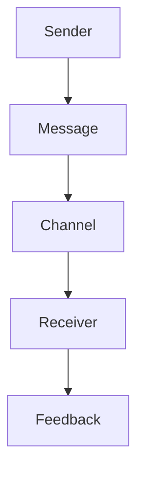

# Unit – 1: Theory of Communi- cation

*(AI-generated self-study book for GTU, subject code C4300002 — generated locally with Ollama.)*

This module carries approximately ****.

Learning objectives covered by this module:
- 1.a. Define the theory of communication
- 1.b. State different types of communication.
- 1.c. Explain barriers in communication
- 1.d. Communicate effectively

## 1.1. Concept of effective communication and communication skills

### Definition of Effective Communication
**Effective communication** is the process by which information, ideas, and feelings are exchanged between individuals or groups in a clear and efficient manner. It is a fundamental skill in both personal and professional contexts. Effective communication ensures that the message is understood as intended, leading to better decision-making and problem-solving.

### Types of Communication
Effective communication can be categorized into two main types: **Verbal** and **Non-verbal**.

- **Verbal Communication**: This involves the use of spoken or written words to convey messages. It includes face-to-face conversations, telephone calls, video calls, and written documents such as emails, reports, and memos.

- **Non-verbal Communication**: This includes body language, facial expressions, gestures, and physical appearance. Non-verbal cues can significantly influence the perception of the message and its effectiveness.

### Importance of Communication Skills
Effective communication skills are crucial in various aspects of life, including personal relationships, education, and professional settings. These skills enhance understanding, build trust, and foster positive interactions. For example, a manager who can communicate effectively with their team can improve productivity and morale.

### Key Components of Effective Communication
Effective communication involves several key components:

- **Clarity**: The message should be clear and unambiguous. Ambiguity can lead to misunderstandings.
- **Completeness**: The message should provide all necessary information to avoid confusion.
- **Conciseness**: The message should be brief and to the point, avoiding unnecessary details.
- **Correctness**: The message should be accurate and free from errors.

### Barriers to Effective Communication
Despite the importance of effective communication, several barriers can hinder its effectiveness. These barriers include:

- **Language barriers**: Differences in dialects, jargon, or technical language can create misunderstandings.
- **Emotional barriers**: Emotional states such as stress, anger, or fear can affect the clarity and effectiveness of the message.
- **Attitudinal barriers**: Prejudices, biases, or resistance to change can prevent effective communication.
- **Physical barriers**: Environmental factors such as noise, distance, or poor lighting can impede communication.

### Example
> **Example:**  
> Consider a scenario where a manager is giving feedback to an employee. The manager could say, "You did a great job on the project, but I noticed you could have been more efficient with your time." This feedback is clear, concise, and constructive, making it effective. Alternatively, the manager could say, "You're doing a terrible job and need to improve your time management." This feedback is less effective as it is vague, negative, and lacks specific details.

Effective communication skills are essential for success in any field. By understanding the components and barriers of effective communication, one can improve their ability to convey and receive information accurately and efficiently.

---

## 1.2. Basic Communication Model (S+M+C+R+F)

### Definition of the Basic Communication Model
The basic communication model is a fundamental concept that explains how messages are transmitted from a sender to a receiver through a medium, while being influenced by various factors. It is represented by the acronym S+M+C+R+F, where each letter stands for a crucial component in the communication process.

- **S (Sender):** The person or entity that initiates and encodes the message. The sender is responsible for creating the message and conveying it to the receiver.
- **M (Message):** The content or information that the sender intends to communicate. This can be verbal, written, or non-verbal, such as gestures or facial expressions.
- **C (Channel):** The medium or pathway through which the message is transmitted. This can include various modes such as spoken words, written text, emails, or digital platforms.
- **R (Receiver):** The person or entity that receives and decodes the message. The receiver processes the message and interprets it based on their own context and experiences.
- **F (Feedback):** The response given by the receiver to the sender. Feedback can be direct (verbal or written) or indirect (through actions or inactions).

### Explanation of the Basic Communication Model

The basic communication model can be visualized as a flowchart. Here, we will use mermaid syntax to represent it:

### Example of the Basic Communication Model

> **Example:** 
>
> **Scenario:** A manager wants to inform her team about a new project.
>
> - **Sender (S):** The manager.
> - **Message (M):** "We are starting a new project to improve our product's user interface. The deadline is next month, and we need your full commitment."
> - **Channel (C):** Email.
> - **Receiver (R):** The team members.
> - **Feedback (F):** The team members reply with questions and concerns about the project's requirements and timeline.

### Key Points to Remember
- **Accuracy and Clarity:** The message should be clear and concise to avoid misunderstandings.
- **Choosing the Right Channel:** The choice of channel should match the nature and urgency of the message.
- **Feedback Mechanism:** Effective communication requires a mechanism for the receiver to provide feedback to the sender.
- **Contextual Understanding:** Both the sender and receiver should have a shared understanding of the context to ensure the message is interpreted correctly.

### Practical Application
In a business context, consider a marketing team wanting to launch a new campaign. The marketing manager (sender) decides to send a detailed plan via email (channel) to the team. The team (receiver) reads the email and responds with feedback, suggesting improvements and asking for clarifications (feedback).

By understanding and applying the basic communication model, you can enhance your communication skills and ensure that messages are effectively conveyed and understood.

---

## 1.3. Types of Communication

### 1.3.1 Verbal Communication

Verbal communication involves the transmission of information through spoken or written words. It can be further classified into two main categories: **formal** and **informal**.

- **Formal Verbal Communication:** This type of communication is structured and follows specific rules. It is used in professional and academic settings. Examples include meetings, presentations, and reports.
  
- **Informal Verbal Communication:** This type of communication is spontaneous and less structured. It is often used in personal and social settings. Examples include conversations, telephone calls, and casual discussions.

### 1.3.2 Non-Verbal Communication

Non-verbal communication refers to the transmission of messages using body language, facial expressions, gestures, and other forms of non-verbal cues. It plays a significant role in effective communication.

- **Body Language:** This includes posture, eye contact, and facial expressions. For example, maintaining eye contact during a conversation can convey confidence and attentiveness.
  
- **Facial Expressions:** These are crucial in conveying emotions. A smile can show friendliness, while a frown can indicate displeasure.
  
- **Gestures:** Hand and arm movements can emphasize points or convey meaning. For instance, nodding the head can confirm agreement, and shaking hands can symbolize a handshake agreement.

### 1.3.3 Written Communication

Written communication involves the exchange of information through written words. It can be formal or informal.

- **Formal Written Communication:** This includes documents such as letters, reports, and emails. It is used in professional and academic settings. For example, a business letter should follow a specific format and structure.
  
- **Informal Written Communication:** This includes personal notes, social media posts, and text messages. It is used in personal and social settings. For example, sending a text message to a friend to arrange a meeting.

### 1.3.4 Electronic Communication

Electronic communication refers to the use of digital technology to send and receive information. It includes emails, instant messaging, social media, and video conferencing.

- **Email:** Used for professional and academic communication. It should follow a formal tone and include a clear subject line.
  
- **Instant Messaging:** Used for quick, informal communication. Examples include WhatsApp and Facebook Messenger.
  
- **Social Media:** Used for public and personal communication. Examples include Twitter, Instagram, and LinkedIn.

### 1.3.5 Interpersonal Communication

Interpersonal communication involves direct interaction between individuals. It can be one-to-one or in a group setting.

- **One-to-One Communication:** This includes face-to-face interactions, phone calls, and video chats. For example, a manager discussing project details with an employee.
  
- **Group Communication:** This includes team meetings, presentations, and group discussions. For example, a team meeting to discuss project plans.

### 1.3.6 Intrapersonal Communication

Intrapersonal communication refers to the communication that takes place within an individual. It involves thoughts, emotions, and self-talk.

- **Thoughts and Emotions:** An individual can reflect on their experiences and feelings. For example, a student may think about their exam preparation.
  
- **Self-Talk:** This involves internal dialogue. For example, repeating positive affirmations to boost confidence before an exam.

### 1.3.7 Inter-Cultural Communication

Inter-cultural communication involves communication between individuals from different cultural backgrounds. It is important in today's globalized world.

- **Language Barriers:** Differences in language can create misunderstandings. For example, a businessperson from India and a businessperson from the USA might use different terms for the same concept.
  
- **Non-Verbal Cues:** Non-verbal cues can vary significantly across cultures. For example, direct eye contact is seen as respectful in some cultures but rude in others.

### 1.3.8 Intrapersonal Communication

Intrapersonal communication involves the communication that takes place within an individual. It includes thoughts, emotions, and self-talk.

- **Thoughts and Emotions:** An individual can reflect on their experiences and feelings. For example, a student may think about their exam preparation.
  
- **Self-Talk:** This involves internal dialogue. For example, repeating positive affirmations to boost confidence before an exam.

### 1.3.9 Intra-Organizational Communication

Intra-organizational communication involves communication within an organization. It can be formal or informal.

- **Formal:** This includes reports, memos, and meetings. For example, a department head communicating the organization's goals to employees.
  
- **Informal:** This includes gossip, rumors, and water-cooler conversations. For example, employees discussing project deadlines over lunch.

### 1.3.10 Inter-Organizational Communication

Inter-organizational communication involves communication between different organizations. It can be formal or informal.

- **Formal:** This includes contracts, agreements, and business meetings. For example, a supplier and a customer discussing terms of a new contract.
  
- **Informal:** This includes networking, informal meetings, and industry events. For example, a business meeting at a trade fair.

### 1.3.11 Media Communication

Media communication involves the use of media channels to disseminate information. It includes print, broadcast, and digital media.

- **Print Media:** This includes newspapers, magazines, and books. For example, a journalist writing an article for a newspaper.
  
- **Broadcast Media:** This includes television, radio, and podcasts. For example, a broadcaster conducting an interview.
  
- **Digital Media:** This includes the internet, social media, and online platforms. For example, a blogger writing a post on a website.

### 1.3.12 Mass Communication

Mass communication involves the dissemination of information to a large, undifferentiated audience.

- **Broadcast Media:** This includes television, radio, and podcasts. For example, a news broadcast informing the public about an event.
  
- **Print Media:** This includes newspapers and magazines. For example, a newspaper reporting on a local election.

### 1.3.13 Personal Communication

Personal communication involves direct, one-on-one interaction between individuals.

- **Face-to-Face Interaction:** This includes meetings, interviews, and casual conversations. For example, a client meeting with a salesperson.
  
- **Phone Calls:** This includes direct communication over the phone. For example, a customer service representative assisting a customer.

### 1.3.14 Group Communication

Group communication involves interaction within a group setting.

- **Team Meetings:** This includes discussions and problem-solving sessions. For example, a project team meeting to discuss progress.
  
- **Group Discussions:** This includes collaborative activities and brainstorming sessions. For example, a group of students discussing a project idea.

### 1.3.15 Work Communication

Work communication involves the exchange of information in a professional setting.

- **Emails:** This includes formal communication over email. For example, a manager sending a report to a colleague.
  
- **Presentations:** This includes formal communication through presentations. For example, a presentation given to stakeholders.

> **Example:** 
> 
> **Identify the type of communication used in the following scenario:**
> 
> A manager is having a one-on-one meeting with an employee to discuss project progress.
> 
> **Answer:** The type of communication used in this scenario is **One-to-One Communication**.

---

## 1.4. Barriers of Effective Communication

Effective communication is crucial in both personal and professional settings. However, several barriers can hinder the process, leading to misunderstandings, misinterpretations, and ineffective communication. Understanding these barriers is essential to improve communication skills.

### 1.4.1. Physical Barriers

Physical barriers are external obstacles that can interfere with the communication process. These include:

- **Noise:** Environmental noise, such as construction work, can make it difficult to hear the message.
- **Distance:** Spatial separation between the sender and receiver can lead to poor clarity in verbal and non-verbal communication.
- **Technology Issues:** Malfunctioning equipment, such as poor internet connection or outdated software, can disrupt communication.

**Example:**
> **Example:** During a virtual meeting, the speaker’s internet connection was weak, causing frequent disruptions. The meeting participants could not hear clearly, leading to a significant delay in decision-making.

### 1.4.2. Semantic Barriers

Semantic barriers arise due to differences in language, vocabulary, and jargon, which can lead to misunderstandings.

- **Language Barriers:** Language differences can cause confusion. For example, the word "dust" in Hindi means "dirt" in English.
- **Vocabulary:** Using complex or unfamiliar terms can confuse the receiver. For instance, using technical jargon in a non-technical meeting can make the message hard to understand.
- **Ambiguity:** Vague or ambiguous language can lead to misinterpretation. For example, using the phrase "I will try" instead of "I will do it" can be unclear.

**Example:**
> **Example:** During a project meeting, a team member used the term "kick-off," which led to confusion among non-technical members who were unfamiliar with the term. This caused delays in starting the project.

### 1.4.3. Psychological Barriers

Psychological barriers are internal obstacles that affect the communication process. These include:

- **Perception:** Personal biases and preconceived notions can cloud judgment and lead to misinterpretation. For example, a manager might perceive a subordinate's request as a challenge to authority.
- **Emotional State:** Emotions such as anger, fear, or stress can impair clear thinking and effective communication. For instance, during a heated argument, individuals may not listen carefully to each other.
- **Attitude:** Negative attitudes towards the sender or the topic can lead to resistance and poor communication. For example, a team member might not fully engage in a discussion if they dislike the topic.

**Example:**
> **Example:** A manager was leading a team meeting when a conflict arose. Due to his anger, he did not listen to his team members' concerns and instead criticized them harshly. This emotional state led to a breakdown in communication and a tense environment.

### 1.4.4. Organizational Barriers

Organizational barriers are structural and procedural obstacles that can hinder effective communication.

- **Hierarchical Structure:** Hierarchical structures can create bottlenecks in communication, with messages getting delayed or altered as they move through different levels. For example, a suggestion from a junior employee might be filtered through several managers before reaching the decision-maker.
- **Inadequate Communication Channels:** The absence of proper communication channels can lead to misunderstandings. For instance, a company might have a policy of using only email for important communications, but some employees might not check their emails frequently.
- **Misaligned Goals:** When team members have different or unclear goals, communication can suffer. For example, a marketing team and a sales team might have different objectives, leading to misaligned efforts.

**Example:**
> **Example:** In a large organization, a new marketing strategy was communicated through a series of emails and meetings. However, the marketing team did not fully understand the sales team's objectives, leading to a misalignment in their efforts. This misalignment resulted in a lower than expected sales performance.

### 1.4.5. Cultural Barriers

Cultural barriers are related to differences in cultural norms, values, and beliefs that can affect communication.

- **Cultural Differences:** Different cultures have different communication styles. For example, some cultures may prefer direct and explicit communication, while others might rely on indirect and subtle cues.
- **Non-Verbal Communication:** Non-verbal cues such as body language, facial expressions, and tone of voice can be interpreted differently across cultures. For example, a nod might mean agreement in one culture but disagreement in another.
- **Social Norms:** Social norms and taboos can affect communication. For instance, discussing salary openly might be acceptable in one culture but considered impolite in another.

**Example:**
> **Example:** A multinational company was conducting a presentation in a country where direct eye contact is considered rude. The presenter, who was unaware of this cultural norm, continued to look directly at the audience, causing discomfort and misunderstanding.

### Summary

Effective communication is essential for both personal and professional success. However, various barriers can hinder the process. By understanding and addressing these barriers, individuals and organizations can improve their communication skills and achieve better outcomes.
