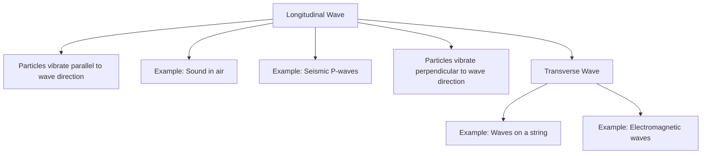

## 5.1. Waves, wave motion, and types of waves: longitudinal and transverse waves

### Definition and Classification of Waves
Waves are disturbances that propagate through a medium or space, transferring energy without transferring matter. Waves can be classified into two main types: **longitudinal waves** and **transverse waves**.

- **Waves**: Disturbances that travel through a medium or space, transferring energy.
- **Wave Motion**: The propagation of waves through a medium or space.

### Longitudinal Waves
**Longitudinal waves** are waves in which the particles of the medium vibrate in a direction parallel to the direction of the wave propagation. Examples of longitudinal waves include sound waves and seismic P-waves.

- **Particles Vibrations**: Particles vibrate back and forth along the direction of wave travel.
- **Example of Longitudinal Wave**: Sound waves in air. The air particles vibrate back and forth as the wave travels.

### Transverse Waves
**Transverse waves** are waves in which the particles of the medium vibrate in a direction perpendicular to the direction of wave propagation. Examples of transverse waves include waves on a string and electromagnetic waves.

- **Particles Vibrations**: Particles vibrate up and down or side to side, perpendicular to the direction of wave travel.
- **Example of Transverse Wave**: Waves on a guitar string. The string moves up and down as the wave travels along the string.

> **Example:** 
> - **Longitudinal Wave**: Consider a sound wave in air. The particles of air vibrate back and forth along the direction of the wave, causing the pressure to vary periodically.
> - **Transverse Wave**: Consider a wave on a string. The string particles move up and down, creating a pattern that travels along the string.

### Mermaid Diagram for Longitudinal and Transverse Waves


## 5.2. Frequency, periodic time, amplitude, wavelength and wave velocity and their relationship

### Basic Definitions
- **Frequency (f)**: The number of oscillations or cycles per second, measured in Hertz (Hz).
- **Periodic Time (T)**: The time taken for one complete cycle of the wave, measured in seconds.
- **Amplitude (A)**: The maximum displacement of the wave from its equilibrium position.
- **Wavelength (λ)**: The distance between two consecutive identical points in a wave.
- **Wave Velocity (v)**: The speed at which the wave travels through the medium, measured in meters per second.

### Relationship Between Frequency and Periodic Time
- **Relationship**: The frequency and periodic time of a wave are inversely related.
- **Formula**: f = 1 T or T = 1 f

### Relationship Between Wave Velocity, Wavelength, and Frequency
- **Relationship**: The wave velocity, wavelength, and frequency of a wave are directly related.
- **Formula**: v = f × λ

### Example of Wave Velocity, Wavelength, and Frequency
- **Example**: A wave travels at a velocity of 300 meters per second and has a wavelength of 3 meters. Calculate the frequency of the wave.
  > **Example:** 
  > - Given: v = 300 m/s and λ = 3 m
  > - Using the formula v = f × λ:
  > - f = v λ = 300 m/s 3 m = 100 Hz
  > - Therefore, the frequency of the wave is 100 Hz.

### Mermaid Diagram for Frequency, Periodic Time, Amplitude, Wavelength, and Wave Velocity
```mermaid
flowchart TD
    A[Frequency(f)] --> B[1/T]
    A --> C[Amplitude(A)]
    A --> D[Wavelength(λ)]
    A --> E[Wave Velocity(v)]
    E --> F[v = f × λ]
```

This section covers the fundamental concepts of waves, including their types (longitudinal and transverse), definitions, and key relationships. The worked examples provided will help students understand and apply these concepts effectively in exam scenarios.