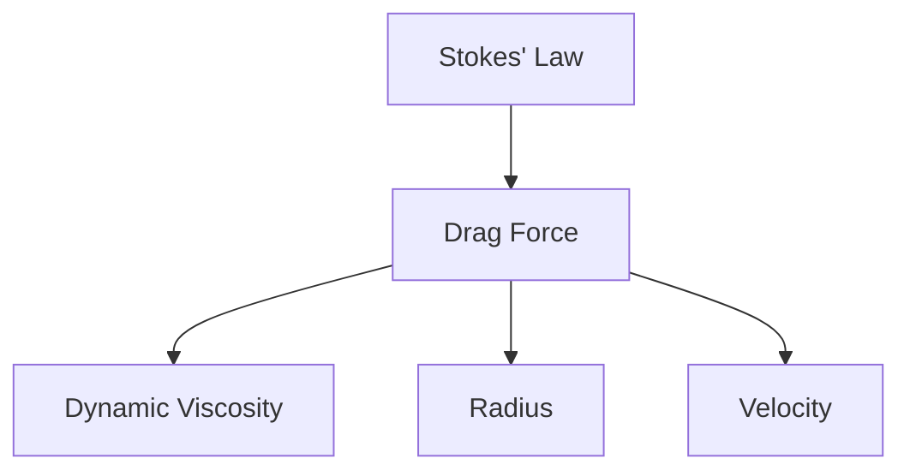
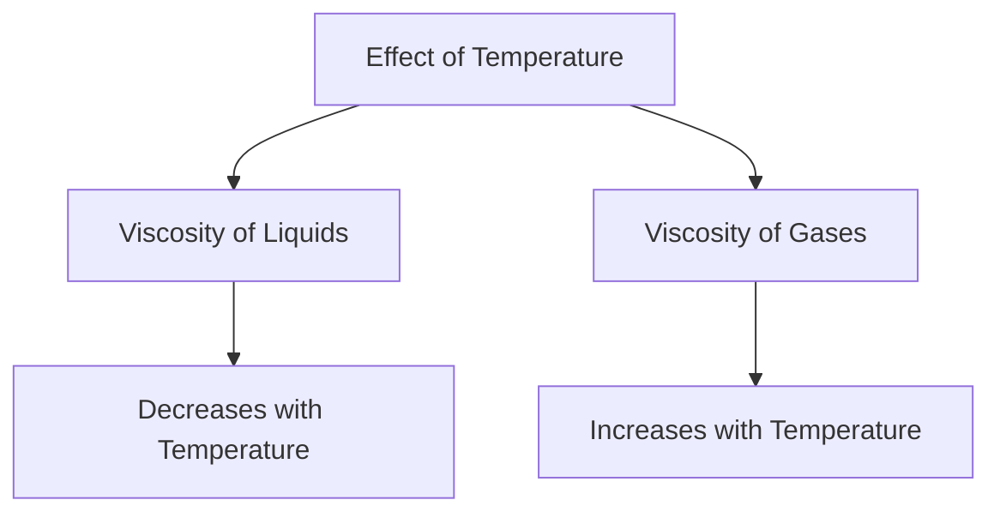
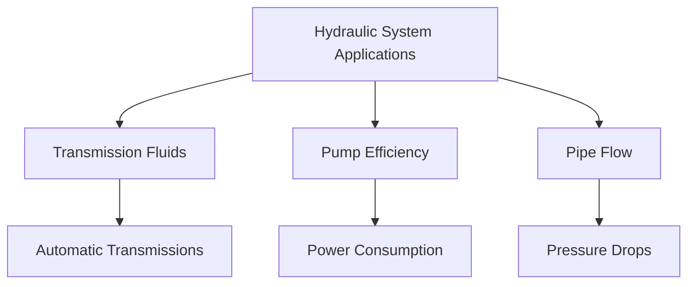

## 3.3.5. Stokes’ Law

### Definition and Explanation
Stokes’ law is a fundamental principle in fluid mechanics that describes the drag force exerted on a sphere moving through a viscous fluid. This law is crucial in understanding the behavior of small particles in fluids, such as in the sedimentation of colloidal particles or the movement of microorganisms in water.

**Stokes’ Law:** The drag force F_d on a small sphere of radius r moving at a velocity v through a fluid of dynamic viscosity  is given by:
[ F_d = 6 \pi \eta r v ]

### Derivation and Explanation
The derivation of Stokes’ law is based on the assumption that the flow around the sphere is laminar and the resistance to motion is primarily due to the viscous drag of the fluid. The derivation involves integrating the forces acting on the sphere over its surface.

### Example
> **Example:** A small spherical particle with a radius of 1 μm is moving through water at a velocity of 0.1 m/s. The dynamic viscosity of water is approximately 1 × 10⁻³ Pa·s. Calculate the drag force on the particle.

1. **Given:**
   - Radius r = 1 μ m = 1 × 10⁻⁶ m
   - Velocity v = 0.1 m/s
   - Dynamic viscosity = 1 × 10⁻³ Pa·s

2. **Using Stokes’ law:**
   [ F_d = 6 \pi \eta r v ]
   [ F_d = 6 \pi (1 \times 10^{-3}) (1 \times 10^{-6}) (0.1) ]
   [ F_d = 6 \pi \times 1 \times 10^{-10} \times 0.1 ]
   [ F_d = 6 \pi \times 1 \times 10^{-11} ]
   [ F_d \approx 1.88 \times 10^{-10}\, \text{N} ]

### Diagram

## 3.3.6. Effect of Temperature on Viscosity

### Definition and Explanation
Viscosity is a measure of a fluid's resistance to flow. The viscosity of a fluid changes with temperature. Generally, the viscosity of a liquid decreases as the temperature increases, while the viscosity of a gas increases as the temperature increases. This relationship is due to the thermal energy causing the molecules to move faster and collide more frequently.

### Temperature-Viscosity Relationship
The relationship between temperature and viscosity can be described by the following empirical equations:

1. **For liquids:**
   [ \mu_2 = \mu_1 \left(\frac{T_1}{T_2}\right)^n ]
   where μ₁ and μ₂ are the viscosities at temperatures T₁ and T₂, and n is a temperature exponent, typically between 0.3 and 0.7.

2. **For gases:**
   [ \mu_2 = \mu_1 \left(\frac{T_1}{T_2}\right)^{0.7} ]

### Example
> **Example:** A liquid has a viscosity of 0.01 Pa·s at 20°C. Calculate its viscosity at 30°C, assuming n = 0.6.

1. **Given:**
   - Initial viscosity μ₁ = 0.01 Pa·s
   - Initial temperature T₁ = 20^ C
   - Final temperature T₂ = 30^ C
   - Temperature exponent n = 0.6

2. **Using the empirical equation:**
   [ \mu_2 = \mu_1 \left(\frac{T_1}{T_2}\right)^n ]
   [ \mu_2 = 0.01 \left(\frac{20}{30}\right)^{0.6} ]
   [ \mu_2 = 0.01 \left(\frac{2}{3}\right)^{0.6} ]
   [ \mu_2 = 0.01 \times 0.63096 ]
   [ \mu_2 \approx 0.00631\, \text{Pa·s} ]

### Diagram

## 3.3.7. Applications of Viscosity in Hydraulic Systems

### Definition and Explanation
Viscosity plays a critical role in hydraulic systems, where it affects the performance, efficiency, and reliability of the system. Viscosity determines the fluid's ability to flow and the power losses due to friction.

### Applications

1. **Transmission Fluids:**
   - **Explanation:** Transmission fluids are used in automatic transmissions to lubricate and cool the gears. The correct viscosity ensures smooth operation and prevents wear.
   - **Example:** A car's automatic transmission uses transmission fluid with a viscosity of 75W-90. If the temperature drops, the viscosity increases, which can lead to increased power losses and potential damage.

2. **Pump Efficiency:**
   - **Explanation:** Higher viscosity fluids require more energy to pump, which can lead to increased power consumption and lower efficiency.
   - **Example:** In a hydraulic pump system, if the viscosity of the fluid is too high, it can cause the pump to work harder, increasing the power input required.

3. **Pipe Flow:**
   - **Explanation:** In pipe systems, the flow of fluid is affected by its viscosity. Higher viscosity fluids flow more slowly and can lead to increased pressure drops.
   - **Example:** In a water distribution system, if the water is at a lower temperature and has a higher viscosity, it will flow more slowly, leading to increased pressure drops and potential clogging.

### Example
> **Example:** A hydraulic system uses oil with a viscosity of 20 cSt at 40°C. If the temperature drops to 20°C, the viscosity increases to 50 cSt. Calculate the percentage increase in viscosity.

1. **Given:**
   - Initial viscosity μ₁ = 20 cSt
   - Final viscosity μ₂ = 50 cSt

2. **Calculate the percentage increase:**
   [ \text{Percentage Increase} = \left(\frac{\mu_2 - \mu_1}{\mu_1}\right) \times 100 ]
   [ \text{Percentage Increase} = \left(\frac{50 - 20}{20}\right) \times 100 ]
   [ \text{Percentage Increase} = \left(\frac{30}{20}\right) \times 100 ]
   [ \text{Percentage Increase} = 1.5 \times 100 ]
   [ \text{Percentage Increase} = 150\% ]

### Diagram

By understanding and applying the principles of Stokes’ law, the effect of temperature on viscosity, and the applications of viscosity in hydraulic systems, students can effectively analyze and optimize fluid behavior in various engineering contexts.