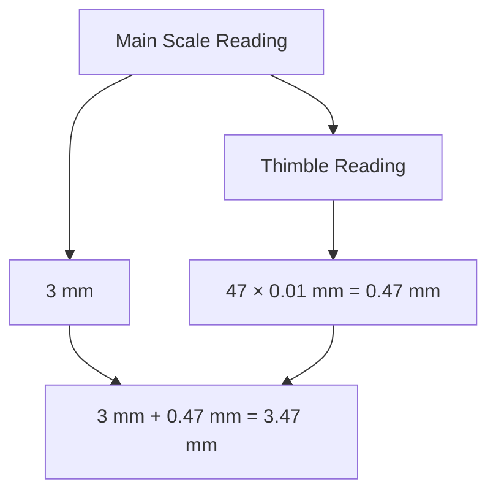

# Unit – I: Units and Measurem ents 1.a Explain Physical quantities and their units. 1.b Convert unit of a given physical quantity in one system of units into another systems of units.

*(AI-generated self-study book for GTU, subject code C4300004 — generated locally with Ollama.)*

This module carries approximately **13 marks (4 Remember + 4 Understand + 5 Apply) (per syllabus)**.


## 1.1 Measurement and units in engineering and science

### Definition of Physical Quantities and Units
A **physical quantity** is a property of a phenomenon, body, or substance that can be quantitatively expressed and is subject to measurement. The **unit** of a physical quantity is a standard for measuring that quantity. Units are crucial in engineering and science to ensure that measurements are consistent and comparable.

### Importance of Units in Engineering and Science
Units provide a common language for scientists and engineers to communicate their findings. They ensure that calculations and experiments are reproducible and meaningful. Inconsistent or incorrect use of units can lead to significant errors in design and analysis. Therefore, understanding and applying appropriate units is critical in both theoretical and practical aspects of engineering and science.

### Common Systems of Units
There are several systems of units used in engineering and science, including the **International System of Units (SI)**, the **English System**, and the **American Engineering System (AES)**. The SI system is the most widely used and is based on seven fundamental units.

- **Length**: **Meter (m)**
- **Mass**: **Kilogram (kg)**
- **Time**: **Second (s)**
- **Electric Current**: **Ampere (A)**
- **Thermodynamic Temperature**: **Kelvin (K)**
- **Amount of Substance**: **Mole (mol)**
- **Luminous Intensity**: **Candela (cd)**

### Example
> **Example:** Convert 1000 meters (m) to feet (ft), inches (in), and miles (mi).

1. **Step 1: Convert meters to feet.**
   - 1 meter = 3.28084 feet
   - 1000 meters = 1000 × 3.28084 = 3280.84 feet

2. **Step 2: Convert feet to inches.**
   - 1 foot = 12 inches
   - 3280.84 feet = 3280.84 × 12 = 39369.68 inches

3. **Step 3: Convert feet to miles.**
   - 1 mile = 5280 feet
   - 3280.84 feet = 3280.84 ÷ 5280 = 0.621371 miles

### Summary
Understanding and correctly applying units is essential in engineering and science. This example demonstrates the conversion of a physical quantity (length) from one unit (meters) to multiple units (feet, inches, miles) in the English system. Proper use of units ensures accurate and consistent measurements, which are critical in designing and analyzing engineering systems.

> **Example:** Convert 5000 kilograms (kg) to pounds (lb) and tons (t).

1. **Step 1: Convert kilograms to pounds.**
   - 1 kilogram = 2.20462 pounds
   - 5000 kilograms = 5000 × 2.20462 = 11023.1 pounds

2. **Step 2: Convert kilograms to tons.**
   - 1 ton = 1000 kilograms
   - 5000 kilograms = 5000 ÷ 1000 = 5 tons

This example further illustrates the importance of converting between different systems of units, highlighting the practical application of units in engineering and scientific contexts.

---

## 1.2. Physical quantities; fundamental and derived quantities

### 1.2.1. Physical Quantities

**Physical quantities** are measurable attributes of matter and energy that can be expressed as a number and a unit. These quantities are essential in formulating equations and solving problems in physics and engineering.

### 1.2.2. Fundamental Quantities

**Fundamental quantities** are the basic physical quantities that are not defined in terms of other quantities. These are considered the building blocks of physics. The seven fundamental quantities are:

- **Length (L)**: Measured in meters (m).
- **Mass (M)**: Measured in kilograms (kg).
- **Time (T)**: Measured in seconds (s).
- **Electric Current (I)**: Measured in amperes (A).
- **Thermodynamic Temperature (T)**: Measured in kelvins (K).
- **Amount of Substance (N)**: Measured in moles (mol).
- **Luminous Intensity (Iv)**: Measured in candelas (cd).

### 1.2.3. Derived Quantities

**Derived quantities** are physical quantities that can be expressed in terms of the fundamental quantities. Some common derived quantities include:

- **Volume (V)**: Derived from length (L). Volume is the amount of three-dimensional space occupied by a substance and is calculated as length × width × height. The unit is cubic meters (m³).
- **Density (ρ)**: Derived from mass (M) and volume (V). Density is the mass per unit volume and is given by the formula ρ = M/V. The unit is kilograms per cubic meter (kg/m³).
- **Speed (v)**: Derived from length (L) and time (T). Speed is the distance traveled per unit of time. The unit is meters per second (m/s).
- **Force (F)**: Derived from mass (M) and acceleration (a). Force is the product of mass and acceleration. The unit is newtons (N), where 1 N = 1 kg·m/s².
- **Energy (E)**: Derived from mass (M) and speed of light (c). Energy is the capacity to do work. The unit is joules (J), where 1 J = 1 kg·m²/s².

### Example

> **Example:** A car travels 120 meters in 10 seconds. Calculate the speed of the car.

Given:
- Distance (d) = 120 meters (m)
- Time (t) = 10 seconds (s)

To find the speed (v), we use the formula:
[ v = \frac{d}{t} ]

Substituting the given values:
[ v = \frac{120 \, \text{m}}{10 \, \text{s}} = 12 \, \text{m/s} ]

Therefore, the speed of the car is 12 m/s.

```mermaid
flowchart TD
    A[Length (L)] --> B[Volume (V)]
    A --> C[Speed (v)]
    A --> D[Density (ρ)]
    C --> E[Force (F)]
    E --> F[Energy (E)]
```

This flowchart illustrates the relationship between the fundamental quantities and derived quantities.

---

## 1.3. Systems of units: CGS, MKS and SI, definition of units (only for information and not to be asked in examination), interconversion of units MKS to CGS and vice versa, Requirements of standard unit

### 1.3.1. Introduction to Systems of Units
The system of units used to measure physical quantities can vary widely, but three major systems are frequently encountered: CGS (Centimeter-Gram-Second), MKS (Meter-Kilogram-Second), and SI (International System of Units). Understanding these systems is crucial for converting between different units and ensuring consistency in scientific and engineering calculations.

### 1.3.2. CGS System
- **Definition**: The CGS system uses centimeters (cm) for length, grams (g) for mass, and seconds (s) for time.
- **Example**: In the CGS system, the unit of force is the dyne, where 1 dyne = 1 g cm/s².

### 1.3.3. MKS System
- **Definition**: The MKS system uses meters (m) for length, kilograms (kg) for mass, and seconds (s) for time.
- **Example**: In the MKS system, the unit of force is the newton (N), where 1 N = 1 kg m/s².

### 1.3.4. SI System
- **Definition**: The SI system is the modern form of the metric system and is the internationally accepted system for measurements. It uses meters (m) for length, kilograms (kg) for mass, and seconds (s) for time.
- **Example**: In the SI system, the unit of force is the newton (N), where 1 N = 1 kg m/s².

### 1.3.5. Interconversion of Units MKS to CGS and Vice Versa
Converting between the MKS and CGS systems involves understanding the relationships between the units. Here are the key conversions:
- **From MKS to CGS**:
  - 1 meter = 100 centimeters
  - 1 kilogram = 1000 grams
  - 1 newton = 10^5 dynes

- **From CGS to MKS**:
  - 1 centimeter = 0.01 meters
  - 1 gram = 0.001 kilograms
  - 1 dyne = 10^-5 newtons

#### Example:
Convert 5 newtons to CGS units.
> **Example:**  
> Given: 1 newton = 10^5 dynes  
> To convert 5 newtons to CGS units:  
> 5 newtons = 5 × 10^5 dynes  
> Therefore, 5 newtons = 500,000 dynes

### 1.3.6. Requirements of a Standard Unit
A standard unit must meet certain requirements to ensure its utility and reliability in various scientific and engineering applications. These requirements include:
- **Invariance**: The unit should not change with time, location, or other factors.
- **Reproducibility**: The unit should be capable of being reproduced and verified by different individuals and institutions.
- **Simplicity**: The unit should be simple to use and understand.
- **Universality**: The unit should be applicable to a wide range of physical quantities.

#### Example:
Define a standard unit for length that meets the above requirements.
> **Example:**  
> A standard unit for length, such as the meter, is chosen because it is invariant (its length does not change with time or location), reproducible (can be accurately measured by multiple parties), simple (easy to understand and use), and universal (used worldwide in various scientific and engineering fields).

### Summary
In this section, we have discussed the CGS, MKS, and SI systems of units, and provided examples for interconverting units between the MKS and CGS systems. Understanding these systems and their interconversions is essential for solving problems in physics and engineering. The requirements of a standard unit have also been highlighted, emphasizing the importance of choosing a unit that is invariant, reproducible, simple, and universal.

---

## 1.4. Vernier Caliper, Micrometer Screw Gauge

### 1.4.1 Vernier Caliper

A **Vernier caliper** is an instrument used for making precise linear measurements. It consists of a main scale and a Vernier scale. The main scale is calibrated in millimeters (mm), and the Vernier scale is used to measure fractions of a millimeter. The accuracy of a Vernier caliper is typically 0.02 mm.

The Vernier scale has a smaller number of divisions than the main scale, but each division on the Vernier scale is slightly shorter than the corresponding division on the main scale. This allows for more precise measurement by aligning the Vernier scale with the main scale.

#### Working of Vernier Caliper

1. **Zero Adjustment**: Ensure that the zero mark on the Vernier scale aligns with the zero mark on the main scale. This is done by carefully aligning the jaws of the caliper.
2. **Main Scale Reading**: Read the whole number of millimeters from the main scale.
3. **Vernier Scale Reading**: Find the Vernier scale division that aligns perfectly with a main scale division. The value of this division in millimeters is added to the main scale reading.
4. **Fractional Reading**: The smallest division on the Vernier scale is 0.02 mm. If the alignment is at the 5th division, the fractional reading is 0.05 mm.

### 1.4.2 Micrometer Screw Gauge

A **Micrometer screw gauge** (also known as a micrometer) is a precision measuring instrument used to measure small dimensions, typically with an accuracy of 0.01 mm. It consists of a barrel, a spindle, a thimble, and a spindle screw.

The micrometer screw gauge works on the principle of the screw thread, where the screw advances or retracts by a precise amount for each full turn. The thimble has a vernier scale that is used to read the fractional part of the measurement.

#### Working of Micrometer Screw Gauge

1. **Zero Adjustment**: Adjust the micrometer so that the spindle touches the anvil (fixed block) without any pressure. This ensures that the zero mark on the thimble aligns with the reference line on the barrel.
2. **Main Scale Reading**: Read the whole number from the main scale.
3. **Thimble Reading**: The thimble has 50 divisions, each representing 0.01 mm. Rotate the thimble to find the division that aligns with a mark on the barrel. The value of this division in millimeters is added to the main scale reading.
4. **Fractional Reading**: If the thimble is rotated such that the 35th division aligns with the barrel mark, the fractional reading is 35 × 0.01 mm = 0.35 mm.

### Worked Example

> **Example:**  
> A micrometer screw gauge is used to measure the diameter of a small metal rod. The main scale reading is 3 mm, and the thimble reading is the 47th division. What is the diameter of the rod?

1. **Main Scale Reading**: 3 mm
2. **Thimble Reading**: 47 × 0.01 mm = 0.47 mm
3. **Total Reading**: 3 mm + 0.47 mm = 3.47 mm

Therefore, the diameter of the rod is **3.47 mm**.



This example demonstrates the step-by-step process of using a micrometer screw gauge to measure a precise dimension.

---

## 1.5. Accuracy, precision and error, estimation of errors - absolute error, relative error and percentage error, error propagation, significant figures

### 1.5.1 Accuracy and Precision

**Accuracy** refers to how close a measured value is to the true or accepted value. **Precision** indicates how close repeated measurements are to each other, regardless of their proximity to the true value. High accuracy implies that the measurements are correct, while high precision implies that the measurements are consistent.

### 1.5.2 Estimation of Errors

Errors can be classified into **absolute error**, **relative error**, and **percentage error**.

- **Absolute Error**: This is the difference between the measured value and the true value. It is given by:
  [ \text{Absolute Error} = \text{Measured Value} - \text{True Value} ]

- **Relative Error**: This is the absolute error divided by the true value. It is given by:
  [ \text{Relative Error} = \frac{\text{Absolute Error}}{\text{True Value}} ]

- **Percentage Error**: This is the relative error expressed as a percentage. It is given by:
  [ \text{Percentage Error} = \left( \frac{\text{Absolute Error}}{\text{True Value}} \right) \times 100\% ]

### 1.5.3 Error Propagation

When measurements are combined, the errors in the individual measurements can propagate to the final result. The propagation of errors can be estimated using the following rules:

- For addition or subtraction:
  [ \Delta y = \sqrt{(\Delta x_1)^2 + (\Delta x_2)^2 + \cdots + (\Delta x_n)^2} ]

- For multiplication or division:
  [ \frac{\Delta y}{y} = \sqrt{\left( \frac{\Delta x_1}{x_1} \right)^2 + \left( \frac{\Delta x_2}{x_2} \right)^2 + \cdots + \left( \frac{\Delta x_n}{x_n} \right)^2} ]

### 1.5.4 Significant Figures

Significant figures are the digits in a number that carry meaning contributing to its precision. The following rules are used to determine significant figures:

- **Non-zero digits are always significant.**
- **Zeros between non-zero digits are significant.**
- **Leading zeros are not significant.**
- **Trailing zeros in a number containing a decimal point are significant.**
- **Trailing zeros in a whole number with no decimal point may or may not be significant.**

### 1.5.5 Worked Example

> **Example:** A laboratory measurement of the length of a metal rod is recorded as 123.45 cm. The true length of the rod is 123.50 cm. Calculate the absolute error, relative error, and percentage error.

1. **Absolute Error**:
   [ \text{Absolute Error} = \text{Measured Value} - \text{True Value} = 123.45 \, \text{cm} - 123.50 \, \text{cm} = -0.05 \, \text{cm} ]

2. **Relative Error**:
   [ \text{Relative Error} = \frac{\text{Absolute Error}}{\text{True Value}} = \frac{-0.05 \, \text{cm}}{123.50 \, \text{cm}} = -0.000405 ]

3. **Percentage Error**:
   [ \text{Percentage Error} = \left( \frac{\text{Absolute Error}}{\text{True Value}} \right) \times 100\% = \left( \frac{-0.05 \, \text{cm}}{123.50 \, \text{cm}} \right) \times 100\% = -0.0405\% ]

These calculations help in understanding the accuracy and precision of the measurement.
