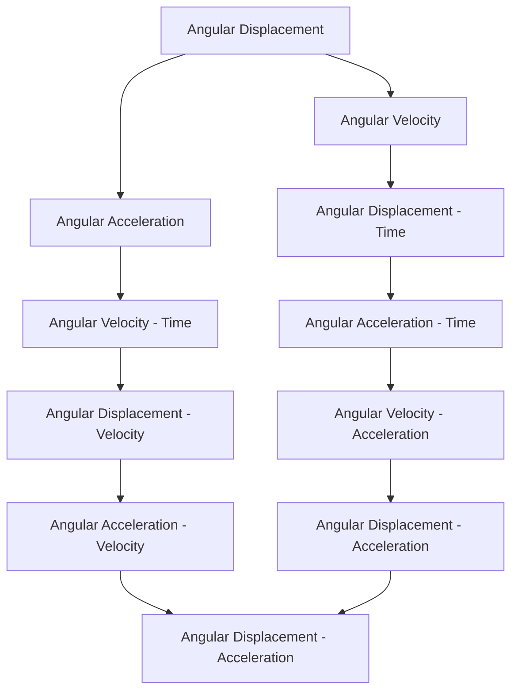

# Unit – II: Circular motion 2.a Apply the concept of linear momentum and its conservation to explain recoil of gun and rockets propulsion. 2.b Apply the concept of centripetal and centrifugal forces to solve

*(AI-generated self-study book for GTU, subject code C4300004 — generated locally with Ollama.)*

This module carries approximately **10 marks (3 Remember + 3 Understand + 4 Apply) (per syllabus)**.


## 2.1 Force, momentum, law of conservation of linear momentum, its applications such as recoil of gun, rocket propulsion, impulse and its applications

### 2.1.1 Force
**Force:** A push or pull on an object. It can change the object's velocity, direction, or shape. Forces are vectors, meaning they have both magnitude and direction.

### 2.1.2 Momentum
**Momentum (p):** The product of an object's mass (m) and its velocity (v). It is a vector quantity. The formula for momentum is:
[ p = m \cdot v ]

### 2.1.3 Law of Conservation of Linear Momentum
**Law of Conservation of Linear Momentum:** In the absence of an external net force, the total linear momentum of a closed system remains constant. Mathematically, this can be expressed as:
[ \sum p_{\text{initial}} = \sum p_{\text{final}} ]

### 2.1.4 Applications: Recoil of Gun
**Example:** A gun with a mass of 2 kg fires a bullet of mass 0.01 kg at a velocity of 500 m/s. Calculate the recoil velocity of the gun.

> **Example:** 
>
> Given:
> - Mass of the gun, m_g = 2 kg
> - Mass of the bullet, m_b = 0.01 kg
> - Velocity of the bullet, v_b = 500 m/s
>
> Using the law of conservation of linear momentum:
>
> [ \sum p_{\text{initial}} = \sum p_{\text{final}} ]
>
> Initially, both the gun and the bullet are at rest, so initial momentum is zero.
>
> [ 0 = m_g v_g + m_b v_b ]
>
> Rearranging for the recoil velocity v_g of the gun:
>
> [ v_g = -\frac{m_b v_b}{m_g} ]
>
> Substituting the values:
>
> [ v_g = -\frac{0.01 \, \text{kg} \times 500 \, \text{m/s}}{2 \, \text{kg}} ]
>
> [ v_g = -0.25 \, \text{m/s} ]

The negative sign indicates the direction opposite to the bullet's direction. The gun recoils with a velocity of 0.25 m/s.

### 2.1.5 Rocket Propulsion
**Rocket Propulsion:** The principle behind rocket propulsion is based on the conservation of linear momentum. A rocket expels mass in one direction, and the reaction force propels the rocket in the opposite direction.

### 2.1.6 Impulse
**Impulse (J):** The change in momentum of an object due to an external force. Impulse is the product of the average force applied and the time for which it acts. Mathematically, impulse is given by:
[ J = F_{\text{avg}} \cdot \Delta t = \Delta p ]

### 2.1.7 Applications: Rocket Propulsion (continued)
**Example:** A rocket engine expels gases at a rate of 10 kg/s with a velocity of 3000 m/s. Calculate the thrust (force) generated by the engine.

> **Example:** 
>
> Given:
> - Mass flow rate, m = 10 kg/s
> - Velocity of the expelled gases, v = 3000 m/s
>
> Using the principle of conservation of linear momentum:
>
> The thrust F is the rate of change of momentum:
>
> [ F = \dot{m} \cdot v ]
>
> Substituting the values:
>
> [ F = 10 \, \text{kg/s} \times 3000 \, \text{m/s} ]
>
> [ F = 30000 \, \text{N} ]

The thrust generated by the rocket engine is 30000 N.

### 2.1.8 Summary
- **Force:** A push or pull on an object.
- **Momentum:** The product of mass and velocity.
- **Law of Conservation of Linear Momentum:** Total linear momentum of a closed system remains constant.
- **Recoil of Gun:** Gun recoils in the opposite direction of the bullet due to the conservation of momentum.
- **Rocket Propulsion:** Thrust is generated by expelling mass at high velocity.
- **Impulse:** Change in momentum due to an external force.

These concepts are crucial for understanding and solving problems related to linear momentum and its applications.

---

## 2.2 Circular motion, angular displacement, angular velocity, angular acceleration and their interrelation

### 2.2.1 Introduction to Circular Motion
Circular motion refers to the movement of an object along a circular path. In this motion, the object always returns to the same position after completing one full revolution. A common example is the Earth orbiting the Sun.

### 2.2.2 Angular Displacement
Angular displacement (θ) is the angle through which a point or object moves on a circular path. It is measured in radians (rad). The relationship between angular displacement, arc length (s), and radius (r) is given by:
[ s = r \theta ]
- **Example:** If a point on a wheel with a radius of 1 meter moves through an arc length of 3.14 meters, the angular displacement is:
  [ \theta = \frac{s}{r} = \frac{3.14 \, \text{m}}{1 \, \text{m}} = 3.14 \, \text{rad} ]

### 2.2.3 Angular Velocity
Angular velocity (ω) is the rate of change of angular displacement with respect to time. It is measured in radians per second (rad/s). The formula for angular velocity is:
[ \omega = \frac{\theta}{t} ]
- **Example:** If an object completes an angular displacement of 2π radians in 4 seconds, the angular velocity is:
  [ \omega = \frac{2\pi \, \text{rad}}{4 \, \text{s}} = \frac{\pi}{2} \, \text{rad/s} ]

### 2.2.4 Angular Acceleration
Angular acceleration (α) is the rate of change of angular velocity with respect to time. It is measured in radians per second squared (rad/s²). The formula for angular acceleration is:
[ \alpha = \frac{\omega}{t} ]
- **Example:** If an object's angular velocity increases from 0 rad/s to π rad/s in 5 seconds, the angular acceleration is:
  [ \alpha = \frac{\pi \, \text{rad/s} - 0 \, \text{rad/s}}{5 \, \text{s}} = \frac{\pi}{5} \, \text{rad/s}^2 ]

### 2.2.5 Interrelation Between Angular Displacement, Velocity, and Acceleration
Angular displacement, velocity, and acceleration are related by the following kinematic equations:
- ω = Δ θ Δ t
- α = Δ ω Δ t
- ω = ω₀ + α t
- θ = θ₀ + ω₀ t + 1 2 α t²
- ω² = ω₀² + 2 α (θ - θ₀)
- θ = θ₀ + 1 2 (ω₀ + ω) t

- **Example:** Consider a wheel with an initial angular velocity of 2 rad/s and an angular acceleration of 1 rad/s². After 3 seconds, the final angular velocity is:
  [ \omega = \omega_0 + \alpha t = 2 \, \text{rad/s} + 1 \, \text{rad/s}^2 \times 3 \, \text{s} = 5 \, \text{rad/s} ]

### 2.2.6 Practical Application: Pendulum Motion
Consider a simple pendulum with a length of 1 meter. The time period (T) of the pendulum can be calculated using the formula:
[ T = 2\pi \sqrt{\frac{l}{g}} ]
where l is the length of the pendulum and g is the acceleration due to gravity (approximately 9.81 m/s²).

- **Example:** For a pendulum with a length of 1 meter, the time period is:
  [ T = 2\pi \sqrt{\frac{1 \, \text{m}}{9.81 \, \text{m/s}^2}} \approx 2\pi \times 0.319 \, \text{s} \approx 2 \times 0.997 \, \text{s} \approx 1.994 \, \text{s} ]



This diagram helps visualize the interrelation between angular displacement, velocity, and acceleration.

---

## 2.3. Centripetal and centrifugal forces examples: banking of roads and bending of cyclist

### Banking of Roads

In circular motion, the banking of roads is a common application of centripetal force to prevent skidding of vehicles. The road is inclined at an angle to the horizontal, providing a component of the normal force that acts towards the center of the circular path, thus counteracting the tendency of the vehicle to skid outward. The banking angle θ is determined by the radius of the curve R and the speed v of the vehicle.

The centripetal force required to keep the vehicle moving in a circular path is given by:
[ F_{c} = \frac{mv^2}{R} ]

Where:
- m is the mass of the vehicle,
- v is the speed of the vehicle,
- R is the radius of the curve.

The normal force N acting on the vehicle has a horizontal component N θ and a vertical component N θ. The vertical component must balance the weight of the vehicle mg, and the horizontal component provides the necessary centripetal force.

The equations for the normal force components are:
[ N \cos \theta = mg ]
[ N \sin \theta = \frac{mv^2}{R} ]

Dividing the second equation by the first:
[ \tan \theta = \frac{v^2}{gR} ]

Thus, the banking angle θ is:
[ \theta = \tan^{-1} \left( \frac{v^2}{gR} \right) ]

### Bending of Cyclist

When a cyclist turns, the centripetal force is provided by the friction between the tires and the road surface. The frictional force f must be enough to provide the necessary centripetal force to keep the cyclist moving in a circular path.

The centripetal force required is:
[ F_{c} = \frac{mv^2}{R} ]

Where:
- m is the mass of the cyclist,
- v is the speed of the cyclist,
- R is the radius of the turn.

The frictional force f is given by:
[ f = \mu N ]

Where:
- μ is the coefficient of friction between the tires and the road,
- N is the normal force, which is equal to the weight of the cyclist mg.

Thus, the frictional force is:
[ f = \mu mg ]

For the cyclist to safely turn without skidding, the frictional force must be at least equal to the required centripetal force:
[ \mu mg = \frac{mv^2}{R} ]

Solving for the speed v:
[ v = \sqrt{\mu g R} ]

### Example

> **Example:** A cyclist is turning a curve of radius 30 meters at a speed of 10 m/s. The coefficient of friction between the tires and the road is 0.5. Determine the speed at which the cyclist can safely turn the curve without skidding.
>
> Given:
> - Radius of the curve, R = 30 m,
> - Speed, v = 10 m/s,
> - Coefficient of friction, μ = 0.5.
>
> Using the formula for the maximum speed:
> [ v = \sqrt{\mu g R} ]
> [ v = \sqrt{0.5 \times 9.8 \times 30} ]
> [ v = \sqrt{147} ]
> [ v \approx 12.12 \, \text{m/s} ]
>
> Therefore, the cyclist can safely turn the curve without skidding at a speed of approximately 12.12 m/s.

```mermaid
flowchart LR
    A[Given] --> B[R = 30m, v = 10m/s, μ = 0.5]
    B --> C[Required: Maximum Speed v]
    C --> D[Formula: v = sqrt(μgR)]
    D --> E[v = sqrt(0.5 * 9.8 * 30)]
    E --> F[v = sqrt(147)]
    F --> G[v ≈ 12.12m/s]
```
