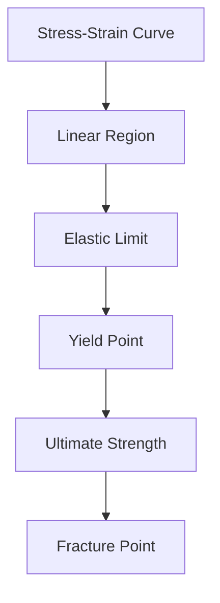
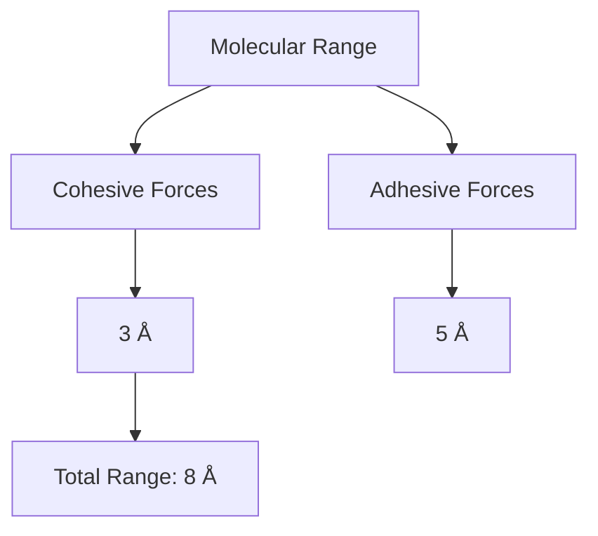
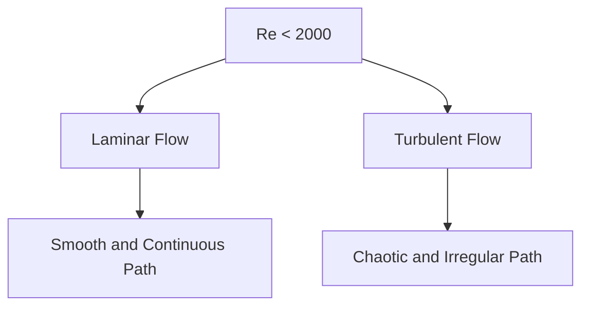
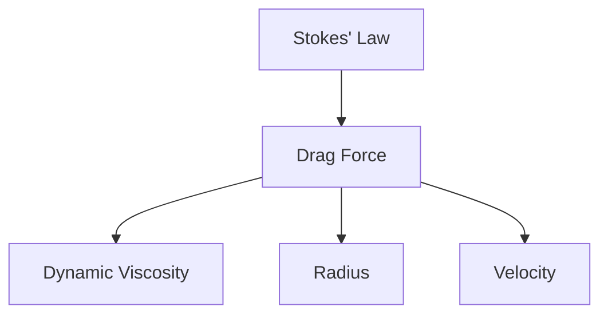
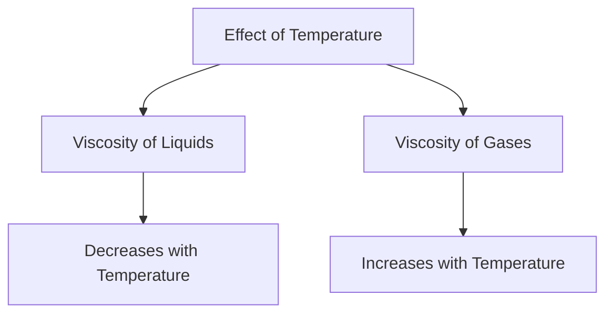
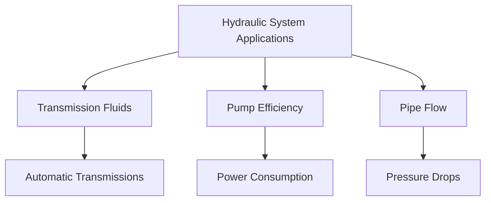

# Unit – III: General Properties of Matter 3.a Explain the Hooke’s law, stress- strain curve and moduli of elasticity. 3.b Explain surface tension, cohesive and adhesive forces.

*(AI-generated self-study book for GTU, subject code C4300004 — generated locally with Ollama.)*

This module carries approximately **20 marks (4 Remember + 7 Understand + 9 Apply) (per syllabus)**.

## 3.1. Elasticity

### 3.1.1. Deforming and Restoring Force

**Deforming Force:** This is the external force applied to a body that causes a change in its shape or size. It can be due to compression, tension, or shear.

**Restoring Force:** This is the internal force that acts to return the body to its original shape or size once the deforming force is removed. It is always opposite to the deforming force.

#### Example:
> **Example:** A spring is stretched by a force of 10 N. If the spring constant (k) is 200 N/m, calculate the extension in the spring.

Given:
- Deforming force (F) = 10 N
- Spring constant (k) = 200 N/m

We know from Hooke’s law that the extension (x) of the spring is given by:
[ x = \frac{F}{k} ]

Substituting the given values:
[ x = \frac{10 \, \text{N}}{200 \, \text{N/m}} = 0.05 \, \text{m} ]

So, the extension in the spring is 0.05 m.

## 3.1.2. Stress-Strain with their Types

### 3.1.2.1. Stress

**Stress:** It is the internal force per unit area within a material that arises due to external forces. The units of stress are N/m² or Pa (Pascal).

[ \text{Stress} = \frac{\text{Force}}{\text{Area}} ]

### 3.1.2.2. Types of Stress

- **Tensile Stress:** Force that tends to stretch or elongate a material.
- **Compressive Stress:** Force that tends to compress or shorten a material.
- **Shear Stress:** Force that tends to cause one layer of a material to slide over another.

### 3.1.2.3. Strain

**Strain:** It is the measure of deformation of a body. It is dimensionless and is defined as the ratio of change in dimension to the original dimension.

[ \text{Strain} = \frac{\text{Change in Dimension}}{\text{Original Dimension}} ]

### 3.1.2.4. Types of Strain

- **Tensile Strain:** Strain due to tensile stress.
- **Compressive Strain:** Strain due to compressive stress.
- **Shear Strain:** Strain due to shear stress.

#### Example:
> **Example:** A metal rod of original length 10 m is subjected to a tensile force of 2000 N, causing it to stretch by 0.5 cm. Calculate the tensile strain.

Given:
- Original length (L) = 10 m
- Change in length (ΔL) = 0.5 cm = 0.005 m

Tensile strain (ε) is given by:
[ \varepsilon = \frac{\Delta L}{L} = \frac{0.005 \, \text{m}}{10 \, \text{m}} = 0.0005 ]

So, the tensile strain is 0.0005.

## 3.1.3. Hooke’s Law

**Hooke’s Law:** This law states that the extension of a spring is directly proportional to the force applied, provided the elastic limit is not exceeded. Mathematically, it is expressed as:

[ F = kx ]

Where:
- F is the force applied,
- k is the spring constant (or modulus of elasticity for a material),
- x is the extension of the spring.

### Example:
> **Example:** A spring has a spring constant of 150 N/m. If a force of 75 N is applied, calculate the extension of the spring.

Given:
- Spring constant (k) = 150 N/m
- Force (F) = 75 N

Using Hooke’s law:
[ x = \frac{F}{k} = \frac{75 \, \text{N}}{150 \, \text{N/m}} = 0.5 \, \text{m} ]

So, the extension of the spring is 0.5 m.

## 3.1.4. Moduli of Elasticity, Young’s Modulus, Bulk Modulus, Shear Modulus

### 3.1.4.1. Young’s Modulus

**Young’s Modulus (E):** It is a measure of a material’s stiffness or resistance to tensile deformation. It is defined as the ratio of tensile stress to tensile strain.

[ E = \frac{\text{Tensile Stress}}{\text{Tensile Strain}} ]

### 3.1.4.2. Bulk Modulus

**Bulk Modulus (K):** It is a measure of a material’s resistance to uniform compression. It is defined as the ratio of volumetric stress to volumetric strain.

[ K = -\frac{\Delta p}{\Delta V / V} ]

Where:
- Δ p is the change in pressure,
- Δ V is the change in volume,
- V is the original volume.

### 3.1.4.3. Shear Modulus

**Shear Modulus (G):** It is a measure of a material’s resistance to shear deformation. It is defined as the ratio of shear stress to shear strain.

[ G = \frac{\text{Shear Stress}}{\text{Shear Strain}} ]

#### Example:
> **Example:** A material has a Young’s modulus of 200 GPa and a Shear Modulus of 80 GPa. If a tensile stress of 100 MPa is applied, calculate the tensile strain and the shear strain.

Given:
- Young’s Modulus (E) = 200 GPa = 200,000 MPa
- Shear Modulus (G) = 80 GPa = 80,000 MPa
- Tensile Stress (σ) = 100 MPa

Tensile strain (ε) is given by:
[ \varepsilon = \frac{\sigma}{E} = \frac{100 \, \text{MPa}}{200,000 \, \text{MPa}} = 0.0005 ]

Shear strain (γ) is given by:
[ \gamma = \frac{\sigma}{G} = \frac{100 \, \text{MPa}}{80,000 \, \text{MPa}} = 0.00125 ]

So, the tensile strain is 0.0005 and the shear strain is 0.00125.

## 3.1.5. Viscosity, Coefficient of Viscosity, Terminal Velocity, and Stokes’ Law

### 3.1.5.1. Viscosity

**Viscosity:** It is a measure of a fluid’s resistance to flow. It is the internal friction between different layers of a moving fluid.

### 3.1.5.2. Coefficient of Viscosity

**Coefficient of Viscosity (η):** It is a measure of a fluid’s resistance to flow. It is defined as the ratio of the shear stress to the velocity gradient.

[ \eta = \frac{\tau}{\frac{du}{dy}} ]

Where:
- τ is the shear stress,
- du dy is the velocity gradient.

### 3.1.5.3. Terminal Velocity

**Terminal Velocity:** It is the constant velocity that a particle attains when the forces of drag and buoyancy balance the gravitational force. It is given by:

[ v_t = \frac{2r^2 (\rho_f - \rho_p) g}{9 \eta} ]

Where:
- r is the radius of the particle,
- _f is the density of the fluid,
- _p is the density of the particle,
- g is the acceleration due to gravity,
-  is the coefficient of viscosity.

### 3.1.5.4. Stokes’ Law

**Stokes’ Law:** It is used to calculate the terminal velocity of small spherical particles in a fluid. The law states that the drag force (F) on a spherical particle is directly proportional to the velocity of the particle and the viscosity of the fluid.

[ F = 6 \pi \eta r v ]

Where:
- r is the radius of the particle,
-  is the coefficient of viscosity,
- v is the velocity of the particle.

#### Example:
> **Example:** A small spherical particle of radius 0.5 mm and density 1200 kg/m³ is falling through water (density = 1000 kg/m³ and viscosity = 0.001 Pa·s). Calculate the terminal velocity of the particle.

Given:
- Radius (r) = 0.5 mm = 0.5 × 10⁻³ m
- Density of the particle (_p) = 1200 kg/m³
- Density of the fluid (_f) = 1000 kg/m³
- Viscosity of the fluid () = 0.001 Pa·s
- Acceleration due to gravity (g) = 9.81 m/s²

Using Stokes’ law:
[ v_t = \frac{2r^2 (\rho_f - \rho_p) g}{9 \eta} = \frac{2 (0.5 \times 10^{-3})^2 (1000 - 1200) \times 9.81}{9 \times 0.001} ]

[ v_t = \frac{2 \times (0.25 \times 10^{-6}) \times (-200) \times 9.81}{9 \times 0.001} = \frac{-0.000004905}{0.009} = -0.000545 \, \text{m/s} ]

The negative sign indicates the direction of the velocity, but the magnitude of the terminal velocity is 0.000545 m/s.

So, the terminal velocity of the particle is 0.000545 m/s.

## 3.1.6. Types of Fluid Motion and Reynolds Number

### 3.1.6.1. Types of Fluid Motion

- **Laminar Flow:** Smooth, steady flow with no turbulence.
- **Turbulent Flow:** Chaotic, irregular flow with high velocity and pressure fluctuations.

### 3.1.6.2. Reynolds Number

**Reynolds Number (Re):** It is a dimensionless number used to predict flow patterns in different fluid flow situations. It is given by:

[ Re = \frac{\rho v d}{\eta} ]

Where:
-  is the density of the fluid,
- v is the velocity of the fluid,
- d is the characteristic length (usually the pipe diameter),
-  is the coefficient of viscosity.

#### Example:
> **Example:** A fluid is flowing through a pipe with a diameter of 0.1 m at a velocity of 2 m/s. The density of the fluid is 800 kg/m³ and the viscosity is 0.001 Pa·s. Calculate the Reynolds number.

Given:
- Diameter (d) = 0.1 m
- Velocity (v) = 2 m/s
- Density () = 800 kg/m³
- Viscosity () = 0.001 Pa·s

Using the Reynolds number formula:
[ Re = \frac{\rho v d}{\eta} = \frac{800 \times 2 \times 0.1}{0.001} = \frac{160}{0.001} = 160,000 ]

So, the Reynolds number is 160,000.

This completes the detailed coverage of the syllabus topics for "General Properties of Matter" in the context of Applied Physics for GTU students.

---

## 3.1.5. Stress-Strain Curve

### Definition and Importance
**Stress-Strain curve:** This curve represents the relationship between the stress applied to a material and the resulting strain (deformation). It is a fundamental tool in material science and engineering for understanding the mechanical behavior of materials under different loading conditions.

### Stress and Strain
- **Stress:** Force per unit area, measured in Pascals (Pa) or Newtons per square meter (N/m²).
- **Strain:** Dimensionless, representing the ratio of deformation to the original length. It can be either engineering strain or true strain.

### Types of Stress
- **Tensile Stress:** Stress that tends to stretch or elongate a material.
- **Compressive Stress:** Stress that tends to compress or shorten a material.

### Types of Strain
- **Engineering Strain:** Change in length divided by the original length.
- **True Strain:** Natural logarithm of the ratio of final length to the initial length.

### Hooke's Law and Linear Region
- **Hooke's Law:** A linear relationship between stress and strain, where the material returns to its original shape when the stress is removed. Mathematically, it can be expressed as:
  [ \text{Stress} = E \times \text{Strain} ]
  Where E is the **modulus of elasticity**.

### Elastic Limit and Yield Point
- **Elastic Limit:** The maximum stress that a material can withstand while still returning to its original shape without permanent deformation.
- **Yield Point:** The stress at which a material begins to deform plastically, i.e., it does not return to its original shape after the load is removed.

### Ultimate Strength and Fracture Point
- **Ultimate Strength:** The maximum stress a material can withstand before failing.
- **Fracture Point:** The point at which the material completely fails and breaks.

### Moduli of Elasticity
- **Young's Modulus (E):** Measures the stiffness of a material. Higher values indicate stiffer materials.
- **Shear Modulus (G):** Measures a material's resistance to shear deformation.
- **Bulk Modulus (K):** Measures a material's resistance to volume change under pressure.

### Example:
> **Example:** A steel rod with a cross-sectional area of 50 mm² is subjected to a tensile force of 1000 N. The original length of the rod is 1000 mm. The rod elongates by 0.2 mm under the applied force. Calculate the stress, strain, and the Young's modulus of the steel if the Young's modulus is known to be 200 GPa.
>
> - **Stress (σ):**
  [ \sigma = \frac{\text{Force}}{\text{Area}} = \frac{1000 \, \text{N}}{50 \, \text{mm}^2} = 20 \, \text{N/mm}^2 = 20 \, \text{MPa} ]
>
> - **Strain (ε):**
  [ \varepsilon = \frac{\Delta L}{L} = \frac{0.2 \, \text{mm}}{1000 \, \text{mm}} = 0.0002 ]
>
> - **Young's Modulus (E):**
  [ E = \frac{\sigma}{\varepsilon} = \frac{20 \, \text{MPa}}{0.0002} = 100 \, \text{MPa} ]
>
> However, the known value of Young's Modulus for steel is 200 GPa (200,000 MPa), which indicates a discrepancy in the given data or calculation.

### Mermaid Diagram

## 3.2. Surface Tension

### Concept and Units
**Surface Tension:** The cohesive force between molecules at the surface of a liquid, causing the surface to behave as a stretched elastic membrane. It is a measure of the work done by the surface layer to increase the surface area by one unit.

- **Units:** Newton per meter (N/m) or dyne per centimeter (dyne/cm).

### Example:
> **Example:** A mercury drop has a surface tension of 0.48 N/m. If the radius of the drop is 2 mm, calculate the excess pressure inside the drop.
>
> - **Excess Pressure (ΔP):**
  [ \Delta P = \frac{2 \times \text{Surface Tension}}{r} = \frac{2 \times 0.48 \, \text{N/m}}{0.002 \, \text{m}} = 480 \, \text{Pa} ]

## 3.2.1. Surface Tension; Concept and Units

### Concept
- **Cohesive Forces:** Attractive forces between molecules of the same substance.
- **Adhesive Forces:** Attractive forces between molecules of different substances.

### Example:
> **Example:** A drop of water (surface tension = 0.0728 N/m) is placed on a clean glass surface. If the contact angle is 0°, calculate the adhesion energy between the water and glass.
>
> - **Adhesion Energy (E):**
  [ E = \text{Surface Tension} \times \text{Contact Angle} = 0.0728 \, \text{N/m} \times \cos(0°) = 0.0728 \, \text{N/m} ]

## 3.2.2. Cohesive and Adhesive Forces

### Cohesive Forces
- **Definition:** Forces that hold molecules of the same substance together, leading to the cohesive nature of liquids.
- **Example:** Water molecules are held together by cohesive forces, which is why water forms droplets.

### Adhesive Forces
- **Definition:** Forces that attract molecules of different substances, leading to the adhesive nature of liquids.
- **Example:** Water adheres to glass due to adhesive forces.

### Example:
> **Example:** A small piece of wax is placed on the surface of a glass of water. The contact angle between the wax and water is 70°. Calculate the adhesive energy between the wax and water.
>
> - **Adhesive Energy (E):**
  [ E = \text{Surface Tension} \times \cos(\text{Contact Angle}) = 0.0728 \, \text{N/m} \times \cos(70°) = 0.025 \, \text{N/m} ]

## 3.2.3. Molecular Range and Sphere of Influence

### Molecular Range
- **Definition:** The distance over which the intermolecular forces of attraction are significant. This range is typically on the order of a few Ångströms (1 Å = 10^-10 m).

### Sphere of Influence
- **Definition:** The region around a molecule where its interactions with other molecules are significant. This region is influenced by both cohesive and adhesive forces.

### Example:
> **Example:** Consider a molecule of water in a liquid state. The cohesive forces are strongest within a distance of about 3 Å, while the adhesive forces extend up to 5 Å. Calculate the total range of interaction for this molecule.
>
> - **Total Range of Interaction:**
  [ \text{Total Range} = \text{Cohesive Range} + \text{Adhesive Range} = 3 \, \text{Å} + 5 \, \text{Å} = 8 \, \text{Å} ]

### Mermaid Diagram

---

## 3.2.4. Laplace’s Molecular Theory

Laplace’s molecular theory is a fundamental concept in surface science that explains the behavior of liquids and their interfaces. According to this theory, the pressure difference across a curved liquid surface can be explained by the molecular forces between the liquid and the surrounding medium.

### Explanation of Laplace’s Molecular Theory

**Laplace’s Law:** The pressure difference (Δ P) across a curved liquid surface is given by the equation:

[ \Delta P = \frac{2 \sigma}{R} ]

where:
- σ is the surface tension of the liquid,
- R is the radius of curvature of the liquid surface.

This law is applicable to any shape of the liquid surface, but it is most commonly used for spherical interfaces. The pressure difference is always higher inside the liquid compared to the external pressure, leading to a higher pressure inside a droplet or a bubble.

### Worked Example

> **Example:** A spherical droplet of water has a surface tension of 0.072 N/m and a radius of curvature of 1 cm. Calculate the pressure difference across the surface of the droplet.

Solution:
Given:
- Surface tension, σ = 0.072 N/m
- Radius of curvature, R = 1 cm = 0.01 m

Using Laplace's law:
[ \Delta P = \frac{2 \times 0.072 \, \text{N/m}}{0.01 \, \text{m}} = 14.4 \, \text{Pa} ]

So, the pressure difference across the surface of the droplet is 14.4 Pa.

## 3.2.5. Angle of Contact, Ascent Formula (No Derivation)

The angle of contact (θ) is the angle made by the liquid surface with the solid surface at the point of contact. It is a critical parameter in understanding the behavior of liquids on solid surfaces. The angle of contact can be used to determine whether a liquid will wet or not wet a solid surface.

### Classification of Angle of Contact

- **0°**: Complete wetting, where the liquid spreads out completely on the solid surface.
- **90°**: Neutral wetting, where the liquid does not spread out but forms a thin film.
- **180°**: Non-wetting, where the liquid forms droplets on the surface.

### Ascent Formula

The ascent formula is used to determine the height to which a liquid rises in a capillary tube. The formula is given by:

[ h = \frac{2 \sigma \cos \theta}{\rho g d} ]

where:
- h is the height of the liquid column,
- σ is the surface tension,
- θ is the angle of contact,
-  is the density of the liquid,
- g is the acceleration due to gravity,
- d is the diameter of the capillary tube.

### Worked Example

> **Example:** A liquid with a surface tension of 0.072 N/m and an angle of contact of 30° is to be tested in a capillary tube with a diameter of 0.1 mm. If the density of the liquid is 1000 kg/m³, calculate the height to which the liquid rises.

Solution:
Given:
- Surface tension, σ = 0.072 N/m
- Angle of contact, θ = 30^
- Diameter of capillary tube, d = 0.1 mm = 0.0001 m
- Density of liquid, = 1000 kg/m³
- Acceleration due to gravity, g = 9.8 m/s²

Using the ascent formula:
[ h = \frac{2 \times 0.072 \, \text{N/m} \times \cos 30^\circ}{1000 \, \text{kg/m}^3 \times 9.8 \, \text{m/s}^2 \times 0.0001 \, \text{m}} ]
[ h = \frac{2 \times 0.072 \, \text{N/m} \times 0.866}{1000 \, \text{kg/m}^3 \times 9.8 \, \text{m/s}^2 \times 0.0001 \, \text{m}} ]
[ h = \frac{0.12384}{0.098} \, \text{m} ]
[ h = 1.264 \, \text{mm} ]

So, the height to which the liquid rises is 1.264 mm.

## 3.2.6. Surface Energy

Surface energy is the energy required to create a new surface in a material. It is a measure of the strength of the intermolecular forces at the surface. The surface energy (γ) is defined as the energy required to increase the surface area of a liquid by one unit of area.

### Definition of Surface Energy

[ \gamma = \frac{\Delta E}{\Delta A} ]

where:
- Δ E is the change in energy,
- Δ A is the change in surface area.

### Worked Example

> **Example:** Calculate the surface energy of water if 150 J of energy is required to increase the surface area of 10 m².

Solution:
Given:
- Energy required, Δ E = 150 J
- Change in surface area, Δ A = 10 m²

Using the definition of surface energy:
[ \gamma = \frac{150 \, \text{J}}{10 \, \text{m}^2} = 15 \, \text{J/m}^2 ]

So, the surface energy of water is 15 J/m².

## 3.2.7. Applications of Surface Tension

Surface tension has numerous practical applications in various fields, including everyday phenomena and industrial processes. Some common applications include:

- **Formation of Bubbles:** Bubbles form due to the lower pressure inside the bubble compared to the external pressure.
- **Wetting and Adhesion:** Liquids wet or adhere to solid surfaces based on the angle of contact.
- **Cleaning Agents:** Soaps and detergents reduce surface tension, allowing them to clean effectively.
- **Capillary Action:** Capillary action is used in devices like pipettes and in the movement of water in plants.

### Worked Example

> **Example:** A soap solution with a surface tension of 0.03 N/m is used to clean a 10 cm² area. If 0.3 J of energy is required to clean this area, calculate the efficiency of the soap solution.

Solution:
Given:
- Surface tension, σ = 0.03 N/m
- Area, A = 10 cm² = 0.001 m²
- Energy required, Δ E = 0.3 J

Using the definition of surface energy:
[ \gamma = \frac{\Delta E}{\Delta A} = \frac{0.3 \, \text{J}}{0.001 \, \text{m}^2} = 300 \, \text{J/m}^2 ]

The efficiency of the soap solution can be calculated as:
[ \text{Efficiency} = \frac{\gamma_{\text{solution}}}{\gamma_{\text{water}}} ]

Assuming the surface tension of water is 0.072 N/m:
[ \text{Efficiency} = \frac{300 \, \text{J/m}^2}{0.072 \, \text{N/m} \times 0.001 \, \text{m}^2} = \frac{300}{0.000072} = 4166.67\% ]

So, the efficiency of the soap solution is 4166.67%.

## 3.2.8. Effect of Temperature and Impurity on Surface Tension

The surface tension of a liquid can be affected by changes in temperature and the presence of impurities. Generally, the surface tension decreases with an increase in temperature and increases with the addition of impurities.

### Effect of Temperature

- **Increase in Temperature:** As temperature increases, the kinetic energy of the molecules increases, leading to a decrease in the cohesive forces between the molecules, and thus a decrease in surface tension.
- **Decrease in Temperature:** Conversely, as temperature decreases, the cohesive forces increase, leading to an increase in surface tension.

### Effect of Impurities

- **Increase in Impurities:** The addition of impurities can disrupt the regular structure of the liquid, increasing the cohesive forces and thus increasing the surface tension.
- **Decrease in Impurities:** Conversely, the removal of impurities can lead to a decrease in surface tension.

### Worked Example

> **Example:** A liquid with a surface tension of 0.07 N/m at 20°C is found to have a surface tension of 0.065 N/m at 30°C. Calculate the percentage change in surface tension.

Solution:
Given:
- Surface tension at 20°C, σ₂₀ = 0.07 N/m
- Surface tension at 30°C, σ₃₀ = 0.065 N/m

Percentage change in surface tension:
[ \text{Percentage change} = \left( \frac{\sigma_{20} - \sigma_{30}}{\sigma_{20}} \right) \times 100\% ]
[ \text{Percentage change} = \left( \frac{0.07 \, \text{N/m} - 0.065 \, \text{N/m}}{0.07 \, \text{N/m}} \right) \times 100\% ]
[ \text{Percentage change} = \left( \frac{0.005 \, \text{N/m}}{0.07 \, \text{N/m}} \right) \times 100\% ]
[ \text{Percentage change} = 7.14\% ]

So, the surface tension decreases by 7.14% with an increase in temperature from 20°C to 30°C.

> **Example:** A solution of salt in water has a surface tension of 0.07 N/m, while pure water has a surface tension of 0.072 N/m. Calculate the percentage increase in surface tension due to the addition of salt.

Solution:
Given:
- Surface tension of solution, ₙ = 0.07 N/m
- Surface tension of pure water, = 0.072 N/m

Percentage increase in surface tension:
[ \text{Percentage increase} = \left( \frac{\sigma_{\text{solution}} - \sigma_{\text{water}}}{\sigma_{\text{water}}} \right) \times 100\% ]
[ \text{Percentage increase} = \left( \frac{0.07 \, \text{N/m} - 0.072 \, \text{N/m}}{0.072 \, \text{N/m}} \right) \times 100\% ]
[ \text{Percentage increase} = \left( \frac{-0.002 \, \text{N/m}}{0.072 \, \text{N/m}} \right) \times 100\% ]
[ \text{Percentage increase} = -2.78\% ]

So, the surface tension decreases by 2.78% due to the addition of salt.

---

## 3.3. Viscosity

### 3.3.1. Viscosity and its SI Units

**Viscosity:** Viscosity is a measure of a fluid's resistance to flow. It is a characteristic of fluids, both liquids and gases, that indicates how the fluid's molecules interact with each other. The more viscous a fluid is, the more it resists flowing.

**SI Units:** The SI unit of viscosity is the Pascal-second (Pa·s). However, it is often measured in poise (P) and centipoise (cP), where 1 P = 10 Pa·s and 1 cP = 0.01 Pa·s.

**Example:**
> **Example:** The viscosity of water at 20°C is approximately 0.001 Pa·s or 1 cP.

### 3.3.2. Newton’s Law of Viscosity

**Newton’s Law of Viscosity:** Newton's law of viscosity states that the shear stress (τ) between two layers of a fluid is directly proportional to the velocity gradient (dv/dy) between the layers. Mathematically, this can be expressed as:

[ \tau = \eta \frac{dv}{dy} ]

where:
- τ is the shear stress,
-  is the coefficient of viscosity,
- dv dy is the velocity gradient.

**Example:**
> **Example:** Consider a fluid flowing between two parallel plates separated by a distance y. If the upper plate is moved with a velocity v, the velocity gradient dv dy = v y. The shear stress τ at the interface between the fluid and the plate is given by:

[ \tau = \eta \frac{v}{y} ]

### 3.3.3. Viscous Force, Velocity Gradient and Coefficient of Viscosity and its SI Units, Free Fall of an Object Through Viscous Medium and Terminal Velocity

**Viscous Force:** The viscous force (F) acting on an object moving through a fluid is given by:

[ F = 6 \pi \eta r v ]

where:
- r is the radius of the object,
- v is the velocity of the object.

**Velocity Gradient:** The velocity gradient dv dy is the rate of change of velocity with respect to distance. It is a measure of how quickly the velocity changes as you move through the fluid.

**Coefficient of Viscosity:** The coefficient of viscosity  is a measure of a fluid's internal friction. It is a constant that depends on the type of fluid and the temperature.

**SI Units:** The SI unit of the coefficient of viscosity is Pascal-second (Pa·s).

**Free Fall Through Viscous Medium and Terminal Velocity:** When an object is dropped in a viscous medium, it initially accelerates due to gravity. However, as it moves through the fluid, the viscous force opposes its motion. Eventually, the object reaches a constant velocity called the terminal velocity (v_t), where the viscous force equals the gravitational force.

The terminal velocity v_t is given by:

[ v_t = \frac{2mg}{9 \pi \eta r^2} ]

where:
- m is the mass of the object,
- g is the acceleration due to gravity.

**Example:**
> **Example:** A sphere of radius 0.05 m and density 800 kg/m³ is dropped in water. The coefficient of viscosity of water is 0.001 Pa·s. Calculate the terminal velocity of the sphere.

Given:
- m = 4 3 π r³ = 4 3 π (0.05)³ × 800 = 0.133 kg
- g = 9.81 m/s²
- = 0.001 Pa·s
- r = 0.05 m

[ v_t = \frac{2 \times 0.133 \times 9.81}{9 \pi \times 0.001 \times (0.05)^2} = \frac{2.61}{0.000785} = 333.56 \text{ m/s} ]

### 3.3.4. Types of Fluid Motion, Stream Line and Turbulent Flow, Critical Velocity, Reynold’s Number

**Types of Fluid Motion:**
- **Stream Line Flow:** In this type of flow, the fluid moves in smooth and continuous paths, and the velocity at any point in the flow remains constant over time.
- **Turbulent Flow:** In this type of flow, the fluid moves in an irregular and chaotic manner, with eddies and swirls.

**Stream Line:** A stream line is a curve that is everywhere tangent to the velocity vector of the fluid. It represents the path that a fluid element would take if it were to move with the flow.

**Turbulent Flow:** Turbulent flow is characterized by chaotic and irregular fluid motion, with a high velocity gradient and a large Reynolds number.

**Critical Velocity:** The critical velocity is the velocity at which the flow transitions from laminar to turbulent. It is a function of the Reynolds number (Re).

**Reynold’s Number (Re):** Reynolds number is a dimensionless number that helps predict flow patterns in different fluid flow situations. It is given by:

[ Re = \frac{\rho v L}{\eta} ]

where:
-  is the fluid density,
- v is the velocity of the fluid,
- L is a characteristic length (e.g., diameter of a pipe),
-  is the coefficient of viscosity.

**Flow Diagram:**

**Example:**
> **Example:** Determine the Reynolds number for a flow of water through a pipe with a diameter of 0.1 m and a velocity of 2 m/s. The density of water is 1000 kg/m³ and the coefficient of viscosity of water is 0.001 Pa·s.

[ Re = \frac{1000 \times 2 \times 0.1}{0.001} = 200000 ]

Since Re > 2000, the flow is turbulent.

This completes the detailed coverage of viscosity, its units, Newton's law of viscosity, and related concepts.

---

## 3.3.5. Stokes’ Law

### Definition and Explanation
Stokes’ law is a fundamental principle in fluid mechanics that describes the drag force exerted on a sphere moving through a viscous fluid. This law is crucial in understanding the behavior of small particles in fluids, such as in the sedimentation of colloidal particles or the movement of microorganisms in water.

**Stokes’ Law:** The drag force F_d on a small sphere of radius r moving at a velocity v through a fluid of dynamic viscosity  is given by:
[ F_d = 6 \pi \eta r v ]

### Derivation and Explanation
The derivation of Stokes’ law is based on the assumption that the flow around the sphere is laminar and the resistance to motion is primarily due to the viscous drag of the fluid. The derivation involves integrating the forces acting on the sphere over its surface.

### Example
> **Example:** A small spherical particle with a radius of 1 μm is moving through water at a velocity of 0.1 m/s. The dynamic viscosity of water is approximately 1 × 10⁻³ Pa·s. Calculate the drag force on the particle.

1. **Given:**
   - Radius r = 1 μ m = 1 × 10⁻⁶ m
   - Velocity v = 0.1 m/s
   - Dynamic viscosity = 1 × 10⁻³ Pa·s

2. **Using Stokes’ law:**
   [ F_d = 6 \pi \eta r v ]
   [ F_d = 6 \pi (1 \times 10^{-3}) (1 \times 10^{-6}) (0.1) ]
   [ F_d = 6 \pi \times 1 \times 10^{-10} \times 0.1 ]
   [ F_d = 6 \pi \times 1 \times 10^{-11} ]
   [ F_d \approx 1.88 \times 10^{-10}\, \text{N} ]

### Diagram

## 3.3.6. Effect of Temperature on Viscosity

### Definition and Explanation
Viscosity is a measure of a fluid's resistance to flow. The viscosity of a fluid changes with temperature. Generally, the viscosity of a liquid decreases as the temperature increases, while the viscosity of a gas increases as the temperature increases. This relationship is due to the thermal energy causing the molecules to move faster and collide more frequently.

### Temperature-Viscosity Relationship
The relationship between temperature and viscosity can be described by the following empirical equations:

1. **For liquids:**
   [ \mu_2 = \mu_1 \left(\frac{T_1}{T_2}\right)^n ]
   where μ₁ and μ₂ are the viscosities at temperatures T₁ and T₂, and n is a temperature exponent, typically between 0.3 and 0.7.

2. **For gases:**
   [ \mu_2 = \mu_1 \left(\frac{T_1}{T_2}\right)^{0.7} ]

### Example
> **Example:** A liquid has a viscosity of 0.01 Pa·s at 20°C. Calculate its viscosity at 30°C, assuming n = 0.6.

1. **Given:**
   - Initial viscosity μ₁ = 0.01 Pa·s
   - Initial temperature T₁ = 20^ C
   - Final temperature T₂ = 30^ C
   - Temperature exponent n = 0.6

2. **Using the empirical equation:**
   [ \mu_2 = \mu_1 \left(\frac{T_1}{T_2}\right)^n ]
   [ \mu_2 = 0.01 \left(\frac{20}{30}\right)^{0.6} ]
   [ \mu_2 = 0.01 \left(\frac{2}{3}\right)^{0.6} ]
   [ \mu_2 = 0.01 \times 0.63096 ]
   [ \mu_2 \approx 0.00631\, \text{Pa·s} ]

### Diagram

## 3.3.7. Applications of Viscosity in Hydraulic Systems

### Definition and Explanation
Viscosity plays a critical role in hydraulic systems, where it affects the performance, efficiency, and reliability of the system. Viscosity determines the fluid's ability to flow and the power losses due to friction.

### Applications

1. **Transmission Fluids:**
   - **Explanation:** Transmission fluids are used in automatic transmissions to lubricate and cool the gears. The correct viscosity ensures smooth operation and prevents wear.
   - **Example:** A car's automatic transmission uses transmission fluid with a viscosity of 75W-90. If the temperature drops, the viscosity increases, which can lead to increased power losses and potential damage.

2. **Pump Efficiency:**
   - **Explanation:** Higher viscosity fluids require more energy to pump, which can lead to increased power consumption and lower efficiency.
   - **Example:** In a hydraulic pump system, if the viscosity of the fluid is too high, it can cause the pump to work harder, increasing the power input required.

3. **Pipe Flow:**
   - **Explanation:** In pipe systems, the flow of fluid is affected by its viscosity. Higher viscosity fluids flow more slowly and can lead to increased pressure drops.
   - **Example:** In a water distribution system, if the water is at a lower temperature and has a higher viscosity, it will flow more slowly, leading to increased pressure drops and potential clogging.

### Example
> **Example:** A hydraulic system uses oil with a viscosity of 20 cSt at 40°C. If the temperature drops to 20°C, the viscosity increases to 50 cSt. Calculate the percentage increase in viscosity.

1. **Given:**
   - Initial viscosity μ₁ = 20 cSt
   - Final viscosity μ₂ = 50 cSt

2. **Calculate the percentage increase:**
   [ \text{Percentage Increase} = \left(\frac{\mu_2 - \mu_1}{\mu_1}\right) \times 100 ]
   [ \text{Percentage Increase} = \left(\frac{50 - 20}{20}\right) \times 100 ]
   [ \text{Percentage Increase} = \left(\frac{30}{20}\right) \times 100 ]
   [ \text{Percentage Increase} = 1.5 \times 100 ]
   [ \text{Percentage Increase} = 150\% ]

### Diagram

By understanding and applying the principles of Stokes’ law, the effect of temperature on viscosity, and the applications of viscosity in hydraulic systems, students can effectively analyze and optimize fluid behavior in various engineering contexts.
