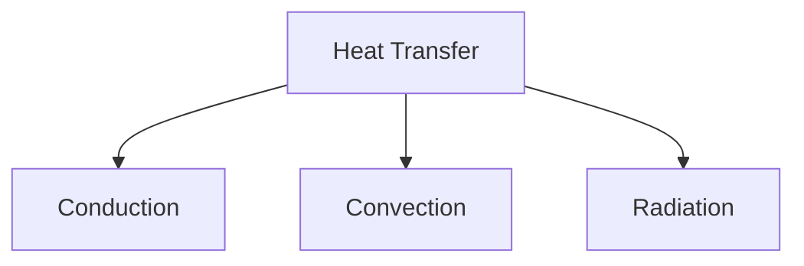

# Unit – IV: Heat and Thermometry 4.a Distinguish between heat and temperature. 4.b Explain modes of heat transmission. 4.c Explain various temperature scales and conversion between

*(AI-generated self-study book for GTU, subject code C4300004 — generated locally with Ollama.)*

This module carries approximately **13 marks (3 Remember + 4 Understand + 6 Apply) (per syllabus)**.

## 4.1. Heat and Temperature

### Defining Heat and Temperature
- **Heat**: Heat is the form of energy transferred between two systems or substances due to a temperature difference. It is a measure of the total kinetic energy of particles in a substance.
- **Temperature**: Temperature is a measure of the average kinetic energy of the particles in a substance. It is a scalar quantity that indicates the degree of hotness or coldness of a body.

### Classification and Units
- **Heat Units**: Heat is measured in Joules (J), calories (cal), or kilocalories (kcal). 1 calorie is the amount of heat required to raise the temperature of 1 gram of water by 1°C.
- **Temperature Units**: Temperature is measured in Celsius (°C), Fahrenheit (°F), and Kelvin (K). The relationship between these units is given by:
  - T(K) = T(°C) + 273.15
  - T(°F) = 9 5 × T(°C) + 32

### Example:
> **Example:** Convert 30°C to Kelvin.
  - T(K) = 30 + 273.15 = 303.15 K

### Relationship Between Heat and Temperature
- **Specific Heat Capacity**: The amount of heat required to raise the temperature of 1 gram of a substance by 1°C. It is denoted by c and is specific to each substance.
- **Heat Transfer Equation**: The heat Q transferred to a substance can be calculated using:
  - Q = mcΔ T
  - Where m is the mass of the substance, c is the specific heat capacity, and Δ T is the change in temperature.

### Example:
> **Example:** A 100 g block of copper initially at 20°C is heated until its temperature rises to 80°C. If the specific heat capacity of copper is 0.385 J/g°C, calculate the heat absorbed by the copper block.
  - m = 100 g
  - c = 0.385 J/g°C
  - Δ T = 80 - 20 = 60 °C
  - Q = 100 × 0.385 × 60 = 2310 J

## 4.2. Modes of Heat Transfer: Conduction, Convection, and Radiation

### Conduction
- **Definition**: Conduction is the transfer of heat between particles of matter through direct contact. Heat is transferred from the more energetic particles to the less energetic ones.
- **Examples**: A spoon in hot soup, metal rod in a fire.
- **Equation**: Fourier's Law of Heat Conduction:
  - Q = -kA dT dx
  - Where k is the thermal conductivity, A is the cross-sectional area, and dT dx is the temperature gradient.

### Convection
- **Definition**: Convection is the transfer of heat by the movement of fluids or gases. It involves the movement of particles from one place to another due to temperature differences.
- **Examples**: Boiling water, wind blowing over a building.
- **Equation**: Newton's Law of Cooling:
  - Q = hA(T_s - T_a)
  - Where h is the convective heat transfer coefficient, A is the surface area, T_s is the surface temperature, and T_a is the ambient temperature.

### Radiation
- **Definition**: Radiation is the transfer of heat through electromagnetic waves. It does not require any medium and can occur in a vacuum.
- **Examples**: Sun heating the Earth, infrared heaters.
- **Equation**: Stefan-Boltzmann Law:
  - P = σ A T⁴
  - Where P is the power radiated, σ is the Stefan-Boltzmann constant,  is the emissivity, A is the surface area, and T is the absolute temperature.

### Example:
> **Example:** A 2 m x 2 m flat surface is exposed to a temperature of 500 K. If the emissivity of the surface is 0.8, calculate the power radiated from the surface.
  - σ = 5.67 × 10⁻⁸ W/m²K⁴
  - A = 2 m × 2 m = 4 m²
  - T = 500 K
  - = 0.8
  - P = 5.67 × 10⁻⁸ × 0.8 × 4 × 500⁴ = 1.12 × 10⁶ W

### Summary
- **Heat and Temperature** are distinct but related concepts. Heat is the transfer of energy, while temperature is the measure of thermal energy.
- **Conduction** occurs through direct particle contact, **Convection** involves fluid movement, and **Radiation** occurs through electromagnetic waves. Each mode of heat transfer has specific equations and applications.

---

## 4.3. Temperature measurement scales: Kelvin, Celsius and Fahrenheit and interconversion between them

### Definition and Overview
**Temperature:** The degree or intensity of heat present in a substance or object. It is a measure of the average kinetic energy of the particles in a substance.

**Temperature Scales:** Different scales are used to measure temperature, such as Kelvin (K), Celsius (°C), and Fahrenheit (°F). Each scale has its origin and unit size defined differently.

### Kelvin Scale
- **Origin:** Absolute zero (0 K), where molecular motion theoretically ceases.
- **Unit Size:** 1 K is equivalent to 1°C.
- **Symbol:** K

### Celsius Scale
- **Origin:** The freezing point of water (0°C) and the boiling point of water (100°C) at standard atmospheric pressure.
- **Unit Size:** 1°C is equivalent to 1 K.
- **Symbol:** °C

### Fahrenheit Scale
- **Origin:** 32°F is the freezing point of water and 212°F is the boiling point of water at standard atmospheric pressure.
- **Unit Size:** 1°F is not equivalent to 1 K or 1°C. The unit size is different.
- **Symbol:** °F

### Conversion Between Temperature Scales
**Conversion from Celsius to Kelvin:**
[ K = °C + 273.15 ]

**Conversion from Kelvin to Celsius:**
[ °C = K - 273.15 ]

**Conversion from Celsius to Fahrenheit:**
[ °F = \left( \frac{9}{5} \times °C \right) + 32 ]

**Conversion from Fahrenheit to Celsius:**
[ °C = \left( \frac{5}{9} \times (°F - 32) \right) ]

**Conversion from Kelvin to Fahrenheit:**
[ °F = \left( \frac{9}{5} \times (K - 273.15) \right) + 32 ]

**Conversion from Fahrenheit to Kelvin:**
[ K = \left( \frac{5}{9} \times (°F - 32) \right) + 273.15 ]

### Example:
> **Example:** Convert 25°C to Kelvin and Fahrenheit.
> 
> **Step 1:** Convert 25°C to Kelvin.
> [ K = 25 + 273.15 = 298.15 \, K ]
> 
> **Step 2:** Convert 25°C to Fahrenheit.
> [ °F = \left( \frac{9}{5} \times 25 \right) + 32 = 77 \, °F ]

### 4.4. Heat Capacity and Specific Heat

### Definition and Overview
- **Heat Capacity:** The amount of heat required to raise the temperature of an object by 1 K.
- **Specific Heat:** The heat capacity per unit mass of a substance. It is a measure of how much heat is required to raise the temperature of a unit mass of a substance by 1 K.

### Specific Heat Capacity
- **Symbol:** c
- **Unit:** J/kg·K or J/g·K
- **Formula:** Q = mcΔ T
  - Q: Heat added or removed
  - m: Mass of the substance
  - c: Specific heat capacity
  - Δ T: Change in temperature

### Heat Capacity
- **Symbol:** C
- **Unit:** J/K or J/°C
- **Formula:** C = mc

### Example:
> **Example:** A 200 g sample of aluminum is heated from 20°C to 120°C. The specific heat capacity of aluminum is 0.9 J/g·K. Calculate the heat energy required.
> 
> **Step 1:** Calculate the change in temperature.
> [ \Delta T = 120 - 20 = 100 \, K ]
> 
> **Step 2:** Use the formula Q = mcΔ T.
> [ Q = 200 \times 0.9 \times 100 = 18000 \, \text{J} ]

> The heat energy required to raise the temperature of the aluminum sample is 18000 J.

### Summary
- **Temperature Scales:** Understanding and converting between Kelvin, Celsius, and Fahrenheit is essential for various applications.
- **Heat Capacity and Specific Heat:** These concepts are fundamental in thermodynamics and are used to calculate the amount of heat required to change the temperature of substances.

These sections cover the necessary details for exam preparation and provide practical examples for better understanding.

---

## 4.5. Types of Thermometers: Mercury Thermometer, Bimetallic Thermometer, Platinum Resistance Thermometer, Pyrometer and their Uses

### 4.5.1 Mercury Thermometer
A **mercury thermometer** is a simple and commonly used type of thermometer that relies on the expansion and contraction of liquid mercury to measure temperature. The principle of operation is based on the **linear expansion** of the mercury column with changes in temperature. The mercury column rises or falls in a sealed glass tube, and the position of the mercury can be calibrated to indicate temperature.

**Example:**
> **Example:** A mercury thermometer has a mercury column of 10 cm at 0°C. If the mercury column rises to 30 cm at a certain temperature, what is the temperature?  
> 
> Solution:  
> The mercury column has expanded by 20 cm (30 cm - 10 cm). Since the expansion is linear, the temperature change can be calculated as:  
> [
\text{Temperature change} = \frac{\text{Change in mercury column}}{\text{Initial mercury column}} \times \text{Temperature range} = \frac{20 \text{ cm}}{10 \text{ cm}} \times 100^\circ\text{C} = 200^\circ\text{C}
]  
> Therefore, the temperature is 200^.

### 4.5.2 Bimetallic Thermometer
A **bimetallic thermometer** consists of two different metal strips that are bonded together and wound into a coil. The two metals have different coefficients of thermal expansion. When the temperature changes, one strip expands more than the other, causing the coil to bend. This bending can be used to measure temperature.

**Example:**
> **Example:** A bimetallic strip made of steel and brass has a coefficient of thermal expansion of 12 × 10⁻⁶ per ^ for steel and 19 × 10⁻⁶ per ^ for brass. If the strip is 100 cm long at 0°C and is subjected to a temperature change of 50°C, by how much will it bend?  
> 
> Solution:  
> The expansion of each metal can be calculated as:  
> [
\text{Expansion of steel} = 100 \, \text{cm} \times 12 \times 10^{-6} \, \text{per} \, ^\circ\text{C} \times 50^\circ\text{C} = 0.06 \, \text{cm}
]  
> [
\text{Expansion of brass} = 100 \, \text{cm} \times 19 \times 10^{-6} \, \text{per} \, ^\circ\text{C} \times 50^\circ\text{C} = 0.095 \, \text{cm}
]  
> The net expansion of the bimetallic strip is:  
> [
\text{Net expansion} = 0.095 \, \text{cm} - 0.06 \, \text{cm} = 0.035 \, \text{cm}
]  
> Therefore, the strip will bend by 0.035 cm.

### 4.5.3 Platinum Resistance Thermometer
A **platinum resistance thermometer** works on the principle that the resistance of platinum changes with temperature. As the temperature increases, the resistance of platinum increases. This change in resistance can be measured using an electric circuit, and the temperature can be determined from the resistance value.

**Example:**
> **Example:** A platinum resistance thermometer has a resistance of 100 Ω at 0°C and 150 Ω at 100°C. If the resistance measured is 125 Ω, what is the temperature?  
> 
> Solution:  
> The relationship between resistance and temperature for platinum can be approximated by the equation:  
> [
R = R_0 (1 + \alpha T)
]  
> Where R₀ is the resistance at 0°C, R is the resistance at temperature T, and α is the temperature coefficient of resistance. For platinum, α ≈ 3.9 × 10⁻³ per ^.  
> Plugging in the values:  
> [
125 = 100 (1 + 3.9 \times 10^{-3} T)
]  
> [
1.25 = 1 + 3.9 \times 10^{-3} T
]  
> [
0.25 = 3.9 \times 10^{-3} T
]  
> [
T = \frac{0.25}{3.9 \times 10^{-3}} = 64.1^\circ\text{C}
]  
> Therefore, the temperature is 64.1^.

### 4.5.4 Pyrometer
A **pyrometer** is a type of thermometer used to measure high temperatures. It works by using the principle that the emissivity of a material changes with temperature, and the temperature can be determined from the emitted radiation.

**Example:**
> **Example:** A pyrometer measures the temperature of a hot object by detecting the emitted radiation. If the emissivity of the object is 0.8 and the emitted radiation is measured at 1000 W/m², what is the temperature of the object?  
> 
> Solution:  
> The Stefan-Boltzmann law states that the radiation emitted by a black body is given by:  
> [
P = \sigma \epsilon T^4
]  
> Where P is the emitted power, σ is the Stefan-Boltzmann constant (5.67 × 10⁻⁸ W/m²K⁴),  is the emissivity, and T is the temperature in Kelvin.  
> Plugging in the values:  
> [
1000 = 5.67 \times 10^{-8} \times 0.8 \times T^4
]  
> [
1000 = 4.536 \times 10^{-8} \times T^4
]  
> [
T^4 = \frac{1000}{4.536 \times 10^{-8}} = 2.203 \times 10^{10}
]  
> [
T = \sqrt[4]{2.203 \times 10^{10}} = 379.6 \, \text{K}
]  
> Therefore, the temperature is approximately 379.6 K or 106.5^.

## 4.6. Coefficient of Thermal Conductivity and its Engineering Applications

### 4.6.1 Definition and Explanation
The **coefficient of thermal conductivity** (k) is a material property that quantifies how well a material conducts heat. It is defined as the amount of heat (in watts) conducted through a material of thickness 1 meter, with a temperature difference of 1 kelvin, in steady state, per unit area. The formula for thermal conductivity is:  
[
q = -k \frac{dT}{dx}
]  
Where q is the heat flux (W/m²), k is the thermal conductivity (W/m·K), dT is the temperature difference (K), and dx is the thickness (m).

### 4.6.2 Importance in Engineering
Thermal conductivity is crucial in various engineering applications, such as designing heat exchangers, insulation materials, and heat sinks. For example, in a heat exchanger, a material with high thermal conductivity is preferred to transfer heat efficiently.

**Example:**
> **Example:** A copper rod has a thermal conductivity of 385 W/m·K. If the temperature difference across a 1 m rod is 100^, and the area of the rod is 0.01 m², calculate the heat flow rate through the rod.  
> 
> Solution:  
> The heat flow rate q can be calculated using the formula:  
> [
q = -k \frac{dT}{dx} = 385 \, \text{W/m·K} \times \frac{100 \, \text{K}}{1 \, \text{m}} = 38500 \, \text{W}
]  
> Therefore, the heat flow rate is 38500 W.

### 4.6.3 Applications in Design
Understanding thermal conductivity is essential in designing materials that can withstand high temperatures or that provide effective insulation. For instance, in designing a heat sink for an electronic component, a material with high thermal conductivity should be chosen to dissipate heat efficiently.

**Example:**
> **Example:** A heat sink is to be designed for a processor that generates 100 W of heat. If the heat sink is to be made of aluminum with a thermal conductivity of 237 W/m·K, and the temperature difference across the heat sink is 50^, what is the minimum area of the heat sink required to ensure the temperature does not exceed 70^?  
> 
> Solution:  
> The heat flow rate q is given by:  
> [
q = -k \frac{dT}{dx} = 237 \, \text{W/m·K} \times \frac{50 \, \text{K}}{A} = 100 \, \text{W}
]  
> Solving for A:  
> [
A = \frac{237 \times 50}{100} = 118.5 \, \text{m}^2
]  
> Therefore, the minimum area of the heat sink required is 118.5 m².

### 4.6.4 Conclusion
Understanding the types of thermometers and the coefficient of thermal conductivity is crucial for engineering applications. These principles are applied in designing efficient heat exchangers, insulation materials, and heat sinks, among other applications.

---

## 4.7. Expansion of Solids, Coefficient of Linear Expansion

### Definition and Importance
**Expansion of solids** refers to the increase in the dimensions of a solid material when it is heated. This phenomenon is crucial in various engineering applications, such as the design of bridges, buildings, and machinery. The **coefficient of linear expansion (α)** is a measure of the fractional increase in length of a material per degree increase in temperature. It is defined as:
[ \alpha = \frac{\Delta L / L_0}{\Delta T} ]
where Δ L is the change in length, L₀ is the original length, and Δ T is the change in temperature.

### Understanding the Coefficient of Linear Expansion
The coefficient of linear expansion varies with the type of material. Common materials have different values of α. For instance, metals generally have higher coefficients of linear expansion compared to ceramics and plastics.

### Factors Affecting Coefficient of Linear Expansion
The coefficient of linear expansion is influenced by the material's atomic structure and the strength of intermolecular forces. For example, metals with more mobile atoms, such as copper (Cu), have higher coefficients of linear expansion compared to less mobile atoms, like tungsten (W).

### Examples of Coefficients of Linear Expansion
- Copper (Cu): α = 1.7 × 10⁻⁵ ^ C⁻¹
- Steel: α = 1.2 × 10⁻⁵ ^ C⁻¹
- Aluminum (Al): α = 2.4 × 10⁻⁵ ^ C⁻¹

### Calculation of Linear Expansion
The change in length (Δ L) of a solid due to a temperature change (Δ T) can be calculated using the formula:
[ \Delta L = \alpha L_0 \Delta T ]

### Example
> **Example:** A steel rod with an original length of 1 meter is heated from 20^ C to 120^ C. Calculate the change in length of the rod given that the coefficient of linear expansion for steel is 1.2 × 10⁻⁵ ^ C⁻¹.

1. **Identify the given values:**
   - Original length (L₀) = 1 meter
   - Initial temperature (T₁) = 20^ C
   - Final temperature (T₂) = 120^ C
   - Coefficient of linear expansion (α) = 1.2 × 10⁻⁵ ^ C⁻¹

2. **Calculate the change in temperature (Δ T):**
   [ \Delta T = T_2 - T_1 = 120^\circ C - 20^\circ C = 100^\circ C ]

3. **Apply the formula for linear expansion:**
   [ \Delta L = \alpha L_0 \Delta T ]
   [ \Delta L = (1.2 \times 10^{-5} \, ^\circ C^{-1}) \times 1 \, \text{m} \times 100 \, ^\circ C ]
   [ \Delta L = 1.2 \times 10^{-3} \, \text{m} ]

4. **Convert the change in length to millimeters (mm):**
   [ \Delta L = 1.2 \times 10^{-3} \, \text{m} \times 1000 \, \text{mm/m} = 1.2 \, \text{mm} ]

Therefore, the change in length of the steel rod is 1.2 mm.

### Summary
The expansion of solids, particularly the coefficient of linear expansion, is a fundamental concept in engineering and materials science. Understanding this helps in designing structures and machinery that can withstand temperature changes without significant deformation. The formula for linear expansion and the practical example provided can be directly applied in solving related problems in exams.
