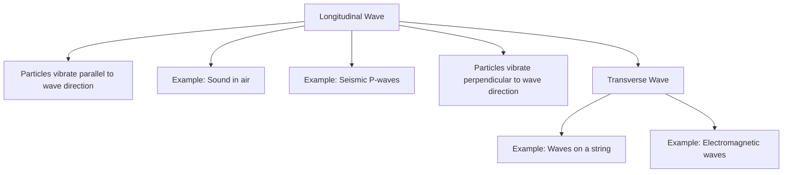

# Unit – V: Wave motion and its applications 5.a Explain wave and wave motion with example. 5.b Distinguish between longitudinal and transverse

*(AI-generated self-study book for GTU, subject code C4300004 — generated locally with Ollama.)*

This module carries approximately **14 marks (4 Remember + 5 Understand + 5 Apply) (per syllabus)**.


## 5.1. Waves, wave motion, and types of waves: longitudinal and transverse waves

### Definition and Classification of Waves
Waves are disturbances that propagate through a medium or space, transferring energy without transferring matter. Waves can be classified into two main types: **longitudinal waves** and **transverse waves**.

- **Waves**: Disturbances that travel through a medium or space, transferring energy.
- **Wave Motion**: The propagation of waves through a medium or space.

### Longitudinal Waves
**Longitudinal waves** are waves in which the particles of the medium vibrate in a direction parallel to the direction of the wave propagation. Examples of longitudinal waves include sound waves and seismic P-waves.

- **Particles Vibrations**: Particles vibrate back and forth along the direction of wave travel.
- **Example of Longitudinal Wave**: Sound waves in air. The air particles vibrate back and forth as the wave travels.

### Transverse Waves
**Transverse waves** are waves in which the particles of the medium vibrate in a direction perpendicular to the direction of wave propagation. Examples of transverse waves include waves on a string and electromagnetic waves.

- **Particles Vibrations**: Particles vibrate up and down or side to side, perpendicular to the direction of wave travel.
- **Example of Transverse Wave**: Waves on a guitar string. The string moves up and down as the wave travels along the string.

> **Example:** 
> - **Longitudinal Wave**: Consider a sound wave in air. The particles of air vibrate back and forth along the direction of the wave, causing the pressure to vary periodically.
> - **Transverse Wave**: Consider a wave on a string. The string particles move up and down, creating a pattern that travels along the string.

### Mermaid Diagram for Longitudinal and Transverse Waves


## 5.2. Frequency, periodic time, amplitude, wavelength and wave velocity and their relationship

### Basic Definitions
- **Frequency (f)**: The number of oscillations or cycles per second, measured in Hertz (Hz).
- **Periodic Time (T)**: The time taken for one complete cycle of the wave, measured in seconds.
- **Amplitude (A)**: The maximum displacement of the wave from its equilibrium position.
- **Wavelength (λ)**: The distance between two consecutive identical points in a wave.
- **Wave Velocity (v)**: The speed at which the wave travels through the medium, measured in meters per second.

### Relationship Between Frequency and Periodic Time
- **Relationship**: The frequency and periodic time of a wave are inversely related.
- **Formula**: f = 1 T or T = 1 f

### Relationship Between Wave Velocity, Wavelength, and Frequency
- **Relationship**: The wave velocity, wavelength, and frequency of a wave are directly related.
- **Formula**: v = f × λ

### Example of Wave Velocity, Wavelength, and Frequency
- **Example**: A wave travels at a velocity of 300 meters per second and has a wavelength of 3 meters. Calculate the frequency of the wave.
  > **Example:** 
  > - Given: v = 300 m/s and λ = 3 m
  > - Using the formula v = f × λ:
  > - f = v λ = 300 m/s 3 m = 100 Hz
  > - Therefore, the frequency of the wave is 100 Hz.

### Mermaid Diagram for Frequency, Periodic Time, Amplitude, Wavelength, and Wave Velocity
```mermaid
flowchart TD
    A[Frequency(f)] --> B[1/T]
    A --> C[Amplitude(A)]
    A --> D[Wavelength(λ)]
    A --> E[Wave Velocity(v)]
    E --> F[v = f × λ]
```

This section covers the fundamental concepts of waves, including their types (longitudinal and transverse), definitions, and key relationships. The worked examples provided will help students understand and apply these concepts effectively in exam scenarios.

---

## 5.3. Properties of sound and light waves.

### 5.3.1. Properties of Sound Waves

**Sound Waves:** Sound waves are mechanical waves that propagate through a medium by the vibration of particles. They can travel through gases, liquids, and solids. Sound waves are longitudinal in nature.

**Longitudinal Waves:** In longitudinal waves, the particles of the medium vibrate parallel to the direction of wave propagation. An example of a longitudinal wave is a sound wave.

- **Characteristics of Sound Waves:**
  - **Wavelength (λ):** The distance between two consecutive compressions or rarefactions.
  - **Frequency (f):** The number of vibrations or compressions per second, measured in Hertz (Hz).
  - **Amplitude (A):** The maximum displacement of a particle from its equilibrium position.
  - **Speed of Sound (v):** The speed at which the sound wave travels through a medium, which depends on the medium's properties.

**Example:**
> **Example:** A sound wave has a frequency of 500 Hz and travels through air at a speed of 340 m/s. Calculate the wavelength of the sound wave.
>
> Solution:
>
> [
> \lambda = \frac{v}{f} = \frac{340 \, \text{m/s}}{500 \, \text{Hz}} = 0.68 \, \text{m}
> ]

### 5.3.2. Properties of Light Waves

**Light Waves:** Light waves are electromagnetic waves that propagate through space without a medium. They can travel through a vacuum and various media such as air, water, and glass.

**Electromagnetic Waves:** Electromagnetic waves are transverse waves where the electric and magnetic fields are perpendicular to each other and to the direction of wave propagation.

- **Characteristics of Light Waves:**
  - **Wavelength (λ):** The distance between two consecutive peaks or troughs.
  - **Frequency (f):** The number of vibrations per second, measured in Hertz (Hz).
  - **Amplitude (A):** The maximum displacement of the electric or magnetic field.
  - **Speed of Light (c):** The speed at which light travels in a vacuum, approximately 3 × 10⁸ m/s.

**Example:**
> **Example:** A light wave has a frequency of 6 × 10¹⁴ Hz. Calculate its wavelength in air.
>
> Solution:
>
> [
> \lambda = \frac{c}{f} = \frac{3 \times 10^8 \, \text{m/s}}{6 \times 10^{14} \, \text{Hz}} = 5 \times 10^{-7} \, \text{m} = 500 \, \text{nm}
> ]

## 5.4. Phase, phase difference and various terms of wave equation (𝑦 = 𝐴𝑠𝑖𝑛(𝜔𝑡 + 𝜑))

### 5.4.1. Phase and Phase Difference

**Phase:** Phase is a measure of the position of a wave in its cycle. It is usually expressed in radians or degrees.

**Phase Difference:** Phase difference is the difference in the phase of two waves. It is the difference in their positions in their cycles.

- **Phase Equation:**
  [
  y = A \sin(\omega t + \phi)
  ]
  where:
  - A is the amplitude,
  - ω is the angular frequency,
  - t is the time,
  - φ is the phase.

**Example:**
> **Example:** Two waves are given by y₁ = A (ω t + φ₁) and y₂ = A (ω t + φ₂). Calculate the phase difference between the two waves.
>
> Solution:
>
> The phase difference Δ φ is given by:
>
> [
> \Delta \phi = \phi_2 - \phi_1
> ]

### 5.4.2. Various Terms of Wave Equation

**Wave Equation:**
  [
  y = A \sin(\omega t + \phi)
  ]
  where:
  - y is the displacement of the wave at any point in space and time,
  - A is the amplitude of the wave,
  - ω is the angular frequency,
  - t is the time,
  - φ is the phase.

**Angular Frequency (ω):**
  [
  \omega = 2\pi f
  ]
  where f is the frequency.

**Example:**
> **Example:** A wave has an angular frequency of 100 rad/s and a phase of π 4. Write the wave equation.
>
> Solution:
>
> [
> y = A \sin(100t + \frac{\pi}{4})
> ]

### 5.4.3. Velocity and Acceleration

**Velocity of a Wave:**
  The velocity of a wave is given by:
  [
  v = \omega k
  ]
  where k is the wave number.

**Acceleration of a Wave:**
  The acceleration of a wave is given by:
  [
  a = -\omega^2 A \sin(\omega t + \phi)
  ]

**Example:**
> **Example:** A wave has an angular frequency of 100 rad/s and an amplitude of 0.1 m. Calculate the acceleration of the wave at time t = 0 if the phase is π 4.
>
> Solution:
>
> The acceleration is given by:
>
> [
> a = -\omega^2 A \sin(\omega t + \phi)
> ]
>
> Substituting the values:
>
> [
> a = -(100)^2 \times 0.1 \times \sin(100 \times 0 + \frac{\pi}{4})
> ]
>
> [
> a = -10000 \times 0.1 \times \sin(\frac{\pi}{4})
> ]
>
> [
> a = -1000 \times \frac{\sqrt{2}}{2} = -707.11 \, \text{m/s}^2
> ]

By understanding the properties of sound and light waves, phase, and phase difference, students can better grasp the behavior and characteristics of waves in various applications.

---

## 5.5. Superposition of Waves, Interference: Constructive and Destructive Interference, Conditions for Stationary Interference Pattern, Beat Formation

### 5.5.1. Superposition of Waves
When two or more waves travel in the same medium, they overlap and combine to produce a resultant wave. This phenomenon is known as the **superposition of waves**. The principle of superposition states that the resultant displacement of a medium at any point is the vector sum of the displacements caused by the individual waves.

#### **Example:**
Consider two waves, y₁ = 3 (2π t - π x) and y₂ = 2 (2π t - π x - π 2 ), where t is time and x is the position. The resultant wave is given by:
[ y = y_1 + y_2 ]
[ y = 3 \sin (2\pi t - \pi x) + 2 \sin \left(2\pi t - \pi x - \frac{\pi}{2}\right) ]

Using the trigonometric identity (θ + π 2 ) = (θ), we can rewrite the second term:
[ y = 3 \sin (2\pi t - \pi x) + 2 \cos (2\pi t - \pi x) ]

Using the principle of superposition, we can combine these terms to find the resultant wave.

### 5.5.2. Interference: Constructive and Destructive Interference
Interference is the phenomenon that occurs when two or more waves overlap in a medium. It can be constructive or destructive based on the phase difference between the waves.

- **Constructive Interference:** This occurs when the waves reinforce each other, leading to an increase in the amplitude of the resultant wave. This happens when the phase difference between the waves is an integer multiple of 2π.

- **Destructive Interference:** This occurs when the waves cancel each other out, leading to a decrease in the amplitude of the resultant wave. This happens when the phase difference between the waves is an odd multiple of π.

#### **Example:**
Two waves traveling in the same direction with amplitudes A₁ and A₂ and a phase difference φ can be represented as:
[ y_1 = A_1 \sin (kx - \omega t) ]
[ y_2 = A_2 \sin (kx - \omega t + \phi) ]

The resultant wave is:
[ y = y_1 + y_2 = A_1 \sin (kx - \omega t) + A_2 \sin (kx - \omega t + \phi) ]

Using the trigonometric identity for the sum of sines:
[ y = A_1 \sin (kx - \omega t) + A_2 \sin (kx - \omega t + \phi) ]
[ y = A_1 \sin (kx - \omega t) + A_2 \left[ \sin (kx - \omega t) \cos \phi + \cos (kx - \omega t) \sin \phi \right] ]
[ y = (A_1 + A_2 \cos \phi) \sin (kx - \omega t) + A_2 \sin \phi \cos (kx - \omega t) ]

The amplitude of the resultant wave is given by:
[ A_{\text{resultant}} = \sqrt{(A_1 + A_2 \cos \phi)^2 + (A_2 \sin \phi)^2} ]

#### Conditions for Stationary Interference Pattern:
- **Constructive Interference:** φ = 2nπ, where n is an integer.
- **Destructive Interference:** φ = (2n+1)π, where n is an integer.

### 5.5.3. Beat Formation
When two waves of slightly different frequencies overlap, they produce a periodic variation in the amplitude of the resultant wave. This phenomenon is called **beats**.

- **Example:**
Consider two waves with frequencies f₁ and f₂ and amplitudes A₁ and A₂. The resultant wave is:
[ y = A_1 \sin (2\pi f_1 t) + A_2 \sin (2\pi f_2 t) ]

Using the trigonometric identity for the sum of sines:
[ y = 2A_1 A_2 \sin \left( \frac{2\pi (f_1 - f_2) t}{2} \right) \cos \left( \frac{2\pi (f_1 + f_2) t}{2} \right) ]

The beat frequency is given by:
[ f_{\text{beat}} = |f_1 - f_2| ]

### 5.5.4. Example
> **Example:** Two sound waves of frequencies 440 Hz and 445 Hz travel in the same medium. Calculate the beat frequency and the time period of the beats.
- **Solution:**
The beat frequency is:
[ f_{\text{beat}} = |440 - 445| = 5 \text{ Hz} ]
The time period of the beats is:
[ T_{\text{beat}} = \frac{1}{f_{\text{beat}}} = \frac{1}{5} = 0.2 \text{ s} ]

## 5.6. Reverberation, Reverberation Time, Echo, Noise and Coefficient of Absorption of Sound

### 5.6.1. Reverberation
Reverberation is the persistence of sound in a room after the original sound has ceased. It is caused by the multiple reflections of sound waves off the surfaces of the room.

#### **Example:**
Consider a room with a volume of 1000 m³. The sound intensity level at a distance of 1 m from the source is 80 dB. Calculate the reverberation time if the total absorption area of the room is 200 m².
- **Solution:**
The sound absorption area per unit volume is:
[ \alpha = \frac{200 \text{ m}^2}{1000 \text{ m}^3} = 0.2 \text{ m}^{-2} ]

The reverberation time T is given by:
[ T = \frac{0.161 \times V}{A \times S} ]
where V is the volume of the room, A is the total absorption area, and S is the speed of sound in air (343 m/s).

[ T = \frac{0.161 \times 1000}{0.2 \times 343} \approx 2.4 \text{ s} ]

### 5.6.2. Reverberation Time
Reverberation time is the time it takes for the sound level in a room to decay by 60 dB after the source has stopped. It is a measure of how long the sound persists in a room.

- **Formula:**
[ T = \frac{0.161 \times V}{A \times S} ]
where V is the volume of the room, A is the total absorption area, and S is the speed of sound in air.

#### **Example:**
A lecture hall has a volume of 5000 m³ and a total absorption area of 1000 m². Calculate the reverberation time.
- **Solution:**
[ T = \frac{0.161 \times 5000}{1000 \times 343} \approx 0.24 \text{ s} ]

### 5.6.3. Echo
An echo is the reflection of sound from a distant surface. It is a discrete, distinguishable repetition of the original sound.

- **Example:**
If the speed of sound in air is 343 m/s and the distance between the source and the reflecting surface is 171.5 m, calculate the time interval for the echo to be heard.
- **Solution:**
The time interval for the echo is:
[ t = \frac{2 \times 171.5 \text{ m}}{343 \text{ m/s}} = 1 \text{ s} ]

### 5.6.4. Noise
Noise is unwanted sound that can interfere with communication and cause discomfort.

- **Example:**
Calculate the sound intensity level of a noise source with an intensity of 10⁻⁶ W/m².
- **Solution:**
The sound intensity level L_I is given by:
[ L_I = 10 \log \left( \frac{I}{10^{-12}} \right) ]
[ L_I = 10 \log \left( \frac{10^{-6}}{10^{-12}} \right) = 10 \log (10^6) = 60 \text{ dB} ]

### 5.6.5. Coefficient of Absorption of Sound
The coefficient of absorption α is a measure of the fraction of sound energy absorbed by a material per unit area.

- **Example:**
A material has a coefficient of absorption of 0.3. Calculate the sound energy absorbed by 2 m² of this material.
- **Solution:**
The sound energy absorbed is:
[ E_{\text{absorbed}} = \alpha \times A \times I ]
where A is the area and I is the sound intensity.

Assume the sound intensity I = 10⁻⁶ W/m²:
[ E_{\text{absorbed}} = 0.3 \times 2 \text{ m}^2 \times 10^{-6} \text{ W/m}^2 = 6 \times 10^{-7} \text{ W} ]

### 5.6.6. Example
> **Example:** A room has a total absorption area of 150 m². Calculate the reverberation time if the sound intensity in the room is 10⁻⁶ W/m².
- **Solution:**
The reverberation time T is given by:
[ T = \frac{0.161 \times V}{A \times S} ]
Assuming the volume of the room is 1500 m³ and the speed of sound S = 343 m/s:
[ T = \frac{0.161 \times 1500}{150 \times 343} \approx 0.24 \text{ s} ]

---

## 5.7. Sabine’s Formula (Derivation Not Required) for Reverberation Time, Methods to Control Reverberation Time, and Their Applications

### Definition and Explanation of Reverberation Time

Reverberation time (T) is a measure of the time it takes for the sound energy in a room to decay by 60 dB after the source of the sound has stopped. It is a critical factor in the acoustic design of auditoriums, concert halls, and other large spaces.

> **Example:** In a large hall, if the sound level drops from 80 dB to 20 dB in 3 seconds, the reverberation time (T) is 3 seconds.

### Sabine’s Formula

Sabine’s formula is used to calculate the reverberation time in a room. The formula is given by:

[ T = \frac{0.161 V}{A} ]

where:
- V is the volume of the room in cubic meters (m³),
- A is the total absorption area of the surfaces in the room in square meters (m²).

### Methods to Control Reverberation Time

Controlling reverberation time is essential for achieving good sound quality. There are several methods to manage reverberation time:

1. **Absorption**: Adding materials that absorb sound energy, such as carpets, curtains, and acoustic panels.
2. **Diffusion**: Using diffusors to scatter sound waves and reduce the decay time.
3. **Reflection**: Using reflective surfaces strategically to control sound distribution.
4. **Volume Control**: Adjusting the volume of the room by adding or removing partitions.

### Applications of Controlling Reverberation Time

Controlling reverberation time is crucial in various fields:

- **Auditoriums and Concert Halls**: Ensuring clear sound transmission and enhancing the listening experience.
- **Recording Studios**: Achieving optimal sound quality for recording and mixing.
- **Theaters**: Improving the acoustics for clear dialogue and music.

### Example

> **Example:** A concert hall has a volume of 2000 m³ and a total absorption area of 100 m². Using Sabine’s formula, calculate the reverberation time.

[ T = \frac{0.161 \times 2000}{100} = 3.22 \text{ seconds} ]

## 5.8. Ultrasonic Waves and Their Properties, Applications of Ultrasonic Waves in the Field of Engineering and Medical

### Definition of Ultrasonic Waves

Ultrasonic waves are sound waves with frequencies above the upper limit of human hearing, typically above 20,000 Hz. These waves have several unique properties and applications.

### Properties of Ultrasonic Waves

1. **High Frequency**: Ultrasonic waves have high frequencies, which give them short wavelengths.
2. **High Directivity**: They can be focused to a small area, making them useful for precise applications.
3. **Longitudinal Nature**: Ultrasonic waves are longitudinal, meaning the particles of the medium vibrate parallel to the direction of wave propagation.
4. **High Energy**: They can transmit a significant amount of energy, making them useful for various applications.

### Applications of Ultrasonic Waves

Ultrasonic waves have numerous applications in both engineering and medical fields:

#### Engineering Applications

1. **Non-Destructive Testing (NDT)**: Ultrasonic testing is used to inspect the integrity of materials without damaging them. It is used in industries like aerospace, automotive, and construction.
2. **Cleaning**: Ultrasonic waves can be used to clean parts and components effectively, especially in industries like jewelry and electronics.
3. **Material Cutting**: Ultrasonic waves can be used to cut materials like plastics and composites.

#### Medical Applications

1. **Ultrasonic Imaging (Ultrasound)**: Used to visualize internal organs and tissues in the body, such as in obstetric and cardiac imaging.
2. **Therapy**: Used in physical therapy to treat pain, reduce inflammation, and promote healing.
3. **Surgical Applications**: Ultrasonic surgical instruments can cut and coagulate tissue simultaneously, reducing blood loss and improving surgical precision.

### Example

> **Example:** In a non-destructive testing scenario, an ultrasonic wave with a frequency of 5 MHz is used to inspect a metal component. The speed of sound in the metal is 5940 m/s. Calculate the wavelength of the ultrasonic wave.

[ \lambda = \frac{v}{f} = \frac{5940}{5 \times 10^6} = 1.188 \times 10^{-3} \text{ meters} ]

This example illustrates the practical application of ultrasonic waves in engineering testing and demonstrates the calculation of wavelength based on given frequency and speed of sound.
